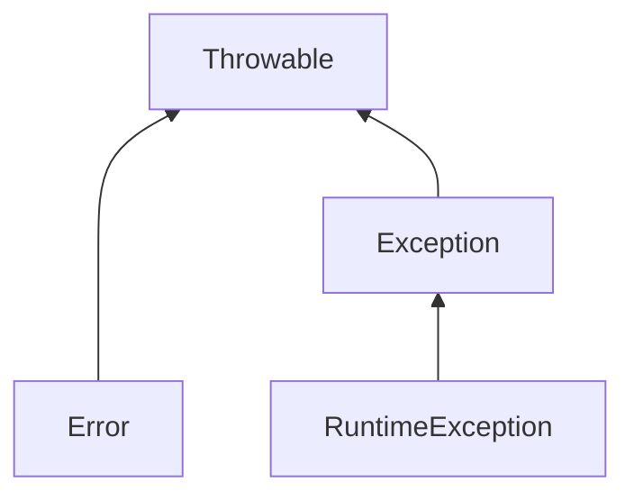

## 基础语法

### JDK,JRE,JVM的区别

1，JDK：Java Development Kit 的简称，Java 开发工具包，针对Java程序员的产品。

2，JRE：Java Runtime Environment 的简称，为Java在操作平台运行提供环境支持，为 Java 提供了一些基本实现和基本类库。

3，JVM：java虚拟机，将java文件编译成字节码文件，然后调用操作系统提供的API来完成任务。是java实现跨平台的核心


为什么java可以跨平台，实现一次编写，到处运行呢？

不同的操作平台有不同的API，如果我们直接面向操作系统进行编程，程序必然无法进行跨平台操作。

而java引入字节码概念，jvm只认识字节码文件。java针对不同系统有不同的jvm实现，但是被编译成字节码后都是一样的。

所以工程师只需要面对jvm进行开发，再由jvm转译到其他系统对应api完成对应工作。

### 常用数字类型的区别

最常被问到整型，说出负21到正21亿即可，记住浮点型做了解即可，整数和单精度占用4个字节，长整数和双精度占用8个字节就可以了）


### 浮点型的坑

执行结果，并说明原因

```java
float d1 = 423432423f;
float d2 = d1 + 1;
if(d1==d2) {
	System.out.println("d1==d2");
} else {
	System.out.println("d1!=d2");
}
```

本题考查单精度型在JVM中的表示方法：

float类型，在内容中的存储形式为科学计数法，表示为：4.2343242e7，小数点后最多表示7位。

如果需要更高精度的保存，需要使用double类型才可以

（金融领域，一定要注意这个问题）

```
使用BigDecimal类进行加减乘除运算。防止因为精度问题而出现数据丢失
```

### 随机生成30-100的随机数

```java
public class RandomSample {
    public Integer randomInt1(){
        int min = 30;
        int max = 100;
        int result = new Random().nextInt(max - min) + min;
        return result;
    }
    public Integer randomInt2(){
        int min = 30;
        int max = 100;
        int result = (int)(Math.random() * (max-min)) + min;
        return result;
    }
    public static void main(String[] args) {
        System.out.println(new RandomSample().randomInt1());
        System.out.println(new RandomSample().randomInt2());
    }
}
```


### 列出1-1000的质数

```java
/**
 * 列出1-1000的质数
 * 质数：在大于1的自然数中，只能被1和自身整除的数
 */
public class PrimeNum {
    public static void main(String[] args) {
        for (int i = 2; i <= 1000; i++) {
            boolean flag = true;
            for (int j = 2; j < i; j++) {
                if (i % j == 0) {
                    flag = false;
                    break;
                }
            }
            if (flag) {
                System.out.println(i);
            }
        }
    }
}
```


### 类型转换

#### 什么时候转换？

数据类型不一样，不能进行计算，需要转成一样的才可以进行计算。

#### 隐式转换（自动类型提升）

把一个取值范围小的数值，转成取值范围大的数据

```java
范例:
int a = 10;
double b = 1;  // b 为10.0
```

##### 隐式转换的两种提升规则

1. 取值范围小的和取值范围大的进行运算，小的会先提升为大大，再进行运算。
2. byte short char 三种类型的数据在运算的时候，都会直接先提升为int，然后再进行运算

> 取值范围从小到大！byte short int long float double

#### 强制转换

* 如果把一个取值范围大的数值，赋值给取值范围小的变量。是不允许直接赋值的。如果一定要这样做就需要加入强制转换。

* 格式：目标数据类型 变量名 = （目标数据类型）被强转的数据；

  ```java
  范例：
    doublie a = 12.3;
  	int b = (int) a;
  	// 如果数据比较大 强转时可能会发生错误
  	int a 300;
  	byte b = (byte) a;
  ```

  

## 面向对象

### 面向对象三大特征

封装、继承、多态。

封装：封装类的内部实现机制，就跟方法封装一样，可以在不影响使用的情况下改变内的内部结构，只要对外的接口不变。增加了代码的可维护性，便于修改。

继承：父类有了的方法子类可以直接继承。增加了代码的复用性。

多态：第一要有继承，第二要有重写，第三父类引用指向子类对象 。提高了程序扩展性，减少耦合

```
Animal A = new Dog();
```

```java
    // 如果想新增一个Bird类，只需要新增Bird类就行，不需要改animalRun方法
	public static void main(String[] args) {
        Test test = new Test();
        test.doIt(new Cat());
        test.doIt(new Dog());
        // test.doIt(new Bird());
    }
    public void animalRun(Animal animal) {
        System.out.println(animal.run());
    }
```


 

### 静态变量和实例变量的区别：

1. 语法区别，静态变量前需要添加“static”关键字，而实例变量则不用。

2. 隶属区别：实例变量属于某个对象（将类使用new关键字使用后才可以使用），静态变量则属于类本身（使用静态变量时，直接使用类名调用即可）

3. 运行区别（最根本的区别）：
   * 静态变量--在JVM加载类是就被创建了。而实例变量则是在实例化对象时创建。
   * 在运行过程中，静态变量无法被垃圾回收释放，而实例变量则是当我们不再使用时，就会被回收掉。
   * 存储位置不同，静态变量区在JVM的方法区中，实例变量则存在于对象堆的内存中。

多使用实例变量，减少队静态变量的使用


### 类的执行顺序

```java
package com.imooc.interview;
//请写出程序输出结果
//1. 静态优先
//2. 父类优先
//3. 非静态块优先于构造函数
public class ExecutionSequence {
    public static void main(String[] args) {
        new GeneralClass();
    }
}
class ParentClass{
    static {
        System.out.println("①我是父类静态块");
    }

    {
        System.out.println("②我是父类非静态块");
    }
    public ParentClass(){
        System.out.println("③我是父类构造函数");
    }
}

class GeneralClass extends ParentClass{
    static{
        System.out.println("④我是子类静态块");
    }

    {
        System.out.println("⑤我是子类非静态块");
    }

    public GeneralClass(){
        System.out.println("⑥我是子类构造函数");
    }
}
```

类的执行顺序：考察的是父类和子类，静态和非静态的执行顺序。

类的执行顺序：- 静态优先- 父类优先- 非静态块优先于构造函数

142356


### Java抽象类和接口的区别？

1. 抽象类可以定义构造器。接口不可以
2. 抽象类可以有抽象方法和具体方法。 接口的方法全是抽象方法
3. 抽象类的成员可以是private、默认、protected、public。接口的成员全都是public
4. 抽象类中可以定义成员变量；接口中定义的成员变量实际上都是常量
5. 抽象类中可以包含静态方法；接口中不能有静态方法
6. 一个类只能继承一个抽象类；一个类可以实现多个接口

有抽象方法的类必须被声明为抽象类，而抽象类未必有抽象方法

##### 衍生问题：什么时候用接口，声明时候用抽象类？

一般描述**特征**用接口，描述**概念**用抽象类

### Java异常体系

##### 请说明Java异常体系

Java最顶层的抽象是Throwable接口，他代表了任何可以抛出的异常或错误

##### Error和Exception的区别和联系

| Exception                  | Error                                |
| -------------------------- | ------------------------------------ |
| 可以是可被控制或不可控制的 | 总是不可控制的                       |
| 表示一个由程序员导致的错误 | 经常用来表示系统错误或低层资源的错误 |
| 应该再应用程序级被处理     | 如果可能的话，应该再系统级被捕捉     |

error--是操作系统级别的错误，需要终止程序运行解决

##### Exception和RuntionException区别

非运行时异常，需要在编码阶段进行处理（try-catch包裹或throw抛出），运行时异常，则不要求包裹或抛出。




## 字符串

### String与字符串常量池

请写出程序执行结果

```java
String s1 = "abc";
String s2 = "abc";
String s3 = "abc"+"def";
String s4 = "abcdef";
String s5 = s2+"def";
String s6 = new String("abc");
System.out.println(s1==s2); // true，指向同一个内存地址
System.out.println(s3==s4); // true，指向同一个内存地址
System.out.println(s4==s5); // false，s2是引用类型，编译期间无法确认数值，只有运行时才能确认
System.out.println(s4.equals(s5)); // true，equals比较的是内容
System.out.println(s1==s6); // false， s1是存放在常量池中的，s6是不在常量池进行保存的，因为保存地址不一样，所以是false
```


### String，StringBuilder，StringBuffer的区别？

|          | String         | StringBuffer           | StringBuilder          |
| -------- | -------------- | ---------------------- | ---------------------- |
| 执行速度 | 最差           | 其次                   | 最高                   |
| 线程安全 | 线程安全       | 线程安全               | 线程不安全             |
| 使用场景 | 少量字符串操作 | 多线程环境下的大量操作 | 单线程环境下的大量操作 |

## 集合

### 什么场景下使用list，set，map呢？

如果你经常会使用索引来对容器中的元素进行访问，那么**List**是你的正确的选择。如果你已经知道索引了的话，那么List的实现类比如ArrayList可以提供更快速的访问,如果经常添加删除元素的，那么肯定要选择LinkedList。

如果你想容器中的元素能够按照它们插入的次序进行有序存储，那么还是List，因为List是一个有序容器，它按照插入顺序进行存储。

想保证插入元素的唯一性，选择一个**Set**的实现类，比如 HashSet、LinkedHashSet或者TreeSet。所有Set的实现类都遵循了统一约束比如唯一性，而且还提供了额外的特性：比如TreeSet还是一个SortedSet，所有存储于TreeSet中的元素可以使用Java里的Comparator或者Comparable进行排序。LinkedHashSet也按照元素的插入顺序对它们进行存储。

以键和值的形式进行数据存储用 **Map**。后续需要从 Hashtable、HashMap、TreeMap 中进行选择。


### List和Set区别

|              | List                  | Set                             |
| ------------ | --------------------- | ------------------------------- |
| 允许重复     | 是                    | 否                              |
| 是否允许null | 是                    | 否                              |
| 是否有序     | 是                    | 否                              |
| 常用类       | ArrayList、LinkedList | HashSet、LinkedHashSet、TreeSet |

##### ArrayList与LinkedList的区别

|            | ArrayList              | LinkedList           |
| ---------- | ---------------------- | -------------------- |
| 存储结构   | 基于动态数组(有序排列) | 基于链表(无序排列)   |
| 遍历放射式 | 连续读取               | 基于指针             |
| 使用场景   | 大数据量读取           | 频繁新增、插入、删除 |

##### HashSet和TreeSet的区别

|          | HashSet        | TreeSet        |
| -------- | -------------- | -------------- |
| 排序方式 | 不能保证顺序   | 按预置规则排序 |
| 底层存储 | 基于HashMap    | 基于TreeMap    |
| 底层实现 | 基于Hash表实现 | 基于二叉树实现 |

### List排序的编码实现

考察的是Collection.sort()方法的使用

```java
List<Employee> emps = new ArrayList<Employee>();
emps.add(new Employee("张三", 33, 1800f));
emps.add(new Employee("李四", 55, 3800f));
emps.add(new Employee("王五", 40, 2300f));
Collections.sort(emps, new Comparator<Employee>() {
@Override
public int compare(Employee o1, Employee o2) {
return (int)(o2.getAge() - o1.getAge());
}
});
System.out.println(emps);
```

Collection.sort()方法--适用于所有List结构

### TreeSet排序的编码实现

1. 自定义排序（图中为升序）

```java
TreeSet<Employee> emps = new TreeSet<Employee>(new Comparator<Employee>() {
    @Override
    public int compare(Employee o1, Employee o2) {
        return (int)(o2.getSalary() - o1.getSalary());
    }
});
emps.add(new Employee("张三", 33, 1800f));
emps.add(new Employee("李四", 55, 3800f));
emps.add(new Employee("王五", 40, 2300f));
System.out.println(emps);
```

2. 自然排序

   （1）定义类时implements Comparable<>

```java

package com.imooc.interview.sorter;

public class Employee implements Comparable<Employee> {
    private String ename;
    private Integer age;
    private Float salary;

    ......
	
    @Override
    public int compareTo(Employee o) {
        return o.getAge().compareTo(this.getAge());
    }
}

```

```java
TreeSet<Employee> emps = new TreeSet<Employee>();
emps.add(new Employee("张三", 33, 1800f));
emps.add(new Employee("李四", 55, 3800f));
emps.add(new Employee("王五", 40, 2300f));
System.out.println(emps);
```

### hashCode()与equals()区别和联系

Object类hashCode()和equals():

1,这两个方法都hi用来判断 两个对象，是否相等

2，hashCode()是一个简单内存地址的表现，执行效率高很多。

3，equals()考虑的因素更所一些，速度更慢。


注意：优势hashCode()方法并不可靠，通常不同对象的hashCode() 值是不同的。但有些情况不同对象的hashCode()的值时候可能相同的。


在java 的hashMap/hashSet/hashTalbe--它们中对象的比较原则是：

1，首先使用hashCode判断两个对象是否相同，如果两个对象的hashCode不行通则必然不是同一个对象。

2，当hashCode() 相等的情况下，也不一定是相同的对象。然后再使用equals()方法进行验证 

| 序号 | 描述                                         |
| ---- | -------------------------------------------- |
| 1    | 两个对象如果equals()成立，hashcode()一定成立 |
| 2    | 如果equals()成立，hashcode()可能成立         |
| 3    | 如果hashcode()成立，equals()不一定成立       |
| 4    | hashcode()不相等，equals()一定不成立         |

## 输入输出流

### Java IO中几种类型的流

字节流：二进制

字符流：可以阅读的字符

```java
inputStreamReader/outputStreamWriter--将输入/输出的字节流转化为，可读的输入/输出字符流
```

|        | 输入流                                                       | 输出流                                                       |
| ------ | ------------------------------------------------------------ | ------------------------------------------------------------ |
| 字节流 | InputStream<br />FileInputSteam<br />BufferedInputStream     | OutputSteam<br />FileOutputStream<br />BufferedOutputStream  |
| 字符流 | Reader<br />FileReader<br />InputStreamReader<br />BufferedReader | Writer<br />FileWriter<br />OutputStreamWriter<br />BufferedWriter |

### 利用IO实现文件复制

```java
public static void main(String[] args) {
    //1. 利用JAVA ＩＯ
    File source = new File("e:/tomcat8.zip");
    File target = new File("e:/target/tomcat8.zip");
    InputStream input = null;
    OutputStream output = null;
    try {
        input = new FileInputStream(source);
        output = new FileOutputStream(target);
        byte[] buf = new byte[1024];
        int byteRead;
        while((byteRead = input.read(buf)) != -1){
            output.write(buf , 0 , byteRead);
        }
    } catch (FileNotFoundException e) {
        e.printStackTrace();
    } catch (IOException e) {
        e.printStackTrace();
    } finally {
        try {
            input.close();
            output.close();
        } catch (IOException e) {
            e.printStackTrace();
        }

    }

    //2. FileChannel实现文件复制
    //3. Commons IO组件实现文件复制
    //FileUtils.copyFile(Source , Target);
    //4. Java 7 提供了Files类
    //Files.copy(Source,Target)
}
```


## 垃圾回收与JVM内存

### JVM的内存组成

运行时，JVM分成两个区共享区和私有区

共享区：方法区、堆

私有区：程序计数器、虚拟机栈和本地方法栈


##### 共享区

堆（Heap）--是JVM管理的内存中最大的一块，也是最主要的部分，唯一的目的是存放程序运行时所创建的对象实例。堆，是垃圾回收的主要区域。对于不在被使用的对象（不再持有引用的对象）垃圾回收器会对其进行回收和销毁。

方法区（MethodArea）--主要存取虚拟机加载的类的信息，常量、静态变量等数据。

方法区和堆 都是共享的。其中的数据对线程都是开放的，可直接访问。对于存在方法区中的数据，垃圾回收器是很少对其进行回收的。主要回收常量和类型卸载的信息。而静态变量是不进行回收的。不过，如果定义的静态常量是一个引用类型，那么这个被引用的对象时有可能进行回收的。

##### 私有区

`私有区对线程来说是私有的，其他线程无法访问。`

程序计数器: 行号计数器，在进行程序跳转时记住行号是多少方便还原

```
当前线程所执行的字节码指令的行号指示器（例如：分支、跳转、循环、异常处理、线程恢复）。Java多线程是通过线程轮流切换分配时间片来执行的。为了线程切换后能恢复到正确的位置，每个线程都有单独的程序计数器。所以程序计数器就是私有的。（在程序进行分支、跳转时记录行号。这是计数器最典型的应用）
```

虚拟机栈：是线程私有的，主要为java的方法服务

```
每个方法被执行的时候，Java虚拟机都会同步创建一个栈帧（Stack Frame）用于存储局部变量表、操作数栈、动态连接、方法出口等信息。每一个方法被调用直至执行完毕的过程，就对应着一个栈帧在虚拟机栈中从入栈到出栈的过程。
```

本地方法栈：用操作系统级别的底层方法时，才会在“本地方法栈”存放方法栈针。

```
与“虚拟机栈”类似。不同的是“虚拟机栈”是为执行java方法所提供的。而“本地方法栈”则是为执行本地方法时服务的， 也就是在调用操作系统级别的底层方法时，才会在“本地方法栈”存放方法栈针。
```


### Java的垃圾回收机制（GC）及算法介绍

GC（Garbage Collection）--回收不再使用的内存

GC负责3项任务：分配内存、确保引用、回收内存

GC回收依据--当对象没有任何作用，则可以被回收。

#### **垃圾回收是双刃剑**：

1，对程序开发提供了便捷，

2，垃圾回收要对程序进行不断的监听，所以执行效率，相对于C、C++要低一些。不过随着技术发展和软硬件技术的提高，差距在不断的缩小。

#### **垃圾回收器**

使用的是有向图的方式管理和记录，堆内存中的所有对象。通过有向图可以识别哪些对象时可达的。哪些对象是不可达的。对于可达的对象进行保留，不可达的对象视为垃圾，被垃圾回收器处理掉。

#### **垃圾回收(GC)算法：常用的5种算法**

1. **引用计数算法**--最简单，但效率也最低。原理是，JVM堆中保存的每一个对象都有一个被引用1计数器，当有变量引用对象时，计数器就会“+1”。当变量被释放或断开引用时，计数器就会“-1”。当计数器变成“0”则表示这个对象可以被垃圾回收。

（注意：当两个对象彼此互相引用，会形成一个循环。称为循环引用，计数器是无法解决循环引用的情况的）

2. **跟踪回收算法**：利用JVM维护的对象引用图（可以形象的理解为JVM在内存中画了一张图，从根节点开始遍历对象的引用图。同时标记还可以遍历到的对象。遍历结束后未被遍历的对象就是没被使用的对象，就是不能使用的对象，就可以进行回收了）

3. **压缩回收算法**：将JVM堆中活动的对象放到一个集中的区域中，在堆的另外一端留出大块空闲区域，相当于对堆中的碎片进行处理。（对性能影响较大）

4. **复制回收算法**--把 堆 分成两个形同大小的区域，在任何时刻只有其中的一个区域被使用，直到其被消耗完。然后垃圾回收器会阻断程序的运行，通过遍历把所有活动的对象复制到另外一个区域中，复制时这些对象时紧密的挨在一起的。从而消除在内存中产生的碎片。复制完成后继续运行，知道区域使用完，然后重复上面的方法。

  优点：在垃圾回收的同时，也完成了对对象的重新布置和安排，因为对象都是紧密连接的所以其访问效率和寻址效率都非常高。并且一次性解决的内存碎片问题。
  但是也有它自己的问题，

  1. 需要指定内存到小的2倍。
  2. 在内存调整的过程需要中断当前程序的执行，降低了程序的执行效率

5. **按代回收算法**（现在的主流回收算法）：
如果按对象生命周期的长短进行区分，绝大多数对象的声明周期都很短。比如方法中声明的对象，方法结束这个对象就被释放了。只有很少的部分对象有较长的生命周期。例如：全局变量、一些需要一直持有易用的变量才拥有较长的声明周期。


基于上述特点，按代回收算法进行了优化，思路为--把堆分成两个或者多个子堆。每个子堆都视为一代。回收算法在运行时，优先回收年轻的对象

对于一些经过多次回收依然存活的，则把其移到高一级的堆中。

这种按代分类的做法，我们可以把一些稳定的不常用的类，减少扫描次数。进而缩小扫描范围，提升了回收的效率。


#### Java的内存泄漏场景

内存泄漏--指一个不再被程序使用的对象或者变量，还在内存中占用空间。

C、C++语言中，垃圾回收是需要手动操作的，如果程序员忘记释放，就会造成内存泄漏。

JAVA--有垃圾回收机制，由回收器自动回收，可以极大的降低程序员垃圾回收的工作。但JAVA也会出现内存泄漏的场景。


**常见的内存泄漏场景**：

1，静态集合类，有些程序员喜欢用静态关键字“static”来修饰变量或对象。这种方法是不可取的，因为对静态对象来说，它存储在方法区中。垃圾回收器不会对“方法区”中的数据进行高频度的回收。
如果使用static 修饰了一个集合，存放的数据量又比较大。而且通常我们方法区的内存是比较小的，时间久了就会产生内存溢出的情况，进而程序崩溃。

2，各种连接--数据库连接、网络连接、IO连接等，只打开，但未关闭。在JVM中这些对象一直是可达状态，因此不会被回收。时间久了就会导致程序崩溃。

3，监听器--因为其往往都是全局存在的，如果监听器中使用的对象或变量，没有进行有效的控制的话，很容易产生内存泄漏。

4，不合理的作用域--java开发中有一个基本的原则，作用域最小化。变量能声明在方法中就不要声明在方法外，能用private 不要用public。（作用域的正确使用是一个java工程师的基本功，只需要它的时候才去创建，如果一个变量的作用范围大于它的使用范围，很有可能导致内存泄漏的情况。。另外如果在平时使用时，没有把引用对象及时设置成null，也有可能造成内存泄漏）


### 请实现对象浅复制与深复制

**浅复制**--只对对象及其变量值进行赋值，如果对象中引用了其它对象的话，那么这个对象赋值了以后，其应用对象的地址是不变的。（也就是，这两个完全相同的对象，会指向同一个引用对象）

**深复制-**-不仅对象及其变量值进行复制，就连引用对象也进行复制。复制的两个对象，都有自己独立的引用对象，彼此互不干扰。

代码演示：

```java
package com.imooc.interview.clone;

import java.io.*;

public class Dancer implements Cloneable,Serializable{ // 克隆必须继承Cloneable接口 序列化必须继承Serializable接口
    private String name;

    private Dancer partner;

    public String getName() {
        return name;
    }

    public void setName(String name) {
        this.name = name;
    }

    public Dancer getPartner() {
        return partner;
    }

    public void setPartner(Dancer partner) {
        this.partner = partner;
    }

    public Dancer deepClone() throws IOException, ClassNotFoundException {
        //序列化，将内存中的对象序列化为字节数组
        ByteArrayOutputStream bos = new ByteArrayOutputStream();
        ObjectOutputStream oos = new ObjectOutputStream(bos); // 对象作为参数传递时，在方法中对对象的值进行修改，会改变原来对象中的内容。
        oos.writeObject(this); // oos这里写入对象到bos中，也就将当前对象转为字节数组了。 

        //反序列化，将字节数组转回到对象，同时完成深复制的任务
        ByteArrayInputStream bis = new ByteArrayInputStream(bos.toByteArray());
        ObjectInputStream ois = new ObjectInputStream(bis);
        return (Dancer)ois.readObject();
    }
 	

    public static void main(String[] args) throws CloneNotSupportedException, IOException, ClassNotFoundException {
        Dancer d1 = new Dancer();
        d1.setName("刘明");
        Dancer d2 = new Dancer();
        d2.setName("李敏霞");
        d1.setPartner(d2);
        System.out.println("Partner:" + d2.hashCode());
        //浅复制
        Dancer shallow = (Dancer)d1.clone();
        System.out.println("浅复制:" + shallow.getPartner().hashCode());
        //深复制
        Dancer deep = (Dancer)d1.deepClone();
        System.out.println("深复制:" + deep.getPartner().hashCode());
    }

}

```

