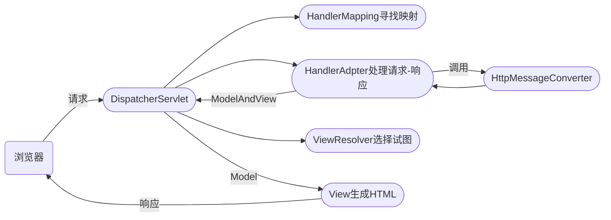

[TOC]


## Spring

### IOC与DI的理解

IOC 是控制反转，设计理念，由第三方来管理和控制对象。

优点：对象 和 对象之间的引用实现了解耦

**DI是依赖注入**，是IOC的具体实现，由对象容器在运行时动态的注入对象

DI基于反射和工厂模式


### Spring 中Bean 实例化有几种方式呢？（3种）

1. 通过类构造器实例化。（People people = new People(张三，26)）

​		（第一种是最常用，最根本的）

2. 使用静态工厂实例化

3. 使用实例工厂实例化

​		（静态工厂和实例工厂类都是间接通过构造器实现的实例化）

```xml
...
    <!--构造函数实例化-->
    <!-- 1.调用无参构造函数 -->
    <bean id="person1" class="com.imooc.spring.instance.Person"></bean>
    <!-- 2.调用有参构造函数 -->
    <bean id="person2" class="com.imooc.spring.instance.Person">
        <constructor-arg name="name" value="枫叶(构造函数)"/>
        <constructor-arg name="age" value="23"/>
    </bean>
    <!-- 通过静态工厂创建对象-->
    <bean id="person3" class="com.imooc.spring.instance.PersonStaticFactory" factory-method="createPerson">
        <constructor-arg name="name" value="蓝天(静态工厂)"/>
        <constructor-arg name="age" value="27"/>
    </bean>
    <!-- 通过实例工厂创建对象 -->
	//实例化PersonFactor
    <bean id="instanceFactory" class="com.imooc.spring.instance.PersonFactory"></bean>
	//调用PersonFactor的createPerson方法
    <bean id="person4" factory-bean="instanceFactory" factory-method="createPerson">
        <constructor-arg name="name" value="绿地(实例工厂)"/>
        <constructor-arg name="age" value="29"/>
    </bean>
...
```

```java
public class Person {
    private String name;
    private Integer age;
    public Person() { System.out.println("Person默认构造函数");}
    public Person(String name, Integer age) {
        this.name = name;
        this.age = age;
        System.out.println("Person{" +
                "name='" + name + '\'' +
                ", age=" + age +
                '}');
    }
}
/**
 * Person静态工厂
 */
public class PersonStaticFactory {
    public static Person createPerson(String name,int age){
        return new Person(name,age);
    }
}
/**
 * Person实例工厂
 */
public class PersonFactory {
    public Person createPerson(String name,int age){
        return new Person(name,age);
    }
}


```

### Spring Bean注入属性有哪几种方式呢？（Spring面试必问）

4种  

主方法

```java
public class InjectionRunner {
    public static void main(String[] args) {
        ApplicationContext ctx = new ClassPathXmlApplicationContext("classpath:injection.xml");
        UserService userService = (UserService)ctx.getBean("userService");
        userService.createUser();
    }
}
```

* **setter注入**
  
  1. `Spring`容器通过调用`bean`的`set`方法为属性注入值
  
  2. `xml`文件中，使用`set`注入的方式通过`property`标签
  
     ```java
     //通过Setter方法注入
     public void setUserDAO(UserDAO userDAO) {
         this.userDAO = userDAO;
         System.out.println(this + ":正在调用Setter方法注入，setUserDAO(" + userDAO + ")");
     }
     ```
  
* **构造器注入**   (用的很少，因为会导致dao和service耦合)

  ```java
  //通过构造函数注入
  public UserService(UserDAO userDAO) {
      this.userDAO = userDAO;
      System.out.println(this + ":正在调用构造函数注入，UserService(" + userDAO + ")");
  }
  ```

* **注解注入**  （注解是JDK1.5以后的新特性，帮程序员简化配置过程。（如果采用配置文件方式配置，当需要配置的javaBean特别多时工作量太大）

  ```xml
  <context:component-scan base-package="com.imooc.spring"/>
  ```

  ```java
  @Repository("userDAO")
  public class UserDAOImpl implements UserDAO{ ...... }
  
  @Service("userService")
  public class UserService {
  	@Resource(name="userDAO")
      private UserDAO userDAO;
  ```

  

* **java Config注入**  (java Config 注入是在Spring 4 以后，新推出的一种对象创建与注入的方式。它摒弃了以前的xml文件配置的方式，采用“注解”+“Java代码”方式，管理对象关系)

  ```java
  // IOC容器在初始化时，会执行“userDao()”方法，并将方法产生的对象命名为“userDAO”放入到IOC容器中。此过程完全是使用java代码完成。
  @Configuration
  public class AppConfig {
      @Bean(name="userDAO")
      public UserDAO userDAO(){
          return new UserDAOImpl();
      }
  
      // 将userService 和 userDao进行关联
      @Bean(name="userService")
      public UserService userService(){
          UserService userService = new UserService();
          userService.setUserDAO(this.userDAO());
          return userService;
      }
  }
  ```

  相对于注解注入的优势：

  1，不破坏原始代码，（不在原始代码中添加任何东西）

  2，解决了 xml文件配置是，编译器无法及时检查的问题。

service()类用于处理业务逻辑，如果涉及到底层数据的增删改查，需要引用“UserDao”。在Spring的架构下，需要动态的将“UserDao”动态的注入“UserService”对象中。

### 请说明Scope属性的作用与取值

对IOC容器来说，默认情况下如果不做额外的设置，创建的多个userService对象是同一个对象

默认情况下，scope="singleton"--表示单例
**scope="prototype" 多例模式**，对同一个对象多次实例化时，会创建不同的对象

scope还有两个值需要了解一下，（不太常用）
如果在工程中共，引入SpringMVC，这两个属性就是生效了，含义是：

1. **request**，如果在同一个“request”请求内，对象是同一个，不同的请求，IOC容器会创建不同的对象
2. **session**，同一个session内部，多次调用getBean()获取的是同一个对象，不同的session IOC会创建不同的对象。

```xml
<beans xmlns="...省略">
    <bean id="userDAO" class="com.imooc.spring.scope.UserDAOImpl"/>
    <bean id="userService" class="com.imooc.spring.scope.UserService" scope="prototype" lazy-init="false">
        <property name="userDAO" ref="userDAO"/>
    </bean>
</beans>
```

### 请说明lazy-init属性的租用

lazy-init -->表示延迟初始化（懒加载）

lazy-init 会把对象实例化的过程，放在getBean（）方法执行时。

1，设置为“true”--表示只有用到这个javaBean时，才会实例化。
2，设置为“false”时，表示不进行延迟初始化（不设置此属性的话，默认为“false”）

在 IOC 初始化时就创建对象

注意：当scope属性为“prototype”多例模式时，lazy-init就会失效

多例模式下，本身就是每调用一次getBean才进行实例化，效果同lazy-init的相关设置冲突了。

lazy-init 有自己的使用场景，因为其作用是，对象在第一次getBean()是被创建，所以可以起到减小服务器压力的作用。（比如：当前有上千个类，但并不是所有的类都是目前需要的，有些是作为备用选项使用的。此时我们就可以使用lazy-init 来减轻服务器和内存的压力，有利于系统的快速启动）

### @Autowired与@Rresource有什么区别

Spring中有两个注解用于对象的注入：

* @Autowired--Spring提供的注入注解，也就是由第三方提供的。

  `“@Autowired”只能按照类型在IOC容器中进行匹配`

* @Resource-->java 官方进行的定义（建议优先使用官方）

  `“@Rresource”可以通过设置“name”属性，指定Bean id,也就是可以按照“name”进行匹配。`

### AOP有几种通知类型

AOP：面向切面编程，在不修改原始程序的情况下，使用通知对程序进行扩展

1. Before--前置通知
2. After returning -- 返回通知
3. After throwing -- 异常通知
4. After -- 后置通知
5. Around -- 环绕通知

前后异返环

```xml
<?xml version="1.0" encoding="UTF-8"?>
<beans xmlns="...省略">
    <!-- 定义类被Spring IOC容器管理 -->
    <bean name="sampleAspect" class="com.imooc.spring.aop.SampleAspect"></bean>
    <bean name="userService" class="com.imooc.spring.aop.UserService"></bean>
    <!-- 配置Spring AOP -->
    <aop:config>
        <!-- 配置过程中引用切面类 -->
        <aop:aspect ref="sampleAspect">
            <!-- PointCut(切点)-->
            <aop:pointcut id="samplePC" expression="execution(* com.imooc.spring.aop.*Service.create*(..))" />
            <!-- 定义通知 -->
            <!-- 前置通知
            <aop:before pointcut-ref="samplePC" method="doBefore"/>
           &lt;!&ndash;  后置通知&ndash;&gt;
            <aop:after pointcut-ref="samplePC" method="doAfter"/>
             &lt;!&ndash;返回后通知，注意：返回后通知需要增加retruning属性，指向doAfterReturning的名为ret的参数，使用ret参数获取方法的返回值&ndash;&gt;
            <aop:after-returning method="doAfterReturning" pointcut-ref="samplePC" returning="ret"/>
             &lt;!&ndash;异常通知&ndash;&gt;
            <aop:after-throwing method="doAfterThrowing" pointcut-ref="samplePC" throwing="t"/>
            -->
            <!--环绕通知-->
            <aop:around method="doAround" pointcut-ref="samplePC"/>
        </aop:aspect>
    </aop:config>
</beans>
```

```java
public class AOPRunner {
    public static void main(String[] args) {
        ApplicationContext ctx = new ClassPathXmlApplicationContext("classpath:aop.xml");
        UserService userService1 = (UserService)ctx.getBean("userService");
        userService1.createUser();
    }
}
public class UserService {
    public String createUser(){
        //打开事务
        System.out.println(this + ":正在调用UserService.createUser()");
        //提交事务
        //catch块中回滚事务 - RuntimeException
        return "success";
    }
}
//切面类
public class SampleAspect {
	//1.前置通知
	public void doBefore(JoinPoint jp){
		String clzName = jp.getTarget().getClass().getName();//getTarget() 获取即将要执行的对象
		String method = jp.getSignature().getName();//即将要执行的方法
		Object args = jp.getArgs();
		System.out.println("【前置通知】"  + clzName + "." + method );
	}
	//2.后置通知
	public void doAfter(JoinPoint jp){
		String clzName = jp.getTarget().getClass().getName();//getTarget() 获取即将要执行的对象
		String method = jp.getSignature().getName();//即将要执行的方法
		System.out.println("【后置通知】"  + clzName + "." + method );
	}
	//3.返回通知
	public void doAfterReturning(JoinPoint jp , Object ret){
		System.out.println("【返回后通知】" + ret);
	}
	//4.异常通知
	public void doAfterThrowing(JoinPoint jp , Throwable t){
		System.out.println("【异常通知】" + t.getMessage());
	}
	//5.环绕通知
	public Object doAround(ProceedingJoinPoint pjp) throws Throwable{
		String clzName = pjp.getTarget().getClass().getName();//getTarget() 获取即将要执行的对象
		String method = pjp.getSignature().getName();//即将要执行的方法
		Object args = pjp.getArgs();
		System.out.println("【前置通知】"  + clzName + "." + method );
		Object ret = null;
		try {
			ret = pjp.proceed();//执行目标方法
			System.out.println("【返回后通知】" + ret);
		} catch (Throwable t) {
			// TODO Auto-generated catch block
			System.out.println("【异常通知】" + t.getMessage());
			throw t;
		}finally{
			System.out.println("【后置通知】"  + clzName + "." + method + "()");
		}
		return ret;
	}
}
```

### 请介绍Spring的声明式事务

声明式事务--是在执行方法时，自动开启或关闭事务的技术

* 其原理是利用AOP(面向切面编程的技术)实现，使用AOP“通知”功能实现，自动提交、自动回滚。
* 执行规则：进入方法时自动打开事务，执行成功则提交，出现“运行时异常”则进行回滚。
* 两种方式
  1. 在xml配置文件中进行配置
  2. 使用@Transactional注解（主流）

`@Transcational`注解如果放在类的层面上则是当前类下所有方法应用@Transcational的规则。

```java
//@Transactional(propagation = Propagation.REQUIRED , rollbackFor = Exception.class)
@Transactional(propagation = Propagation.NOT_SUPPORTED , readOnly = true )
public class UserService {
    public String createUser(){
        //打开事务
        System.out.println(this + ":正在调用UserService.createUser()");
        //提交事务
        //catch块中回滚事务 - RuntimeException
        return "success";
    }
}
```

#### 重要属性

**propagation** 是否启用事务，默认方法`Propagation.REQUIRED`，表示要执行的方法自动使用声明式事务, `@Transactional(propagation=Propagation.REQUIRED,readOnly=true`表示不打开事务并且为只读

**rollbackFor** 表示在什么时机进行回滚`rollbackFor = Exception.class`表示在非运行时异常也会执行自动回滚

#### 如果问什么是声明式事务？

1. 进入方法打开事务

2. 方法执行成功提交事务

3. 方法抛出运行时异常，则回滚事务

   上面回答的三点等同于`@Transcational`注解


### 实例化对象和注入的区别？

一个是创建对象，一个是赋值的过程。

### 注解都包含哪些类型？

**基本注解：**

Java内置的注解共有5个：**`@Override`**、**`@Deprecated`**、**`@SuppressWarnings`**(用在各种需要取消警告的地方)、**`@FunctionalInterface`**告诉编译器检查被标注的接口是否是一个**函数接口**

**元注解：**

用来注解其他注解的注解

**自定义注解**


### SpringMVC实现REST风格

回顾SpringMVC基本配置过程：

1. maven的pom.xml引入spring-webmvc包，还要引入json序列化工具包如fastjson

2. web.xml基本配置

   ```xml
   <?xml version="1.0" encoding="UTF-8"?>
   <web-app ...省略>
       <servlet>
           <servlet-name>spring</servlet-name>
           <servlet-class>org.springframework.web.servlet.DispatcherServlet</servlet-class>
           <init-param>
               <param-name>contextConfigLocation</param-name>
               <param-value>classpath:applicationContext.xml</param-value>
           </init-param>
       </servlet>
       <servlet-mapping>
           <servlet-name>spring</servlet-name>
           <url-pattern>/</url-pattern>
       </servlet-mapping>
   </web-app>
   ```

3. applicationContext.xml配置

   ```xml
   <beans ...省略>
       <!-- 配置扫描的包 -->
       <context:component-scan base-package="com.imooc.interview"/>
       <!-- 注册HandlerMapper、HandlerAdapter两个映射类(开启注解的模式) -->
       <mvc:annotation-driven/>
       <!-- 访问静态资源 -->
       <mvc:default-servlet-handler/>
   </beans>
   ```


**@Controller**注解表示IOC容器初始化的时候会自动扫描这个类进行加载，并且通知IOC容器这是一个MVC中的控制器

**@ResponseBody**返回直接产生的数据而不跳转页面

**@RestController** 表示这个类中所有方法都是默认由@ResponseBody来进行描述

```java
@Controller  
//@RestController
public class RestfulController {
    @GetMapping("/emp/list/{DEPT}")
    @ResponseBody
    public String list(@PathVariable("DEPT") String department) {
        List<Employee> list = new ArrayList<Employee>();
        if (department.equals("RESEARCH")) {
            list.add(new Employee("JAMES", 38, "RESEARCH"));
            list.add(new Employee("ANDY", 23, "RESEARCH"));
            list.add(new Employee("SMITH", 31, "RESEARCH"));
        }
        return JSON.toJSONString(list);
    }
}
```


### 请说明SpringMVC拦截器的作用

* SpringMVC拦截器用于对控制器方法进行前置、后置处理
* 拦截器的底层实现技术是AOP（面相切面编程）
* 拦截器必须实现HanderInterceptor接口

拦截器使用场景：权限控制，登录拦截，字符集管理，国际化等。可以做到不修改源代码的情况下实现响应功能。

applicationContext.xml配置

```xml
<beans .....省略>
	.....省略
    <mvc:default-servlet-handler/>
    <mvc:interceptors>
        <mvc:interceptor>
            <!-- /**表示所有URL，不分层级不分格式 -->
            <mvc:mapping path="/**"/>
            <bean class="com.imooc.interview.rest.MyInterceptor"/>
        </mvc:interceptor>
    </mvc:interceptors>
</beans>
```

preHandle 是在方法前执行

postHandle 是在return之后但响应没有真正产生的时候

afterCompletion 是在所有工作都完成以后进行的调用	

```java
package com.imooc.interview.rest;
......
public class MyInterceptor implements HandlerInterceptor { // MyInterceptor是个特殊的切面类
    public boolean preHandle(HttpServletRequest request, HttpServletResponse response, Object handler) throws Exception {
        System.out.println("进入 preHandle 方法..." + request.getRequestURL().toString());
        return true;
    }
    public void postHandle(HttpServletRequest request, HttpServletResponse response, Object handler, ModelAndView modelAndView) throws Exception {
        System.out.println("进入 postHandle 方法..." + request.getRequestURL().toString());
    }
    public void afterCompletion(HttpServletRequest request, HttpServletResponse response, Object handler, Exception ex) throws Exception {
        System.out.println("进入 afterCompletion 方法..." + request.getRequestURL().toString());
    }
}

package com.imooc.interview.rest;
......
@Controller
public class RestfulController {
    @GetMapping("/emp/list/{DEPT}")
    @ResponseBody
    public String list(@PathVariable("DEPT") String department) {
        List<Employee> list = new ArrayList<Employee>();
        if (department.equals("RESEARCH")) {
            list.add(new Employee("JAMES", 38, "RESEARCH"));
            list.add(new Employee("ANDY", 23, "RESEARCH"));
            list.add(new Employee("SMITH", 31, "RESEARCH"));
        }
        return JSON.toJSONString(list);
    }
}
```


### 请解释SpringMVC的执行流程

1. 所有请求被`DispacherServlet`进行拦截。
2. 拦截后使用`HanlerMapping`接口及其实现类，来寻找URL映射。确认是哪个Controller执行
3. `HanderAdapter`适配器的实现调用`HttpMessageConverter`对请求和响应进行处理和设置
4. Controller方法，对这些数据进行处理。通常返回一个ModleAndView对象。
5. DispacherServlet 收到返回的ModelAndView 以后，会根据模板引擎的规则，选择不同的视图解析器（对应的ViewResolver）。
6. ViewResolver 将 Model数据，结合编写好的View模板，生成对应的HTML.
7. 浏览器再对HTML进行解析显示




### 说明Mybtis的开发流程

1. pom.xml中引入依赖，Mybatis依赖，和对应数据库的链接驱动

   ```xml
       <dependencies>
           <dependency>
               <groupId>org.mybatis</groupId>
               <artifactId>mybatis</artifactId>
               <version>3.4.6</version>
           </dependency>
           <dependency>
               <groupId>mysql</groupId>
               <artifactId>mysql-connector-java</artifactId>
               <version>5.1.46</version>
           </dependency>
       </dependencies>
   ```

2. 配置Mybatis核心配置文件 mybatis.xml

   ```xml
   <configuration>
       <settings>
           <setting name="cacheEnabled" value="true"/>
       </settings>
       <environments default="development">
           <environment id="development">
               <transactionManager type="JDBC" />
               <!-- 配置数据库连接信息 -->
               <dataSource type="POOLED">
                   <property name="driver" value="com.mysql.jdbc.Driver" />
                   <property name="url" value="jdbc:mysql://localhost:3306/scott" />
                   <property name="username" value="root" />
                   <property name="password" value="root" />
               </dataSource>
           </environment>
       </environments>
       <!-- mapper文件写好后要在这里注册 -->
       <mappers>
           <mapper resource="mapper/emp.xml"></mapper>
       </mappers>
   </configuration>
   ```

3. 创建与数据表字段一致的JavaBean类（实体类）

4. 创建用于书写SQL语句的xml文件  ：resources/mapper/xxx.xml 

   ```xml
   <mapper namespace="com.imooc.interview.mybatis.mapper.EmpMapper">
       <cache size="512" eviction="FIFO" flushInterval="60000" readOnly="true"/>
       <select id="findAll"
               resultType="com.imooc.interview.mybatis.entity.Employee" useCache="false">
           select * from emp
       </select>
       <select id="findById" parameterType="int"
               resultType="com.imooc.interview.mybatis.entity.Employee" useCache="true">
           select * from emp where empno = #{value}
       </select>
   </mapper>
   ```

5. 最后运行

   ```java
   package com.imooc.interview.mybatis.entity;
   
   import org.apache.ibatis.session.SqlSession;
   import org.apache.ibatis.session.SqlSessionFactory;
   import org.apache.ibatis.session.SqlSessionFactoryBuilder;
   
   import java.io.InputStream;
   
   public class MybatisRunner {
       public static void main(String[] args) {
           //mybatis的配置文件
           String resource = "mybatis.xml";
           InputStream is = MybatisRunner.class.getClassLoader().getResourceAsStream(resource);
           //构建sqlSession的工厂
           SqlSessionFactory sessionFactory = new SqlSessionFactoryBuilder().build(is);
           String statement = "com.imooc.interview.mybatis.mapper.EmpMapper.findById";
           SqlSession session = sessionFactory.openSession();
   
           Employee emp1 = session.selectOne(statement, 7566);
           System.out.println(emp1);
           session.close();
       }
   }
   ```


### Mybatis的缓存机制

Mybatis有两级缓存（回答出来这两点就有60分）：

1. 一级缓存与SqlSessoin会话绑定，默认开启。

2. 二级缓存是应用程序全局缓存，所有SqlSession共享。默认不开启。


**一级缓存**是将数据保存在内存中（一个巨大的HashMap）,一个SqlSession对应一个HashMap...一级缓存随着SqlSession创建而创建，当SqlSessioin Close关闭时也就跟着销毁了。随意一级缓存声明周期通常较短。

**二级缓存**是应用程序全局的缓存，只要Mybatis在启动的过程中，这个二级缓存就会一直存在，二级缓存的载体可以是内存中的一个HashMap，也可以是一个单体的缓存框架，例如ehcach/分布式NoSql数据库Redis.对于二级缓存来说所有的SqlSesion都可以访问其中的数据。二级缓存的生命周期，随着MybatisSessionFactory 的创建而创建，在SessionFactory销毁时消失。

所以相较与二级缓存，一级缓存需要的空间更大，不过期缓存的命中率更高

**二级缓存配置**  mapper/xxx.xml中

```xml
<mapper namespace="com.imooc.interview.mybatis.mapper.EmpMapper">
    <!-- size="512"最多容纳512个对象 evicaation缓存清除策略:FIFO先进先出/LRU清除指定时间内访问最少的对象 flushInterval="60000"每60秒对缓存清理   -->
    <cache size="512" eviction="FIFO" flushInterval="60000" readOnly="true"/>
    
    <!-- 对于不需要缓存的select，可以配置useCache="false" -->
    <select id="findAll"
            resultType="com.imooc.interview.mybatis.entity.Employee" useCache="false">
        select * from emp
    </select>
    <select id="findById" parameterType="int"
            resultType="com.imooc.interview.mybatis.entity.Employee" useCache="true">
        select * from emp where empno = #{value}
    </select>
</mapper>
```

### mybatis中resultMap和resultType的区别是什么？

resultType：基本映射；通过resultType指定返回的数据类型，如果返回的是集合，则指定的是集合中存储对象的数据类型，要求返回的列名必须与类的属性名一一对应，如果不一致通常可以对列取别名的方式，使列名与属性名一致；只有查询出来的列名和pojo中的属性名一致，该列才可以映射成功；
resultMap：高级映射；通过resultMap指定返回的结果集映射；如果查询出来的列名和pojo中的属性名不一致，还可以通过定义一个resultMap对列名和pojo属性名之间做一个映射关系；功能类似，都是返回对象信息，但resultMap更强大一些，可自定义；

### Spring、SpringMVC与SpringBoot的区别


* Spring--是所有Spring应用的基础，通过Spring IOC 提供的控制翻转 和 AOP(面向切面编程)的特性，可以轻松的对对象进行管理。

* Spring MVC 是Spring的子项目用于提供Web支持，作用是替代传统J2EE中的Servlet，可以提升web应用程序的兼容性和可维护性。在底层，SpringMVC 的Controller,也是要被SpringIOC容器管理的。SpringMVC的拦截器使用了AOP的特性，对Controller的行为进行扩展和控制。
* SpringBoot是Spring体系的敏捷开发框架，它是使用一套市场上最优的默认模板，来对Spring进行自动化配置和处理。其底层是基于Spring和SpringMVC，并在此基础上额外的拓展了使用的功能，和默认配置模板。只需要简单地配置就可以实现Spring/Spring MVC 的复杂功能。提高了程序的开发效率。SpringBoot对整个Spring体系都有良好的支撑。

**Spring机构最主要的项目：**

1，Spring Boot是目前Spring结构最顶级的项目，它是一个敏捷开发框架，用于简化基于Java的应用程序开发

2，Spring Framework 是整个Spring的基础所在，所有的Spring 项目都是以Spring Framework框架为基础的。

3，Spring Cloud (Spring 云)--对于 分布式架构和微服务提供了良好的支持。它是一整套完整的分布式解决方案。

4，SpringData--用于简化和处理，关系型数据库、非关系型数据库、大数据等数据源进行交互的。SpringData提供了统一的接口，通过操作一组API底层就可以对MySql和Oracle，以及Hbase这样的NoSql数据库进行操作。

5，Spring Batch -- 用于高效率的批处理任务。如数据的批量导入，脚本批量执行。

6，Sprintg Security -- 行业中最著名的一款安全框架，系统中的登录验证、权限验证等通过它来完成。

7，Spring AMQP 用于是对消息队列进行支持，为市面上的消息队列产品提供了统一的接口，自动进行适配，从而简化了对于MQ消息队列产品的开发。

8，Spring Mobile--用于手机开发，提供了响应式布局，和一些与移动web应用相关的特性。


### Spring Boot面试题

#### Spring Initializr 是创建 Spring Boot Projects(工程)的唯一方法吗？Spring Initializr -- Spring向导

答案：不是的，Spring Initializr 本质上就是一个Maven工程，使用Maven手动创建也会可以的。Spring Boot 的兼容性很好，基于Maven我们可以在各种环境和各种IDEA之间进行切换。

#### Spring Boot 支持几种配置文件？

Spring Boot目前只支持两种配置文件：

第一种：属性文件，propertis,..在属性文件中我们通过单行来描述要配置的选项。但，这种方式不是Spring Boot推荐的，因为当配置项很多的情况下，会导致配置非常混乱，阅读性很差。

第二种：yml文件，yml文件是按层级进行区分，统一个类型的配置项都是集中在一起的，利于程序段维护。

#### 请列举至少5个Spring Boot中的配置选项

| 配置名称                   | 默认值 | 描述               |
| -------------------------- | ------ | ------------------ |
| serer.port                 | 8080   | 端口号             |
| serer.servlet.context-path | /      | 设置应用上下文     |
| logging.file               | 无     | 日志文件输出路径   |
| logging.level              | info   | 最低日志输出级别   |
| debug                      | false  | 开启/关闭调试模式  |
| spring.datasource.*        |        | 与数据库相关的设置 |

### Maven的构建生命周期

| 命令                   | 用途              |
| ---------------------- | ----------------- |
| mvn archetype:generate | 创建Maven工程结构 |
| mvn validate           | 验证工程结构      |
| mvn compile            | 编译源代码        |
| mvn test               | 执行测试用例      |
| mvn package            | 项目打包          |
| mvn install            | 安装至本地仓库    |
| mvn deploy             | 发布至远程仓库    |


