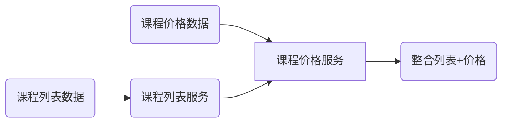
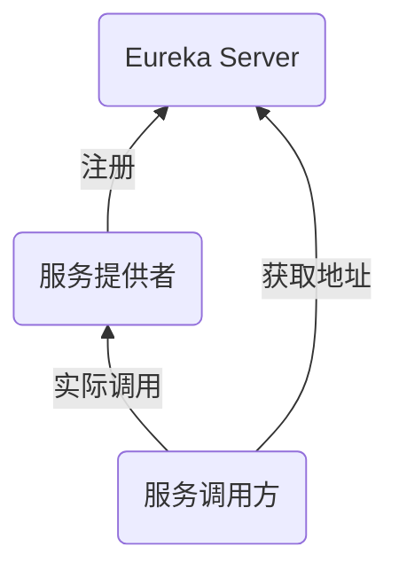

[TOC]

## Spring Cloud简介

* 成熟的微服务框架，定位为开发人员提供工具，以快速构建分布式系统


| 核心组件     | Spring Cloud                 |
| ------------ | ---------------------------- |
| 服务注册中心 | Spring Cloud Netflix Eureka  |
| 服务调用方式 | REST API、Feign、Ribbon      |
| 服务网关     | Spring Cloud Netflix Zuul    |
| 断路器       | Spring Cloud Netflix Hystrix |


## 项目整体设计

* 项目介绍：实现一个最小粒度的课程查询项目，两个模块，课程列表与课程价格
* 接口设计
  * 课程列表
  * 单个课程价格
  * 整合课程列表和价格
* 表设计


## 系统数据流向




## 创建项目和模块

1. 用Spring Initializr创建一个项目spring-cloud-course-practice   删掉src目录

2. 再右键spring-cloud-course-practice目录新建一个Moudle，名称为course-service并再次删掉src目录

3. 在course-service下创建两个Moudle，分别为course-list和course-price，注意创建时的父级为course-service

项目在E:\2022\Java\Proj\practice\spring-cloud-course-practice

## 报错

1.报错 No serializer found for class:

            实体类没有继承序列化接口Serializable
    
            实体类没有getter和setter方法

2.前台显示获取数据为null 但是数据库有数据

            在配置文件中添加配置
    
            mybatis.configuration.map-underscore-to-camel-case=true
    
           (对应识别实体类中驼峰命名属性和数据库中同名下划线属性)


## Eureka Server开发

### Eureka的作用和架构

**Eureka作用**：服务注册与发现，找到别的服务

* **如果没有euraka 服务之间调用需要ip，微服务中ip更换频繁**
* Eureka是Netflix的核心模块之一，可以用于定位服务的。
* Eureka分为Eureka Client和Eureka Server。
* Eureka Server提供服务注册，各个节点启动后，会在Eureka Server中进行注册。
* Eureka例子：医院总机

**Eureka架构**



### 开发Eureka Server

在跟项目下创建eureka-service模块，与course-service平级

* 引入依赖

  ```xml
  	eureka-service的pom.xml
  	<dependencies>
          <dependency>
              <groupId>org.springframework.cloud</groupId>
              <artifactId>spring-cloud-starter-netflix-eureka-server</artifactId>
          </dependency>
      </dependencies>
  
  	spring-cloud-course-practice的pom.xml
      <!-- 表示Spring Cloud的版本 -->
      <dependencyManagement>
          <dependencies>
              <dependency>
                  <groupId>org.springframework.cloud</groupId>
                  <artifactId>spring-cloud-dependencies</artifactId>
                  <version>Greenwich.SR5</version>
                  <type>pom</type>
                  <scope>import</scope>
              </dependency>
          </dependencies>
      </dependencyManagement>
  
  ```

* 配置文件  resources/application.properties

  ```properties
  spring.application.name=eureka-server
  server.port=8000
  eureka.instance.hostname=localhost
  # fetch-registry:获取注册表。这个项目不需要同步其他节点数据
  eureka.client.fetch-registry=false
  # 是否将注解注册到Eureka Service，默认是true
  eureka.client.register-with-eureka=false
  eureka.client.service-url.defaultZone=http://${eureka.instance.hostname}:${server.port}/eureka/
  ```

* 启动注解

  ```java
  /**
   * 描述：     Eureka服务端
   */
  @EnableEurekaServer
  @SpringBootApplication
  public class EurekaServerApplication {
      public static void main(String[] args) {
          SpringApplication.run(EurekaServerApplication.class, args);
      }
  }
  ```

  运行后可能会报错：Error creating bean with name ‘configurationPropertiesBeans‘ defined...

  这是SpringBoot与SpringCloud版本不兼容导致，去官网查看对应的版本

### 进行Eureka Client改造

course-service的子模块course-list与course-price


```xml
<!--spring cloud依赖添加-->
<dependency>
    <groupId>org.springframework.cloud</groupId>
    <artifactId>spring-cloud-starter-netflix-eureka-client</artifactId>
    <version>3.1.1</version>
</dependency>
```

application.properties

```properties
...
eureka.client.service-url.defaultZone=http://localhost:90/eureka/
```

## 服务整合

### 为什么用Feign实现服务间调用

* 使用Http实现服务之间调用需要配置请求头 请求类型以及内容等比较繁琐

* 使用Feign可以实现像调用本地方法一样实现服务之间的调用

### 集成Feign 

course-price需要调用course-list，所以在course-price模块下配置

*  引入依赖

  ```xml
  <dependency>
      <groupId>org.springframework.cloud</groupId>
      <artifactId>spring-cloud-starter-openfeign</artifactId>
  </dependency>
  ```

* 在主类上增加注解@EnableFeignClients

  ```java
  /**
   * CoursePrice控制入口类
   */
  @SpringBootApplication
  @EnableFeignClients
  public class CoursePriceApplication {
      public static void main(String[] args) {
          SpringApplication.run(CoursePriceApplication.class, args);
      }
  }
  ```

* 新建一个client/CourseListClient客户端接口类

    ```java
    /**
     * 描述：     课程列表的Feign客户端
     */
    @FeignClient(value = "course-list")
    @Primary
    public interface CourseListClient {
    
        @GetMapping("/courses")
        List<Course> courseList(); // Course要引入course-list依赖
    }

* 使用时，在controller中，首先@Autowired客户端类，然后即可直接使用

  ```java
      @Autowired
      CourseListClient courseListClient;
  
  	@GetMapping("/coursesInPrice")
      public List<Course> getCourseListInPrice(Integer courseId) {
          List<Course> courses = courseListClient.courseList();
          return courses;
      }
  ```

  

### 利用Ribbon实现负载均衡

##### 负载均衡策略

* 随机 RandomRule
* 轮询  RoundRobinRule
* 响应时间加权 ResponseTimeWeightedRule

course-price调用course-list时负载均衡配置，在application.properties中：

```properties
......
course-list.ribbon.NFLoadBanlancerRuleClassName=com.netflix.loadbalancer.RoundRobinRule
```

### 利用Hystrix实现断路器(熔断器)

断路器： 当某一个服务器发生故障时，返回默认消息，将其隔离出去。

断路器是Hysrtix一种熔断机制

##### 为什么需要Hystrix？

* 兜底的作用

##### 编码引入

* 在course-price模块引入依赖

  ```xml
  <dependency>
    <groupId>org.springframework.cloud</groupId>
    <artifactId>spring-cloud-starter-netflix-hystrix</artifactId>
  </dependency>
  ```

* 配置application.properties 

  ```properties
  # 默认为false
      feign.hystrix.enabled=true   
  ```

* 主类中增加注解@EnableHystrix（之前是@EnableCircuitBreaker，EnableHystrix已完全继承EnableCircuitBreaker）  

  ```java
  @SpringBootApplication
  @EnableFeignClients
  @EnableHystrix
  public class CoursePriceApplication {
      public static void main(String[] args) {
          SpringApplication.run(CoursePriceApplication.class, args);
      }
  }
  ```

* 在Feign中设置配置 发生短路时(fallback)需要做调用的类

  ```java
  @FeignClient(value = "course-list", fallback = CourseListClientHystrix.class)
  @Primary // @Primary 同类型的Bean有多个实例的时候，使用带有@Primary注解的那个
  public interface CourseListClient {
      @GetMapping("/courses")
      List<Course> courseList();
  }
  ```

* 编写短路情况下发生的内容的类：断路器实现类 实现客户端的接口

  ```java
  /**
   * 描述：     断路器实现类
   */
  @Component
  public class CourseListClientHystrix implements CourseListClient {
  
      @Override
      public List<Course> courseList() {
          List<Course> defaultCourses = new ArrayList<>();
          Course course = new Course();
          course.setId(1);
          course.setCourseId(1);
          course.setCourseName("默认课程");
          course.setValid(1);
          defaultCourses.add(course);
          return defaultCourses;
      }
  }
  ```


### 网关利用（集成Zuul）

**通过网关实现路由功能	**

* 把资金注册到Eureka这个注册中心
* 引入依赖
* 配置路由地址
* 利用网关实现过滤器
