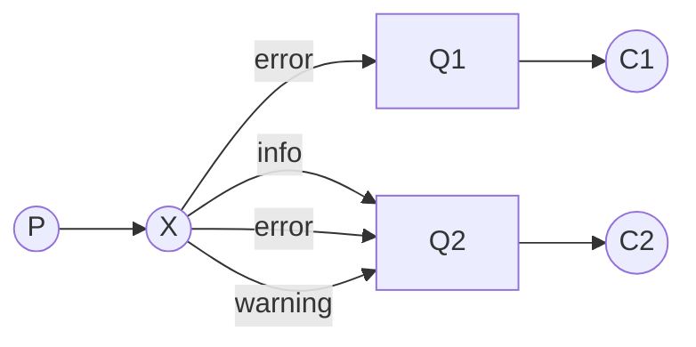
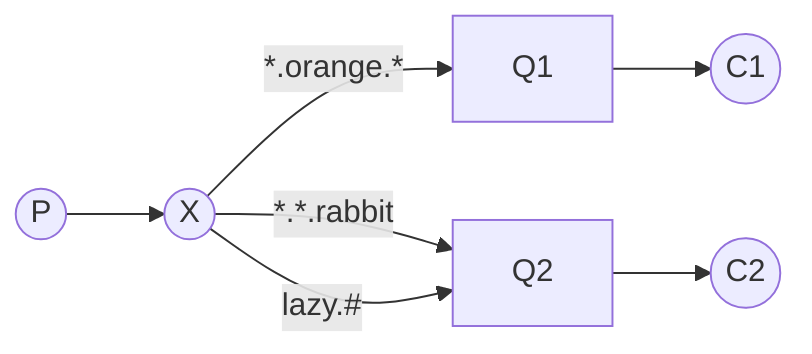

[TOC]

## 初始RabbitMQ

消息队列：接收并转发消息。类似于“快递公司”

* producer：消息的发送者、生产者

* consumer：消息的消费者，从队列获取消息，并且使用

* queue：先进先出(FIFO)，一个queue可以对应多个consumer


### 为什么要使用消息队列	

* 代码解耦，提高系统稳定性
* 流量削峰应对流量高峰，降低流量冲击
* 异步执行，提高系统响应速度（相当于银行的人在那里排队改为领取一个编号排队）


### 消息队列的特性

* 性能好
* 基础组件（通用的系统）
* 支持消息确认（如遇到突然断网,程序中断,没有给确认之前,未处理完的消息不会丢失,系统重启了,可以对消息重试或重新处理,保持消息的一致性.）


### RabbitMQ的特点

1. 路由能力灵活强大-路由是指经过什么样的路径发送给消费者.
2. 开源免费
3. 支持编程语言多
4. 应用广泛,社区活跃
5. 有开箱即用的监控和管理后台

### RabbitMQ的核心概念


Producer: 消息生产者

Message：消息，是由properties和body组成

Exchange：交换机，负责接收消息，并按照指定路由器转发到对应的消息队列。

Binding: 绑定交换机和队列

Routing Key：路由键，决定路由规则

Queue：队列，存储消息

Connection：连接服务器，与RabbitMQ服务建立的连接

Channel：信道，读写数据

Consumer：消费者

Broker：服务实例

Virtual Host: 虚拟主机，用于区分不同服务，类似于不同域名，不会相互影响。


## 安装RabbitMQ

### Linux下安装RabbitMQ

官方安装指南：https://www.rabbitmq.com/install-rpm.html

我们将要安装的RabbitMQ的版本是3.8.2

https://packagecloud.io/rabbitmq/rabbitmq-server/packages/el/7/rabbitmq-server-3.8.2-1.el7.noarch.rpm

不需要单独安装Erlang环境。

##### 1 环境配置：

前提：在一个新建的阿里云的Cent OS 7.6上安装，不要对yum换源，否则可能会安装失败。

echo "export LC_ALL=en_US.UTF-8"  >>  /etc/profile

source /etc/profile

下面两个安装方法，任选其一即可，推荐方法一：

##### 2 方法一（推荐）

第一步：执行

curl -s https://packagecloud.io/install/repositories/rabbitmq/rabbitmq-server/script.rpm.sh | sudo bash

第二步，执行：

curl -s https://packagecloud.io/install/repositories/rabbitmq/erlang/script.rpm.sh | sudo bash

第三步：sudo yum install rabbitmq-server-3.8.2-1.el7.noarch

第四步，看到类似以下的画面：

 

输入y

即可完成安装。

启动RabbitMQ

$ systemctl start rabbitmq-server

看看端口有没有起来，查看状态

$ rabbitmqctl status 

配置阿里云安全组，打开15672端口

添加admin用户：

rabbitmqctl add_user admin password

rabbitmqctl set_user_tags admin administrator

浏览器访问ip: 15672

用admin，密码password即可登录

##### 3 方法二（优先推荐方法一，如果方法一失败了，尝试本方法二）

导入密钥

rpm --import https://www.rabbitmq.com/rabbitmq-release-signing-key.asc

下载rpm安装包：

wget --content-disposition https://packagecloud.io/rabbitmq/rabbitmq-server/packages/el/7/rabbitmq-server-3.8.2-1.el7.noarch.rpm/download.rpm 

如果速度比较慢，就用：

wget https://github.com/rabbitmq/rabbitmq-server/releases/download/v3.8.2/rabbitmq-server-3.8.2-1.el7.noarch.rpm

或者下载教辅的安装包，然后scp  /Users/教辅/RabbitMQ教辅/rabbitmq-server-3.8.2-1.el7.noarch.rpm root@114.55.219.216:/root

下载完成后，安装：

yum install rabbitmq-server-3.8.2-1.el7.noarch.rpm

如果出现解压错误，说明下载了多次，用ls -la看一下有几个文件，如果有多个安装包，要把多余的删掉，把正确的改名为rabbitmq-server-3.8.2-1.el7.noarch.rpm，再执行yum install来安装

到这里RabbitMQ就安装好了

### RabbitMQ常用命令

开启web管理界面

rabbitmq-plugins enable rabbitmq_management

停止RabbitMQ

$rabbitmqctl stop

设置开机启动

$ systemctl enable rabbitmq-server 

启动RabbitMQ

$ systemctl start rabbitmq-server

看看端口有没有起来，查看状态

$ rabbitmqctl status 

要检查RabbitMQ服务器的状态，请运行：

systemctl status rabbitmq-server

### 2 Mac OS下的安装和启动

官方安装指南：https://www.rabbitmq.com/install-homebrew.html

在Mac OS X中使用brew工具，可以很容易的安装RabbitMQ的服务端，只需要按如下命令操作即可：

brew更新到最新版本，执行：brew update

安装Erlang，执行：brew install erlang

安装RabbitMQ Server，执行：brew install rabbitmq

通过上面的命令安装后，RabbitMQ Server的命令会被安装到/usr/local/opt/rabbitmq/sbin，并不会自动加到用户的环境变量中去：

启动Terminal

进入当前用户的home目录

输入 cd ~

编辑.bash_profile文件

输入open -e .bash_profile，这时./bash_profile就会打开，可以在后面加入要写入的环境变量（注意：从后往前读，注意覆盖）

所以我们需要在.bash_profile或.profile文件中增加下面内容：

export PATH=$PATH:/usr/local/opt/rabbitmq/sbin

保存文件，关闭.bash_profile

更新刚配置的环境变量

输入source .bash_profile

这样，我们就可以通过rabbitmq-server命令来启动RabbitMQ的服务端了。

rabbitmq-server

 \##  ##    RabbitMQ 3.8.2

 \##  ##

 \##########  Copyright (c) 2007-2019 Pivotal Software, Inc.

 \######  ##

 \##########  Licensed under the MPL 1.1. Website: https://rabbitmq.com

 Doc guides: https://rabbitmq.com/documentation.html

 Support:   https://rabbitmq.com/contact.html

 Tutorials:  https://rabbitmq.com/getstarted.html

 Monitoring: https://rabbitmq.com/monitoring.html

 Logs: /usr/local/var/log/rabbitmq/rabbit@localhost.log

​    /usr/local/var/log/rabbitmq/rabbit@localhost_upgrade.log

 Config file(s): (none)

 Starting broker... completed with 6 plugins.

打开管理后台

rabbitmq-plugins enable rabbitmq_management

添加admin账号，赋予administrator权限

rabbitmqctl add_user admin password

rabbitmqctl set_user_tags admin administrator

然后访问浏览器进入管理页面

### 3 Windows安装 （不推荐）

不推荐，因为要求系统用户名和计算机名必须是英文，而Win10改名比较麻烦，而且可能会有其他坑，而且和未来的实际工作场景严重不符，没有Windows作为服务器的。

官方安装指南：https://www.rabbitmq.com/install-windows.html

详细步骤：https://www.cnblogs.com/saryli/p/9729591.html

安装Erland，通过官方下载页面http://www.erlang.org/downloads获取exe安装包，直接打开并完成安装。

安装RabbitMQ，通过官方下载页面https://www.rabbitmq.com/install-windows.html获取exe安装包并安装，下载地址：https://github.com/rabbitmq/rabbitmq-server/releases/download/v3.8.2/rabbitmq-server-3.8.2.exe

下载完成后，直接运行安装程序。

RabbitMQ Server安装完成之后，会自动的注册为服务，并以默认配置启动起来。


 

用终端cmd输入：

cd E:\你的RabbitMQ按照地址\sbin\erl.exe

rabbitmq-server

## RabbitMQ的应用

### RabbitMQ的管理后台

rabbitmq-plugins enable rabbitmq_management (打开管理后台)

添加用户rabbitmqctl add_user admin password

将admin设为管理员rabbitmqctl set_user_tags admin administrator

然后就可以用guest访问[http://127.0.0.1:15672/#/](#/)

**如果有报错**：

**windows 安装 rabbitmq ERLANG_HOME not set correctl**

解决：

1. 看看环境变量ERLANG_HOME设为D:\DevTools\erl-24.3.4

   RABBITQM_SERVER值为D:\DevTools\RabbitMQ\rabbitmq_server-3.10.0

2. 打开rabbitmq_server.bat将"!ERLANG_HOME!\bin\erl.exe" +B ^ 改为绝对路径"D:\Program Files\erl9.3\bin\erl.exe" 

### IDEA中尝试运行多个客户端

选择 Edit Configurations 进入选项编辑，点击Modify options，在弹窗中选择Allow multiple instances

### 3-7 自由编程

**题目**

现有一个3个人的客服团队，她们要处理不断发送而来的咨询信息，有时咨询量很大，为了避免错过客户的咨询，于是使用了RabbitMQ消息队列来解决这个问题。请模拟这个场景，给三位工作人员分发咨询信息。

**实现思路**

1）写一个接收消息的类Receive

​     a. 创建连接工厂

​     b. 设置RabbitMQ地址

​     c. 建立连接

​     d. 获得信道

​     e. 声明队列

​     f. 接收消息

​     g. 启动三个该类的实例分别进行接收

2） 写一个接收类SendMassages

​     a.   创建连接工厂

​     b.   设置RabbitMQ地址

​     c.   建立连接

​     d.   获得信道

​     e.   声明队列

​     f.   循环发送10条信息

​    g.  关闭连接

## 交换机类型

### 交换机工作模式：

1、**fanout**：广播。场景—用于消费者接收相同消息

```
这种模式只需要将队列绑定到交换机上即可，是不需要设置路由键的（ 一个消息发送给交换机之后交换机会完全一样的分给每一个队列，每个消费者都能收到）
```

2、**direct**： 场景—用于消费者接收相同消息

```
根据RoutingKey匹配消息路由到指定的队列
日志案例：C1存储在磁盘只想要error类型。  C2是要打印到控制台中，每种都要
X:type=direct
```




3、**topic**：生产者指定RoutingKey消息根据消费端指定的队列通过模糊匹配的方式进行相应转发

```
* 可以代替一个单词
# 可以代替零个或多个单词
```

动物世界的例子，约定好的RoutingKey`<speed>.<colour>.<species>`，表示动物的速度、颜色、种类

* X:type=topic 
* Q1对所有橙色动物都感兴趣
* Q2关心兔子的一切，以及有关懒惰动物的一切。




4、headers(基本上不用)：根据发送消息内容中的headers属性来匹配


### **自由编程**

**题目：**

使用RabbitMQ的topic模式，实现以下内容：

我们来记录一下打怪兽游戏的日志，日志分为两类，包括用户日志和怪兽日志。当用户登录游戏、操作游戏发起攻击、闪躲与加血操作，会记录到用户日志中。当怪兽的发起攻击、闪躲、加血与用户攻击怪兽时记录在怪兽日志中。下面我们来模拟一下这个场景。

**实现思路：**

1）写一个测试类（Test），在测试类中发送消息 

a. 定义两个显示菜单的方法

 private static void loginList()

private static void gameList()

b. 在主方法中先创建连接工厂、设置RabbitMQ地址、建立连接、获得信道、声明队列。然后使用case语句完成主要程序逻辑，当输入对应的数字时模拟发布消息。最后关闭连接。

2） 写两个接收类UserLogsTopic、BossLogsTopic

a. 在主方法中先创建连接工厂，然后设置RabbitMQ地址、建立连接获得信道、 声明队列，最后接收消息 。


## SpringBoot整合RabbitMQ

*AMQP*，即Advanced Message Queuing Protocol 高级消息队列协议。RabbitMQ是基于AMQP协议。

### 生产者

1. pom.xml引入依赖

```xml
        <dependency>
            <groupId>org.springframework.boot</groupId>
            <artifactId>spring-boot-starter-amqp</artifactId>
        </dependency>
```

2. application.properties

```java
server.port=8080
spring.application.name=producer

spring.rabbitmq.addresses=127.0.0.1:5672
spring.rabbitmq.username=admin
spring.rabbitmq.password=password
spring.rabbitmq.virtual-host=/
spring.rabbitmq.connection-timeout=15000
```

3. rabbitmq配置类

```java
@Configuration
public class TopicRabbitConfig {
    @Bean
    public Queue queue1() {
        return new Queue("queue1");
    }
    @Bean
    public Queue queue2() {
        return new Queue("queue2");
    }
    @Bean
    TopicExchange exchange() {
        return new TopicExchange("bootExchange");
    }
    @Bean
    Binding bingdingExchangeMessage1(Queue queue1, TopicExchange exchange) {
        return BindingBuilder.bind(queue1).to(exchange).with("dog.red");
    }
    @Bean
    Binding bingdingExchangeMessage2(Queue queue2, TopicExchange exchange) {
        return BindingBuilder.bind(queue2).to(exchange).with("dog.#");
    }
}
```

4. 发送消息类


```java
/**
 * 描述：     发送消息
 */
@Component
public class MsgSender {
    @Autowired
    private AmqpTemplate rabbitmqTemplate;
    public void send1() {
        String message = "This is message 1, routing key is dog.red";
        System.out.println("发送了："+message);
        this.rabbitmqTemplate.convertAndSend("bootExchange", "dog.red", message);
    }
    public void send2() {
        String message = "This is message 2, routing key is dog.black";
        System.out.println("发送了："+message);
        this.rabbitmqTemplate.convertAndSend("bootExchange", "dog.black", message);
    }
}

```

5. 创建测试类

```java
@SpringBootTest
public class SpringBootRabbitmqProducerApplicationTests {
    @Autowired
    MsgSender msgSender;
    @Test
    public void send1() {
        msgSender.send1();
    }
    @Test
    public void send2(){
        msgSender.send2();
    }
}
```

### 消费者

引入依赖和application.properties和消费者一样，只是端口和名称改下

```xml
server.port=8081
spring.application.name=consumer
```

```java
/**
 * 描述：     消费者1
 */
@Component
@RabbitListener(queues = "queue1")
public class Receiver1 {
    @RabbitHandler
    public void process(String message) {
        System.out.println("Receiver1: " + message);
    }
}
/**
 * 描述：     消费者2
 */
@Component
@RabbitListener(queues = "queue2")
public class Receiver2 {
    @RabbitHandler
    public void process(String message) {
        System.out.println("Receiver2: " + message);
    }
}
```

最后执行Application文件启动SpringBoot


## @RabbitListener

消费者：

* @RabbitListener写在类上需配合@RabbitHandler->用于表示收到某队列对应类型的消息时，要执行的内容

* @RabbitHandler写在方法上，监听到队列debug中有消息时则会进行接收并处理

​       