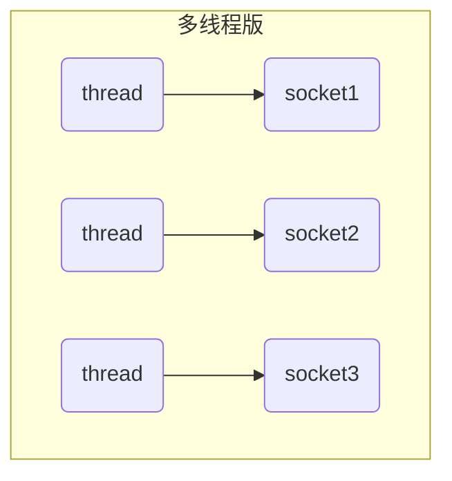
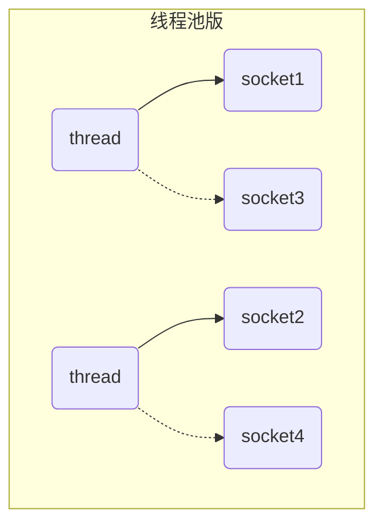
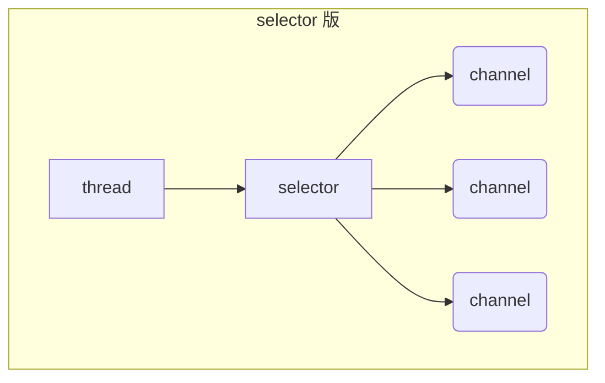
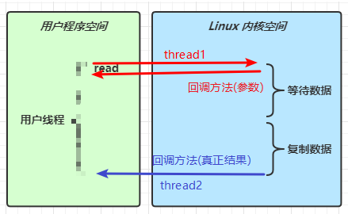
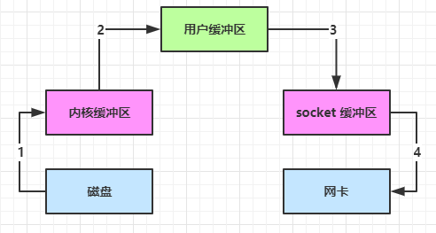

# 一. NIO基础


## 1. 三大组件

### 1.1 Channel与Buffer

**channel** 有一点类似于 stream，它就是读写数据的**双向通道**，可以从 channel 将数据读入 buffer，也可以将 buffer 的数据写入 channel，而之前的 stream 要么是输入，要么是输出，channel 比 stream 更为底层


常见的 Channel 有

- FileChannel
- DatagramChannel
- SocketChannel
- ServerSocketChannel

**buffer** 则用来缓冲读写数据，常见的 buffer 有

- ByteBuffer
  - MappedByteBuffer
  - DirectByteBuffer
  - HeapByteBuffer
- ShortBuffer
- IntBuffer
- LongBuffer
- FloatBuffer
- DoubleBuffer
- CharBuffer

### 1.2 Selector 

在使用Selector之前，处理socket连接还有以下两种方法 

#### **使用多线程技术** 

为每个连接分别开辟一个线程，分别去处理对应的socke连接




#### ⚠️ 多线程版缺点

- 内存占用高
- 线程上下文切换成本高
- 只适合连接数少的场景

#### **使用线程池技术**

使用线程池，让线程池中的线程去处理连接




#### ⚠️ 线程池版缺点

- 阻塞模式下，线程仅能处理一个 socket 连接
- 仅适合短连接场景

#### **使用选择器**

selector 的作用就是配合一个线程来管理多个 channel，获取这些 channel 上发生的事件，这些 channel 工作在非阻塞模式下，不会让线程吊死在一个 channel 上。适合连接数特别多，但流量低的场景（low traffic）



调用 selector 的 select() 会阻塞直到 channel 发生了读写就绪事件，这些事件发生，select 方法就会返回这些事件交给 thread 来处理

## 2. ByteBuffer

### 2.1 ByteBuffer 正确使用姿势

1. 向 buffer 写入数据，例如调用 channel.read(buffer)
2. 调用 flip() 切换至**读模式**
3. 从 buffer 读取数据，例如调用 buffer.get()
4. 调用clear() 或 compact() 切换至**写模式**
5. 重复 1~4 步骤


### 2.2 ByteBuffer 结构

ByteBuffer 有以下重要属性

* capacity
* position
* limit

https://www.bilibili.com/video/BV1py4y1E7oA?p=7

具体还可看netty-demo中test里面的TestByteBufferReadWrite


### 2.3 ByteBuffer 常见方法

#### 分配空间

可以使用 allocate 方法为 ByteBuffer 分配空间， 其他 buffer 类也有该方法

```java
Bytebuffer buf = ByteBuffer.allocate(16);
```


#### 向 buffer 写入数据

有两种办法

* 调用 channel 的 read 方法
* 调用 buffer 自己的 put 方法

``` java
int readBytes = channel.read(buf);
```

和

```java
buf.put((byte)127);
```


#### 从 buffer 读取数据

同样有两种办法

* 调用 channel 的 write 方法
* 调用 buffer 自己的 get 方法

```java
int writeBytes = channel.write(buf)
```

和

```java
byte b = buf.get();
```

get 方法会让 position 读指针向后走，如果想重复读取数据

* 可以调用 rewind 方法将 position 重新置为 0
* 或者调用 **get(int i)** 方法获取索引 i 的内容， 它就不会移动读指针


#### rewind 

从头开始读

```java
// 'a', 'b', 'c', 'd'
buffer.get(new byte[4]);
debugAll(buffer);
buffer.rewind();
System.out.println((char) buffer.get());
```

```
+--------+-------------------- all ------------------------+----------------+
position: [4], limit: [4]
         +-------------------------------------------------+
         |  0  1  2  3  4  5  6  7  8  9  a  b  c  d  e  f |
+--------+-------------------------------------------------+----------------+
|00000000| 61 62 63 64 00 00 00 00 00 00                   |abcd......      |
+--------+-------------------------------------------------+----------------+
a
```


#### mark & reset

mark 做一个标记，记录 position 位置， reset 是将 position 重置到 mark 的位置

```java
// 'a', 'b', 'c', 'd'
System.out.println((char) buffer.get());
System.out.println((char) buffer.get());
buffer.mark(); // 加标记，索引2 的位置
System.out.println((char) buffer.get());
System.out.println((char) buffer.get());
buffer.reset(); // 将 position 重置到索引 2
System.out.println((char) buffer.get());
System.out.println((char) buffer.get());
/*
a
b
c
d
c
d
/*
```

#### get(i) 

不会改变读索引的位置

```java
System.out.println((char) buffer.get(3));
debugAll(buffer);
```

```
d
+--------+-------------------- all ------------------------+----------------+
position: [0], limit: [4]
         +-------------------------------------------------+
         |  0  1  2  3  4  5  6  7  8  9  a  b  c  d  e  f |
+--------+-------------------------------------------------+----------------+
|00000000| 61 62 63 64 00 00 00 00 00 00                   |abcd......      |
+--------+-------------------------------------------------+----------------+
```


#### 字符串与 ByteBuffer 互转

```java
// 字符串转为 ByteBuffer 3种方法
// 1. 原始方法
ByteBuffer buffer1 = ByteBuffer.allocate(16);
buffer1.put("hello".getBytes());
debugAll(buffer1);
// 2. Charset
ByteBuffer buffer2 = StandardCharsets.UTF_8.encode("hello"); // 会自动转为
debugAll(buffer2);
// 3. wrap
ByteBuffer buffer3 = ByteBuffer.wrap("hello".getBytes());
debugAll(buffer3);


// ByteBuffer 转字符串
// 2 和 3 都是直接切换到读模式 再转可以不用filp()切换到读模式
String str1 = StandardCharsets.UTF_8.decode(buffer2).toString();
System.out.println(str1);
// 1方法再转就要用filp()转成读模式
buffer1.flip();
String str2 = StandardCharsets.UTF_8.decode(buffer1).toString();
System.out.println(str2);
```


### 2.4 分散读与集中写

主要是一种思想，可以减少数据再ByteBuffer之间的拷贝，变相的提高了效率

#### 2.4.1 Scattering Reads

分散读取，有一个文本words.txt

```
onetwothree
```

**需求**：读取words.txt中的onetwothree，并输出one、two、three

**思路** (重点)

1. 将数据存入一个ByteBuffer，之后再用别的方法拆分成三组，涉及到数据重新的分割复制
2. 读取时一次读到3个ByteBuffer (分散读取)

```java
// 分散读取
try (FileChannel channel = new RandomAccessFile("words.txt", "r").getChannel()) {
  ByteBuffer b1 = ByteBuffer.allocate(3);
  ByteBuffer b2 = ByteBuffer.allocate(3);
  ByteBuffer b3 = ByteBuffer.allocate(5);
  channel.read(new ByteBuffer[]{b1, b2, b3});
  b1.flip();
  b2.flip();
  b3.flip();
  debugAll(b1);
  debugAll(b2);
  debugAll(b3);
} catch (IOException e) {
  e.printStackTrace();
}
```

```
+--------+-------------------- all ------------------------+----------------+
position: [0], limit: [3]
         +-------------------------------------------------+
         |  0  1  2  3  4  5  6  7  8  9  a  b  c  d  e  f |
+--------+-------------------------------------------------+----------------+
|00000000| 6f 6e 65                                        |one             |
+--------+-------------------------------------------------+----------------+
+--------+-------------------- all ------------------------+----------------+
position: [0], limit: [3]
         +-------------------------------------------------+
         |  0  1  2  3  4  5  6  7  8  9  a  b  c  d  e  f |
+--------+-------------------------------------------------+----------------+
|00000000| 74 77 6f                                        |two             |
+--------+-------------------------------------------------+----------------+
+--------+-------------------- all ------------------------+----------------+
position: [0], limit: [5]
         +-------------------------------------------------+
         |  0  1  2  3  4  5  6  7  8  9  a  b  c  d  e  f |
+--------+-------------------------------------------------+----------------+
|00000000| 74 68 72 65 65                                  |three           |
+--------+-------------------------------------------------+----------------+
```


#### 2.4.2 Gathering Writes

需求：三个ByteBuffer写入到一个文件中

思路：

1. 三个ByteBuffer组合到一个大的ByteBuffer中，涉及到数据到多次拷贝
2. 三个ByteBuffer组合到一起，以一个整体写入（集中写）


```java
ByteBuffer b1 = StandardCharsets.UTF_8.encode("hello");
ByteBuffer b2 = StandardCharsets.UTF_8.encode("world");
ByteBuffer b3 = StandardCharsets.UTF_8.encode("你好");

try (FileChannel channel = new RandomAccessFile("words2.txt", "rw").getChannel()) {
    channel.write(new ByteBuffer[]{b1, b2, b3});
} catch (IOException e) {
    e.printStackTrace();
}
```


### 2.5 粘包与半包

#### 现象

网络上有多条数据发送给服务端，数据之间使用 \n 进行分隔
但由于某种原因这些数据在接收时，被进行了重新组合，例如原始数据有3条为

- Hello,world\n
- I’m Nyima\n
- How are you?\n

变成了下面的两个 byteBuffer (粘包，半包)

- Hello,world\nI’m Nyima\nHo
- w are you?\n

#### 出现原因

**粘包**

发送方在发送数据时，并不是一条一条地发送数据，而是**将数据整合在一起**，当数据达到一定的数量后再一起发送。这就会导致多条信息被放在一个缓冲区中被一起发送出去

**半包**

接收方的缓冲区的大小是有限的，当接收方的缓冲区满了以后，就需要**将信息截断**，等缓冲区空了以后再继续放入数据。这就会发生一段完整的数据最后被截断的现象

#### 解决办法

下面只是原始解法，要会，这样才能知道netty帮我们做了哪些事情

```java
   // 解决粘包和半包问题，下面只是原始解法，要会，这样才能知道netty帮我们做了哪些事情
    public static void main(String[] args) {
        /*
            网络上有多条数据发送给服务端，数据之间使用 \n 进行分隔
            但由于某种原因这些数据在接收时，被进行了重新组合，例如原始数据有3条为
            - Hello,world\n
            - I’m Nyima\n
            - How are you?\n
            变成了下面的两个 byteBuffer (粘包，半包)
            - Hello,world\nI’m Nyima\nHo
            - w are you?\n
            现在要求你编写程序，将错误的数据恢复成原始按 \n 分割的数据
         */
        ByteBuffer source = ByteBuffer.allocate(32);
      	// 模拟粘包+半包
        source.put("Hello,world\nI'm zhangsan\nHo".getBytes());
        split(source);
        source.put("w are you ?\n".getBytes());
        split(source);
    }

    public static void split(ByteBuffer source) {
      	// 切换为读模式
        source.flip();
        for (int i = 0; i < source.limit(); i++) {
            // 找到一条完整消息
            if (source.get(i) == '\n') { // get(i)不会移动position
                int length = i + 1 - source.position(); // 当前位置 - 读指针位置
                // 把这条完整消息存入新的 ByteBuffers
                ByteBuffer target = ByteBuffer.allocate(length);
                // 从source 读，向 target 写
                for (int j = 0; j < length; j++) {
                    target.put(source.get()); // get 方法会让 position 读指针向后走
                }
                debugAll(target);
            }
        }
        // 切换为写模式，但是缓冲区可能未读完，这里需要使用compact
        source.compact();
    }
```


## 3. 文件编程

重点是网络编程，文件编程只了解即可

### 3.1 FileChannel

#### :warning: 注意

> FileChannel 只能工作再阻塞模式下  不能配合Selector


#### 获取

不能直接打开 FileChannel，**必须**通过 FileInputStream、FileOutputStream 或者 RandomAccessFile 来获取 FileChannel，它们都有 getChannel 方法

- 通过 FileInputStream 获取的 channel **只能读**
- 通过 FileOutputStream 获取的 channel **只能写**
- 通过 RandomAccessFile 是否能读写**根据构造 RandomAccessFile 时的读写模式决定**


#### 读取

会从 channel 读取数据填充 ByteBuffer，返回值表示读到了多少字节，-1 表示到达了文件的末尾

```java
int readBytes = channel.read(buffer)
```


#### 写入

因为channel也是有大小的，所以 write 方法并不能保证一次将 buffer 中的内容全部写入 channel。必须**需要按照以下规则进行写入**

```java
// 通过hasRemaining()方法查看缓冲区中是否还有数据未写入到通道中
while(buffer.hasRemaining()) {
	channel.write(buffer);
}
```


#### 关闭

channel必须关闭，一般情况通过try-with-resource进行关闭。

调用了 FileInputStream、FileOutputStream 或者 RandomAccessFile 的 close 方法会间接的调用 channel 的 close 方法


#### 位置

**position**

channel也拥有一个保存读取数据位置的属性，即position

```java
long pos = channel.position();
```

可以通过position(int pos)设置channel中position的值

```java
long newPos = ...;
channel.position(newPos);
```

设置当前位置时，如果设置为文件的末尾

- 这时读取会返回 -1
- 这时写入，会追加内容，但要注意如果 position 超过了文件末尾，再写入时在新内容和原末尾之间会有空洞（00）


#### 大小

使用 size() 方法获取文件的大小


#### 强制写入

操作系统出于性能的考虑，会将数据缓存，不是立刻写入磁盘，而是等到缓存满了以后将所有数据一次性的写入磁盘。可以调用 **force(true)** 方法将文件内容和元数据（文件的权限等信息）立刻写入磁盘


### 3.2 两个 Channel 传输数据

transferTo 方法，大小限制2G，但可以多次传输

```java
        try (
                FileChannel from = new FileInputStream("data.txt").getChannel();
                FileChannel to = new FileOutputStream("to.txt").getChannel();
        ) {
            // 效率高，底层会利用操作系统的零拷贝进行优化, 有2G数据限制
            long size = from.size();
            // left 变量代表还剩余多少字节
            for (long left = size; left > 0; ) {
                System.out.println("position:" + (size - left) + " left:" + left);
                left -= from.transferTo((size - left), left, to);
            }
            from.transferTo(0, from.size(), to);
        } catch (IOException e) {
            e.printStackTrace();
        }
```

### 3.3 Path

- Path 用来表示文件路径
- Paths 是工具类，用来获取 Path 实例

```
Path source = Paths.get("1.txt"); // 相对路径 不带盘符 使用 user.dir 环境变量来定位 1.txt

Path source = Paths.get("d:\\1.txt"); // 绝对路径 代表了  d:\1.txt 反斜杠需要转义

Path source = Paths.get("d:/1.txt"); // 绝对路径 同样代表了  d:\1.txt

Path projects = Paths.get("d:\\data", "projects"); // 代表了  d:\data\projectsCopy
```

- `.` 代表了当前路径
- `..` 代表了上一级路径

例如目录结构如下

```
d:
	|- data
		|- projects
			|- a
			|- bCopy
```

代码

```
Path path = Paths.get("d:\\data\\projects\\a\\..\\b");
System.out.println(path);
System.out.println(path.normalize()); // 正常化路径 会去除 . 以及 ..Copy
```

输出结果为

```
d:\data\projects\a\..\b
d:\data\projects\bCopy
```

### 3.4 Files

#### 查找

检查文件是否存在

```
Path path = Paths.get("helloword/data.txt");
System.out.println(Files.exists(path));Copy
```

#### 创建

创建**一级目录**

```
Path path = Paths.get("helloword/d1");
Files.createDirectory(path);Copy
```

- 如果目录已存在，会抛异常 FileAlreadyExistsException
- 不能一次创建多级目录，否则会抛异常 NoSuchFileException

创建**多级目录用**

```
Path path = Paths.get("helloword/d1/d2");
Files.createDirectories(path);Copy
```

#### 拷贝及移动

**拷贝文件**

```
Path source = Paths.get("helloword/data.txt");
Path target = Paths.get("helloword/target.txt");

Files.copy(source, target);Copy
```

- 如果文件已存在，会抛异常 FileAlreadyExistsException

如果希望用 source **覆盖**掉 target，需要用 StandardCopyOption 来控制

```
Files.copy(source, target, StandardCopyOption.REPLACE_EXISTING);Copy
```

移动文件

```
Path source = Paths.get("helloword/data.txt");
Path target = Paths.get("helloword/data.txt");

Files.move(source, target, StandardCopyOption.ATOMIC_MOVE);Copy
```

- **StandardCopyOption.ATOMIC_MOVE 保证文件移动的原子性**

#### 删除

删除文件

```
Path target = Paths.get("helloword/target.txt");

Files.delete(target);Copy
```

- 如果文件不存在，会抛异常 NoSuchFileException

删除目录

```
Path target = Paths.get("helloword/d1");

Files.delete(target);Copy
```

- 如果**目录还有内容**，会抛异常 DirectoryNotEmptyException

#### 删除多级目录

```java
Files.walkFileTree(Paths.get("路径"), new SimpleFileVisitor<Path>() {
    @Override
    public FileVisitResult visitFile(Path file, BasicFileAttributes attrs) throws IOException {
        // 访问目录时删除目录里面的文件
        Files.delete(file);
        return super.visitFile(file, attrs);
    }
    @Override
    public FileVisitResult postVisitDirectory(Path dir, IOException exc) throws IOException {
        // 退出目录时删除目录
        Files.delete(dir);
        return super.postVisitDirectory(dir, exc);
    }
});
```


#### 遍历多级目录

```java
Path path = Paths.get("/Users/wh37/Documents/Doc/Netty/netty-demo");
// 文件目录数目
AtomicInteger dirCount = new AtomicInteger();
// 文件数目
AtomicInteger fileCount = new AtomicInteger();
Files.walkFileTree(path, new SimpleFileVisitor<Path>(){
    @Override
    public FileVisitResult preVisitDirectory(Path dir, BasicFileAttributes attrs) throws IOException {
        System.out.println("===>"+dir);
        // 增加文件目录数
        dirCount.incrementAndGet();
        return super.preVisitDirectory(dir, attrs);
    }

    @Override
    public FileVisitResult visitFile(Path file, BasicFileAttributes attrs) throws IOException {
        System.out.println(file);
        // 增加文件数
        fileCount.incrementAndGet();
        return super.visitFile(file, attrs);
    }

});
// 打印数目
System.out.println("文件目录数:"+dirCount.get());
System.out.println("文件数:"+fileCount.get());
```


#### 拷贝多级目录

```java
String source = "/Users/wh37/Documents/Doc/Netty/netty-demo/logs";
String target = "/Users/wh37/Documents/Doc/Netty/netty-demo/logs-test-copy";

Files.walk(Paths.get(source)).forEach(path -> {
    try {
        String targetName = path.toString().replace(source, target);
        // 是目录
        if (Files.isDirectory(path)) {
            Files.createDirectory(Paths.get(targetName));
        }
        // 是普通文件
        else if (Files.isRegularFile(path)) {
            Files.copy(path, Paths.get(targetName));
        }
    } catch (IOException e) {
        e.printStackTrace();
    }
});
```


## 4. 网络编程


### 4.1 非阻塞 vs 阻塞

#### 阻塞

- 阻塞模式下，相关方法都会导致线程暂停
  - ServerSocketChannel.accept 会在没有连接建立时让线程暂停
  - SocketChannel.read 会在没有数据可读时让线程暂停
  - 阻塞的表现其实就是线程暂停了，暂停期间不会占用 cpu，但线程相当于闲置
- 单线程下，阻塞方法之间相互影响，几乎不能正常工作，需要多线程支持
- 但多线程下，有新的问题，体现在以下方面
  - 32 位 jvm 一个线程 320k，64 位 jvm 一个线程 1024k，如果连接数过多，必然导致 OOM，并且线程太多，反而会因为频繁上下文切换导致性能降低
  - 可以采用线程池技术来减少线程数和线程上下文切换，但治标不治本，如果有很多连接建立，但长时间 inactive，会阻塞线程池中所有线程，因此不适合长连接，只适合短连接

```java
// 使用 nio 来理解阻塞模式，单线程
// 0. ByteBuffer
ByteBuffer buffer = ByteBuffer.allocate(16);
// 1. 创建服务器
ServerSocketChannel ssc = ServerSocketChannel.open();
// 2. 绑定监听端口
ssc.bind(new InetSocketAddress(8880));
// 3. 连接集合
List<SocketChannel> channels = new ArrayList<>();
while (true) {
    // 4. accept 建立与客户端连接，SocketChannel 用来与客户端直接通信
    log.debug("connecting...");
    SocketChannel sc = ssc.accept(); // 阻塞方法，线程停止运行
    log.debug("connected... {}", sc);
    channels.add(sc);
    for (SocketChannel channel : channels) {
        // 5. 接收客户端发送的消息
        log.debug("before read... {}", channel);
        channel.read(buffer); // 阻塞方法，线程停止运行; 当通道中没有数据可读时，会阻塞线程
        buffer.flip();
        debugRead(buffer);
        buffer.clear();
        log.debug("after read...{}", channel);
    }
}

// Client
SocketChannel sc = SocketChannel.open();
sc.connect(new InetSocketAddress("localhost", 8880));
System.out.println("waiting...");
```


#### 非阻塞

* 非阻塞模式下，相关方法都会不会让线程暂停
  - 在 ServerSocketChannel.accept 在没有连接建立时，会返回 null，继续运行
  - SocketChannel.read 在没有数据可读时，会返回 0，但线程不必阻塞，可以去执行其它 SocketChannel 的 read 或是去执行 ServerSocketChannel.accept
  - 写数据时，线程只是等待数据写入 Channel 即可，无需等 Channel 通过网络把数据发送出去
* 但非阻塞模式下，即使没有连接建立，和可读数据，线程仍然在不断运行，白白浪费了 cpu
* 数据复制过程中，线程实际还是阻塞的（AIO 改进的地方）

```java
// 0. ByteBuffer
ByteBuffer buffer = ByteBuffer.allocate(16);
// 1. 创建服务器
ServerSocketChannel ssc = ServerSocketChannel.open();
ssc.configureBlocking(false); // 非阻塞模式
// 2. 绑定监听端口
ssc.bind(new InetSocketAddress(8880));
// 3. 连接集合
List<SocketChannel> channels = new ArrayList<>();
while (true) {
    // 4. accept 建立与客户端连接，SocketChannel 用来与客户端直接通信
    SocketChannel sc = ssc.accept(); // 非阻塞，线程还会继续运行，如果没有链接建立sc是null
    if (sc != null) {
        log.debug("connected... {}", sc);
        sc.configureBlocking(false); // 非阻塞模式
        channels.add(sc);
    }
    for (SocketChannel channel : channels) {
        // 5. 接收客户端发送的消息
        int read = channel.read(buffer);// 非阻塞，线程仍然会继续执行，如果没有读到数据，read 返回 0
        if (read >0) {
            buffer.flip();
            debugRead(buffer);
            buffer.clear();
            log.debug("after read...{}", channel);
        }
    }
}

// Client
SocketChannel sc = SocketChannel.open();
sc.connect(new InetSocketAddress("localhost", 8880));
System.out.println("waiting...");
```


#### 多路复用

单线程可以配合 Selector 完成对多个 Channel 可读写事件的监控，这称之为多路复用

- 多路复用仅针对网络 IO、普通文件 IO 没法利用多路复用
- 如果不用 Selector 的非阻塞模式，线程大部分时间都在做无用功，而 Selector 能够保证
  - 有可连接事件时才去连接
  - 有可读事件才去读取
  - 有可写事件才去写入
    - 限于网络传输能力，Channel 未必时时可写，一旦 Channel 可写，会触发 Selector 的可写事件


### 4.2 Selector


好处

- 一个线程配合 selector 就可以监控多个 channel 的事件，事件发生线程才去处理。避免非阻塞模式下所做无用功
- 让这个线程能够被充分利用
- 节约了线程的数量
- 减少了线程上下文切换


#### 创建

```java
Selector selector = Selector.open();
```


#### 绑定 Channel 事件

也称之为注册事件，绑定的事件 selector 才会关心

```java
channel.configureBlocking(false);
SelectionKey key = channel.register(selector, 绑定事件);
```

- channel 必须工作在非阻塞模式
- FileChannel 没有非阻塞模式，因此不能配合 selector 一起使用
- 绑定的事件类型可以有
  - connect - 客户端连接成功时触发
  - accept - 服务器端成功接受连接时触发
  - read - 数据可读入时触发，有因为接收能力弱，数据暂不能读入的情况
  - write - 数据可写出时触发，有因为发送能力弱，数据暂不能写出的情况


#### 监听 Channel 事件

可以通过下面三种方法来监听是否有事件发生，方法的返回值代表有多少 channel 发生了事件

方法1，阻塞直到绑定事件发生

```java
int count = selector.select();
```


方法2，阻塞直到绑定事件发生，或是超时（时间单位为 ms）

```java
int count = selector.select(long timeout);
```


方法3，不会阻塞，也就是不管有没有事件，立刻返回，自己根据返回值检查是否有事件

```java
int count = selector.selectNow();
```


### 💡 select 何时不阻塞

> - 事件发生时
>   - 客户端发起连接请求，会触发 accept 事件
>   - 客户端发送数据过来，客户端正常、异常关闭时，都会触发 read 事件，另外如果发送的数据大于 buffer 缓冲区，会触发多次读取事件
>   - channel 可写，会触发 write 事件
>   - 在 linux 下 nio bug 发生时
> - 调用 selector.wakeup()
> - 调用 selector.close()
> - selector 所在线程 interrupt


### 4.3 处理 accept 事件

客户端代码

```java
public class Client {
    public static void main(String[] args) {
        try (Socket socket = new Socket("localhost", 8080)) {
            System.out.println(socket);
            socket.getOutputStream().write("world".getBytes());
            System.in.read();
        } catch (IOException e) {
            e.printStackTrace();
        }
    }
}
```

服务端代码

```java
@Slf4j
public class Server {
    public static void main(String[] args) {
        try (ServerSocketChannel channel = ServerSocketChannel.open()) {
          
            channel.bind(new InetSocketAddress(8080));
            System.out.println(channel);
            Selector selector = Selector.open();
            channel.configureBlocking(false);
            channel.register(selector, SelectionKey.OP_ACCEPT);

            while (true) {
                int count = selector.select();
                log.debug("select count: {}", count);
                // 获取所有事件
                Set<SelectionKey> keys = selector.selectedKeys();

                // 遍历所有事件，逐一处理
                Iterator<SelectionKey> iter = keys.iterator();
                while (iter.hasNext()) {
                    SelectionKey key = iter.next();
                    // 判断事件类型
                    if (key.isAcceptable()) {
                        ServerSocketChannel c = (ServerSocketChannel) key.channel();
                        // 必须处理
                        SocketChannel sc = c.accept();
                        log.debug("{}", sc);
                    }
                    // 处理完毕，必须将事件移除
                    iter.remove();
                }
            }
        } catch (IOException e) {
            e.printStackTrace();
        }
    }
}
```


#### 💡 事件发生后能否不处理

> 事件发生后，要么处理，要么取消（cancel），不能什么都不做，否则下次该事件仍会触发，这是因为 nio 底层使用的是水平触发


### 4.4 处理 read 事件

```java
@Slf4j
public class Server {
    public static void main(String[] args) {
        try (ServerSocketChannel channel = ServerSocketChannel.open()) {
            channel.bind(new InetSocketAddress(8080));
            System.out.println(channel);
            Selector selector = Selector.open();
            channel.configureBlocking(false);
            channel.register(selector, SelectionKey.OP_ACCEPT);

            while (true) {
                int count = selector.select();
                log.debug("select count: {}", count);

                // 获取所有事件
                Set<SelectionKey> keys = selector.selectedKeys();

                // 遍历所有事件，逐一处理
                Iterator<SelectionKey> iter = keys.iterator();
                while (iter.hasNext()) {
                    SelectionKey key = iter.next();
                    // 判断事件类型
                    if (key.isAcceptable()) {
                        ServerSocketChannel c = (ServerSocketChannel) key.channel();
                        // 必须处理
                        SocketChannel sc = c.accept();
                        sc.configureBlocking(false);
                        sc.register(selector, SelectionKey.OP_READ);
                        log.debug("连接已建立: {}", sc);
                    } else if (key.isReadable()) {
                        SocketChannel sc = (SocketChannel) key.channel();
                        ByteBuffer buffer = ByteBuffer.allocate(128);
                        int read = sc.read(buffer);
                        if(read == -1) {
                            key.cancel();
                            sc.close();
                        } else {
                            buffer.flip();
                            debug(buffer);
                        }
                    }
                    // 处理完毕，必须将事件移除
                    iter.remove();
                }
            }
        } catch (IOException e) {
            e.printStackTrace();
        }
    }
}
```

开启两个客户端，修改一下发送文字，输出

```
sun.nio.ch.ServerSocketChannelImpl[/0:0:0:0:0:0:0:0:8080]
21:16:39 [DEBUG] [main] c.i.n.ChannelDemo6 - select count: 1
21:16:39 [DEBUG] [main] c.i.n.ChannelDemo6 - 连接已建立: java.nio.channels.SocketChannel[connected local=/127.0.0.1:8080 remote=/127.0.0.1:60367]
21:16:39 [DEBUG] [main] c.i.n.ChannelDemo6 - select count: 1
         +-------------------------------------------------+
         |  0  1  2  3  4  5  6  7  8  9  a  b  c  d  e  f |
+--------+-------------------------------------------------+----------------+
|00000000| 68 65 6c 6c 6f                                  |hello           |
+--------+-------------------------------------------------+----------------+
21:16:59 [DEBUG] [main] c.i.n.ChannelDemo6 - select count: 1
21:16:59 [DEBUG] [main] c.i.n.ChannelDemo6 - 连接已建立: java.nio.channels.SocketChannel[connected local=/127.0.0.1:8080 remote=/127.0.0.1:60378]
21:16:59 [DEBUG] [main] c.i.n.ChannelDemo6 - select count: 1
         +-------------------------------------------------+
         |  0  1  2  3  4  5  6  7  8  9  a  b  c  d  e  f |
+--------+-------------------------------------------------+----------------+
|00000000| 77 6f 72 6c 64                                  |world           |
+--------+-------------------------------------------------+----------------+
```


#### 💡 为何要 iter.remove()

> 因为 select 在事件发生后，就会将相关的 key 放入 selectedKeys 集合，但不会在处理完后从 selectedKeys 集合中移除，需要我们自己编码删除。例如
>
> - 第一次触发了 ssckey 上的 accept 事件，没有移除 ssckey
> - 第二次触发了 sckey 上的 read 事件，但这时 selectedKeys 中还有上次的 ssckey ，在处理时因为没有真正的 serverSocket 连上了，就会导致空指针异常


#### 💡 cancel 的作用

> cancel 会取消注册在 selector 上的 channel，并从 keys 集合中删除 key 后续不会再监听事件


#### **不处理边界的问题**

将缓冲区的大小设置为4个字节，发送2个汉字（你好），通过decode解码并打印时，会出现乱码

```
ByteBuffer buffer = ByteBuffer.allocate(4);
// 解码并打印
System.out.println(StandardCharsets.UTF_8.decode(buffer));Copy
你�
��Copy
```

这是因为UTF-8字符集下，1个汉字占用3个字节，此时缓冲区大小为4个字节，**一次读时间无法处理完通道中的所有数据，所以一共会触发两次读事件**。这就导致 `你好` 的 `好` 字被拆分为了前半部分和后半部分发送，解码时就会出现问题


#### **处理消息的边界**

传输的文本可能有以下三种情况

- 文本大于缓冲区大小
  - 此时需要将缓冲区进行扩容
- 发生半包现象
- 发生粘包现象

解决思路大致有以下三种

- **固定消息长度**，数据包大小一样，服务器按预定长度读取，当发送的数据较少时，需要将数据进行填充，直到长度与消息规定长度一致。缺点是浪费带宽

- 另一种思路是按分隔符拆分，缺点是效率低，需要一个一个字符地去匹配分隔符

- TLV 格式，即 Type 类型、Length 长度、Value 数据

  （也就是在消息开头

  用一些空间存放后面数据的长度

  ），如HTTP请求头中的Content-Type与

  Content-Length

  。类型和长度已知的情况下，就可以方便获取消息大小，分配合适的 buffer，缺点是 buffer 需要提前分配，如果内容过大，则影响 server 吞吐量

  - Http 1.1 是 TLV 格式
  - Http 2.0 是 LTV 格式

下文的消息边界处理方式为**第二种：按分隔符拆分**

**附件与扩容**

Channel的register方法还有**第三个参数**：`附件`，可以向其中放入一个Object类型的对象，该对象会与登记的Channel以及其对应的SelectionKey绑定，可以从SelectionKey获取到对应通道的附件

```java
public final SelectionKey register(Selector sel, int ops, Object att)Copy
```

可通过SelectionKey的**attachment()方法获得附件**

```java
ByteBuffer buffer = (ByteBuffer) key.attachment();Copy
```

我们需要在Accept事件发生后，将通道注册到Selector中时，**对每个通道添加一个ByteBuffer附件**，让每个通道发生读事件时都使用自己的通道，避免与其他通道发生冲突而导致问题

```java
// 设置为非阻塞模式，同时将连接的通道也注册到选择其中，同时设置附件
socketChannel.configureBlocking(false);
ByteBuffer buffer = ByteBuffer.allocate(16);
// 添加通道对应的Buffer附件
socketChannel.register(selector, SelectionKey.OP_READ, buffer);Copy
```

当Channel中的数据大于缓冲区时，需要对缓冲区进行**扩容**操作。此代码中的扩容的判定方法：**Channel调用compact方法后，的position与limit相等，说明缓冲区中的数据并未被读取（容量太小），此时创建新的缓冲区，其大小扩大为两倍。同时还要将旧缓冲区中的数据拷贝到新的缓冲区中，同时调用SelectionKey的attach方法将新的缓冲区作为新的附件放入SelectionKey中**


**改造后的代码如下**

客户端

```java
public class Client {
    public static void main(String[] args) throws IOException {
        SocketChannel sc = SocketChannel.open();
        sc.connect(new InetSocketAddress("localhost", 8880));
        SocketAddress address = sc.getLocalAddress();
        sc.write(Charset.defaultCharset().encode("0123456789abcdef3333\n"));
        System.in.read();
    }
}
```

服务端

```java
// 如果缓冲区太小，就进行扩容
if (buffer.position() == buffer.limit()) {
    ByteBuffer newBuffer = ByteBuffer.allocate(buffer.capacity()*2);
    // 将旧buffer中的内容放入新的buffer中
    ewBuffer.put(buffer);
    // 将新buffer作为附件放到key中
    key.attach(newBuffer);
}
```

```java
public static void split(ByteBuffer source) {
    // 切换为读模式
    source.flip();
    for (int i = 0; i < source.limit(); i++) {
        // 找到一条完整消息
        if (source.get(i) == '\n') { // get(i)不会移动position
            int length = i + 1 - source.position(); // 当前位置 - 读指针位置
            // 把这条完整消息存入新的 ByteBuffers
            ByteBuffer target = ByteBuffer.allocate(length);
            // 从source 读，向 target 写
            for (int j = 0; j < length; j++) {
                target.put(source.get()); // get 方法会让 position 读指针向后走
            }
            debugAll(target);
        }
    }
    // 切换为写模式，但是缓冲区可能未读完，这里需要使用compact
    source.compact(); // 0123456789abcdef  position 16 limit 16
}

public static void main(String[] args) throws IOException {
    ServerSocketChannel ssc = ServerSocketChannel.open();
    // 通道必须设置为非阻塞模式
    ssc.configureBlocking(false);

    // 1. 创建 selector，管理多个 channel
    Selector selector = Selector.open();

    // 2. 建立 selector 和 channel 的联系（注册）
    // SelectionKey 就是将来事件发生后，通过它可以知道事件和哪个channel的事件（accept、connect、read、write四个事件）
    SelectionKey sscKey = ssc.register(selector, 0, null);
    // 这个key 只关注 accept 事件
    sscKey.interestOps(SelectionKey.OP_ACCEPT);
    log.debug("register key:{}", sscKey);

    ssc.bind(new InetSocketAddress(8880));
    while (true) {
        // 3. select 方法，没有事件发生，线程阻塞，有事件，线程才会恢复运行
        // select 在事件未处理时，它不会阻塞，事件发生后要么处理，要么取消，不能置之不理
        selector.select();
        // 4. 处理事件，selectedKeys 内部包含了所有发生的事件
        Iterator<SelectionKey> iter = selector.selectedKeys().iterator(); // accept read
        while (iter.hasNext()) {
            SelectionKey key = iter.next();
            // 处理key 时，要从 selectedKeys 集合中删除，否则下次处理就会有问题
            iter.remove();
            log.debug("key: {}", key);
            // 5. 区分事件类型
            if (key.isAcceptable()) { // 如果是 accept
                ServerSocketChannel channel = (ServerSocketChannel) key.channel();
                SocketChannel sc = channel.accept();
                sc.configureBlocking(false);
                ByteBuffer buffer = ByteBuffer.allocate(16); // attachment
                // 将一个 ByteBuffer 作为一个附件关联到 selectionKey 上
                SelectionKey scKey = sc.register(selector, 0, buffer);
                scKey.interestOps(SelectionKey.OP_READ);
                log.debug("{}", sc);
            } else if (key.isReadable()) {
                try {
                    SocketChannel channel = (SocketChannel) key.channel();
                    // 获取 selectionKey 上关联的附件
                    ByteBuffer buffer = (ByteBuffer) key.attachment();
                    int read = channel.read(buffer);
                    if (read == -1) {
                        key.cancel();
                    } else {
                        split(buffer);
                        if (buffer.position() == buffer.limit()) {
                            ByteBuffer newBuffer = ByteBuffer.allocate(buffer.capacity() * 2);
                            buffer.flip();
                            newBuffer.put(buffer);
                            key.attach(newBuffer);
                        }
                    }
                } catch (IOException e) {
                    e.printStackTrace();
                    key.cancel(); // 因为客户端断开了，因此需要将 key 取消（从 selector 的 keys 集合中真正删除 key)
                }
            }
//                key.cancel();
        }
    }
}
```


#### ByteBuffer 大小分配

- 每个 channel 都需要记录可能被切分的消息，因为 ByteBuffer 不能被多个 channel 共同使用，因此需要为每个 channel 维护一个独立的 ByteBuffer
- ByteBuffer 不能太大，比如一个 ByteBuffer 1Mb 的话，要支持百万连接就要 1Tb 内存，因此需要设计大小可变的 ByteBuffer
  - 一种思路是首先分配一个较小的 buffer，例如 4k，如果发现数据不够，再分配 8k 的 buffer，将 4k buffer 内容拷贝至 8k buffer，优点是消息连续容易处理，缺点是数据拷贝耗费性能，参考实现 http://tutorials.jenkov.com/java-performance/resizable-array.html
  - 另一种思路是用多个数组组成 buffer，一个数组不够，把多出来的内容写入新的数组，与前面的区别是消息存储不连续解析复杂，优点是避免了拷贝引起的性能损耗


### [4.5 处理 write 事件](https://bright-boy.gitee.io/technical-notes/#/网络编程/netty?id=_45-处理-write-事件)

#### 一次无法写完例子

- 非阻塞模式下，无法保证把 buffer 中所有数据都写入 channel，因此需要追踪 write 方法的返回值（代表实际写入字节数）
- 用 selector 监听所有 channel 的可写事件，每个 channel 都需要一个 key 来跟踪 buffer，但这样又会导致占用内存过多，就有两阶段策略
  - 当消息处理器第一次写入消息时，才将 channel 注册到 selector 上
  - selector 检查 channel 上的可写事件，如果所有的数据写完了，就取消 channel 的注册
  - 如果不取消，会每次可写均会触发 write 事件

```java
// 写数据 向客户端发送数据
public class WriteServer {

    public static void main(String[] args) throws IOException {
        ServerSocketChannel ssc = ServerSocketChannel.open();
        ssc.configureBlocking(false);
        Selector selector = Selector.open();
        ssc.register(selector, SelectionKey.OP_ACCEPT);
        ssc.bind(new InetSocketAddress(8880));
        while (true) {
            selector.select();
            Iterator<SelectionKey> iter = selector.selectedKeys().iterator();
            while (iter.hasNext()) {
                SelectionKey key = iter.next();
                iter.remove();
                if (key.isAcceptable()) {
                    SocketChannel sc = ssc.accept();
                    sc.configureBlocking(false);
                    SelectionKey sckey = sc.register(selector, 0, null);
                    sckey.interestOps(SelectionKey.OP_READ);
                    // 1. 向客户端发送大量数据
                    StringBuilder sb = new StringBuilder();
                    for (int i = 0; i < 5000000; i++) {
                        sb.append("a");
                    }
                    ByteBuffer buffer = Charset.defaultCharset().encode(sb.toString());
//                    while (buffer.hasRemaining()) {
//                        // 2. 返回值代表写入的字节数
//                        int write = sc.write(buffer);
//                        System.out.println(write);
//                    }
                    // 2. 返回值代表写入的字节数
                    int write = sc.write(buffer);
                    System.out.println(write);

                    // 3. 判断是否有剩余内容
                    if (buffer.hasRemaining()) {
                        // 4. 关注可写事件
                        sckey.interestOps(sckey.interestOps() + SelectionKey.OP_WRITE);
//                        sckey.interestOps(sckey.interestOps() | SelectionKey.OP_WRITE);
                        // 5. 把未写完的数据挂到 sckey 上
                        sckey.attach(buffer);
                    }
                } else if (key.isWritable()) {
                    ByteBuffer buffer = (ByteBuffer) key.attachment();
                    SocketChannel sc = (SocketChannel) key.channel();
                    int write = sc.write(buffer);
                    System.out.println(write);
                    // 6. 清理操作
                    if (!buffer.hasRemaining()) {
                        key.attach(null); // 需要清楚buffer
                        key.interestOps(key.interestOps() - SelectionKey.OP_WRITE); // 不需关注可写事件了
                    }
                }
            }
        }
    }
}
```

```java
public class WriteClient {

    public static void main(String[] args) throws IOException {
        SocketChannel sc = SocketChannel.open();
        sc.connect(new InetSocketAddress("localhost", 8880));

        // 3. 接收数据
        int count = 0;
        while (true) {
            ByteBuffer buffer = ByteBuffer.allocate(1024 * 1024);
            count += sc.read(buffer);
            System.out.println(count);
            buffer.clear();
        }
    }
}
```


### 4.6 更进一步

#### 💡 利用多线程优化

> 现在都是多核 cpu，设计时要充分考虑别让 cpu 的力量被白白浪费

前面的代码只有一个选择器，没有充分利用多核 cpu，如何改进呢？

分两组选择器

- 单线程配一个选择器，专门处理 accept 事件
- 创建 cpu 核心数的线程，每个线程配一个选择器，轮流处理 read 事件

```java
public class MultiThreaClient {

    public static void main(String[] args) throws IOException {

        SocketChannel sc = SocketChannel.open();
        sc.connect(new InetSocketAddress("localhost", 8880));
        sc.write(Charset.defaultCharset().encode("1234567890abcdef"));
        System.in.read();
    }
}
```

```java

@Slf4j
public class MultiThreadServer {

    public static void main(String[] args) throws IOException {
        Thread.currentThread().setName("boss");
        ServerSocketChannel ssc = ServerSocketChannel.open(); // 这个Channel可以监听新来的连接
        ssc.configureBlocking(false); // 非阻塞
        ssc.bind(new InetSocketAddress(8880)); // 绑定8880 端口
        Selector boss = Selector.open(); // 创建Selector
        ssc.register(boss, SelectionKey.OP_ACCEPT, null); // 注册并绑定ACCEPT事件

        // 1. 创建固定数量的 worker 并初始化
        Worker[] workers = new Worker[2];
        for (int i = 0; i < workers.length; i++) {
            workers[i] = new Worker("worker-" + i);
        }
        AtomicInteger index = new AtomicInteger();
        while (true) {
            boss.select();
            Iterator<SelectionKey> iter = boss.selectedKeys().iterator();
            if (iter.hasNext()) {
                SelectionKey key = iter.next();
                iter.remove();
                if (key.isAcceptable()) {
                    SocketChannel sc = ssc.accept();
                    sc.configureBlocking(false);
                    log.debug("connected...{}", sc.getRemoteAddress());
                    // 2. 关联 selector
                    log.debug("before register...{}", sc.getRemoteAddress());
                    workers[index.getAndIncrement() % workers.length].register(sc); // boss 调用 初始化 selector ， 启动 worker-0
                    log.debug("after register...{}", sc.getRemoteAddress());
                }
            }
        }
    }

    static class Worker implements Runnable {
        private Thread thread;
        private Selector selector;
        private String name;
        // Volatile可以看做是轻量级的 Synchronized，它只保证了共享变量的可见性。在线程 A 修改被 volatile 修饰的共享变量之后，线程 B 能够读取到正确的值。
        private volatile boolean start = false; // 还未初始化
        private ConcurrentLinkedQueue<Runnable> queue = new ConcurrentLinkedQueue<>();

        public Worker(String name) {
            this.name = name;
        }

        // 问题：如果sc.register(selector, SelectionKey.OP_READ, null) 写在 Boss 线程，
        // 但 selector.select(); 是在work线程，而且他们用的同一个selector，
        // 当 selector.select(); 先执行就会阻塞，从而影响到sc.register
        // 下面有两种解决办法：队列方法 和 wakeup方法

        // 初始化线程 和 selector
        public void register(SocketChannel sc) throws IOException {
            if (!start) {
                selector = Selector.open();
                thread = new Thread(this, name);
                thread.start();
                start = true;
            }

            // 队列方法解决问题
            // 向队列添加了任务，但这个任务并没有立刻执行 boss
            queue.add(()->{
                try {
                    sc.register(selector, SelectionKey.OP_READ, null);
                } catch (ClosedChannelException e) {
                    e.printStackTrace();
                }
            });
            selector.wakeup(); // 唤醒 select 方法

            // wakeup方法解决问题  这个解法有问题 当第三个客户端连接时会阻塞
//            selector.wakeup(); // 唤醒 select 方法 boss
//            sc.register(selector, SelectionKey.OP_READ, null); // boss
        }

        @Override
        public void run() {
            while (true) {
                try {
                    selector.select(); // worker-0 阻塞， wakeup

                    // 队列方法解决问题
                    Runnable task = queue.poll();
                    if (task != null) {
                        task.run(); // 执行了 sc.register(selector, SelectionKey.OP_READ, null);
                    }

                    Iterator<SelectionKey> iter = selector.selectedKeys().iterator();
                    while (iter.hasNext()) {
                        SelectionKey key = iter.next();
                        iter.remove();
                        if (key.isReadable()) {
                            ByteBuffer buffer = ByteBuffer.allocate(16);
                            SocketChannel channel = (SocketChannel) key.channel();
                            log.debug("read...{}", channel.getRemoteAddress());
                            channel.read(buffer);
                            buffer.flip();
                            debugAll(buffer);
                        }
                    }
                } catch (IOException e) {
                    e.printStackTrace();
                }
            }
        }
    }
}

```


#### 💡 如何拿到 cpu 个数

> - Runtime.getRuntime().availableProcessors() 如果工作在 docker 容器下，因为容器不是物理隔离的，会拿到物理 cpu 个数，而不是容器申请时的个数
> - 这个问题直到 jdk 10 才修复，使用 jvm 参数 UseContainerSupport 配置， 默认开启


### 4.7 UDP

- UDP 是无连接的，client 发送数据不会管 server 是否开启
- server 这边的 receive 方法会将接收到的数据存入 byte buffer，但如果数据报文超过 buffer 大小，多出来的数据会被默默抛弃

首先启动服务器端

```java
public class UdpServer {
    public static void main(String[] args) {
        try (DatagramChannel channel = DatagramChannel.open()) {
            channel.socket().bind(new InetSocketAddress(9999));
            System.out.println("waiting...");
            ByteBuffer buffer = ByteBuffer.allocate(32);
            channel.receive(buffer);
            buffer.flip();
            debug(buffer);
        } catch (IOException e) {
            e.printStackTrace();
        }
    }
}Copy to clipboardErrorCopied
```

输出

```
waiting...Copy to clipboardErrorCopied
```

运行客户端

```java
public class UdpClient {
    public static void main(String[] args) {
        try (DatagramChannel channel = DatagramChannel.open()) {
            ByteBuffer buffer = StandardCharsets.UTF_8.encode("hello");
            InetSocketAddress address = new InetSocketAddress("localhost", 9999);
            channel.send(buffer, address);
        } catch (Exception e) {
            e.printStackTrace();
        }
    }
}Copy to clipboardErrorCopied
```

接下来服务器端输出

```
         +-------------------------------------------------+
         |  0  1  2  3  4  5  6  7  8  9  a  b  c  d  e  f |
+--------+-------------------------------------------------+----------------+
|00000000| 68 65 6c 6c 6f                                  |hello           |
+--------+-------------------------------------------------+----------------+Copy to clipboardErrorCopied
```


## 5. NIO vs BIO

### [5.1 stream vs channel](https://bright-boy.gitee.io/technical-notes/#/网络编程/netty?id=_51-stream-vs-channel)

- stream 不会自动缓冲数据，channel 会利用系统提供的发送缓冲区、接收缓冲区（更为底层）
- stream 仅支持阻塞 API，channel 同时支持阻塞、非阻塞 API，网络 channel 可配合 selector 实现多路复用
- 二者均为全双工，即读写可以同时进行

### [5.2 IO 模型](https://bright-boy.gitee.io/technical-notes/#/网络编程/netty?id=_52-io-模型)

同步阻塞、同步非阻塞、同步多路复用、异步阻塞（没有此情况）、异步非阻塞

- 同步：线程自己去获取结果（一个线程）
- 异步：线程自己不去获取结果，而是由其它线程送结果（至少两个线程）

当调用一次 channel.read 或 stream.read 后，会切换至操作系统内核态来完成真正数据读取，而读取又分为两个阶段，分别为：

- 等待数据阶段
- 复制数据阶段


#### 阻塞 IO


* 用户线程进行read操作时，**需要等待操作系统执行实际的read操作**，此期间用户线程是被阻塞的，无法执行其他操作


#### 非阻塞 IO


- 用户线程在一个循环中一直调用read方法，若内核空间中还没有数据可读，立即返回
  - **只是在等待阶段非阻塞**
- 用户线程发现内核空间中有数据后，等待内核空间执行复制数据，待复制结束后返回结果

#### 多路复用


##### Java中通过Selector实现多路复用

- 当没有事件是，调用select方法会被阻塞住
- 一旦有一个或多个事件发生后，就会处理对应的事件，从而实现多路复用
- https://www.zhihu.com/question/59975081 这篇文章不错

##### 阻塞 IO vs 多路复用


- 阻塞IO模式下，**若线程因accept事件被阻塞，发生read事件后，仍需等待accept事件执行完成后**，才能去处理read事件
- 多路复用模式下，一个事件发生后，若另一个事件处于阻塞状态，不会影响该事件的执行


#### 异步 IO



- 线程1调用方法后立即返回，**不会被阻塞也不需要立即获取结果**
- 当方法的运行结果出来以后，由线程2将结果返回给线程1


#### 🔖 参考

UNIX 网络编程 - 卷 I


### 5.3 零拷贝

**零拷贝指的是数据无需拷贝到 JVM 内存中**，同时具有以下三个优点

- 更少的用户态与内核态的切换
- 不利用 cpu 计算，减少 cpu 缓存伪共享
- 零拷贝适合小文件传输


#### 传统 IO 问题

传统的 IO 将一个文件通过 socket 写出

```java
File f = new File("helloword/data.txt");
RandomAccessFile file = new RandomAccessFile(file, "r");

byte[] buf = new byte[(int)f.length()];
file.read(buf);

Socket socket = ...;
socket.getOutputStream().write(buf);
```

内部工作流程是这样的：



1. java 本身并不具备 IO 读写能力，因此 read 方法调用后，要从 java 程序的**用户态**切换至**内核态**，去调用操作系统（Kernel）的读能力，将数据读入**内核缓冲区**。这期间用户线程阻塞，操作系统使用 DMA（Direct Memory Access）来实现文件读，其间也不会使用 cpu

   > DMA 也可以理解为硬件单元，用来解放 cpu 完成文件 IO

2. 从**内核态**切换回**用户态**，将数据从**内核缓冲区**读入**用户缓冲区**（即 byte[] buf），这期间 cpu 会参与拷贝，无法利用 DMA

3. 调用 write 方法，这时将数据从**用户缓冲区**（byte[] buf）写入 **socket 缓冲区**，cpu 会参与拷贝

4. 接下来要向网卡写数据，这项能力 java 又不具备，因此又得从**用户态**切换至**内核态**，调用操作系统的写能力，使用 DMA 将 **socket 缓冲区**的数据写入网卡，不会使用 cpu

可以看到中间环节较多，java 的 IO 实际不是物理设备级别的读写，而是缓存的复制，底层的真正读写是操作系统来完成的

- 用户态与内核态的切换发生了 3 次，这个操作比较重量级
- 数据拷贝了共 4 次


#### NIO 优化

通过 DirectByteBuf

- ByteBuffer.allocate(10) HeapByteBuffer 使用的还是 java 内存
- ByteBuffer.allocateDirect(10) DirectByteBuffer 使用的是操作系统内存


大部分步骤与优化前相同，不再赘述。唯有一点：java 可以使用 DirectByteBuf 将堆外内存映射到 jvm 内存中来直接访问使用

- 这块内存不受 jvm 垃圾回收的影响，因此内存地址固定，有助于 IO 读写
- java 中的 DirectByteBuf 对象仅维护了此内存的虚引用，内存回收分成两步
  - DirectByteBuf 对象被垃圾回收，将虚引用加入引用队列
  - 通过专门线程访问引用队列，根据虚引用释放堆外内存
- 减少了一次数据拷贝，用户态与内核态的切换次数没有减少

进一步优化（底层采用了 linux 2.1 后提供的 sendFile 方法），java 中对应着两个 channel 调用 transferTo/transferFrom 方法拷贝数据


1. java 调用 transferTo 方法后，要从 java 程序的**用户态**切换至**内核态**，使用 DMA将数据读入**内核缓冲区**，不会使用 cpu
2. 数据从**内核缓冲区**传输到 **socket 缓冲区**，cpu 会参与拷贝
3. 最后使用 DMA 将 **socket 缓冲区**的数据写入网卡，不会使用 cpu

可以看到

- 只发生了一次用户态与内核态的切换
- 数据拷贝了 3 次

进一步优化（linux 2.4）


1. java 调用 transferTo 方法后，要从 java 程序的**用户态**切换至**内核态**，使用 DMA将数据读入**内核缓冲区**，不会使用 cpu
2. 只会将一些 offset 和 length 信息拷入 **socket 缓冲区**，几乎无消耗
3. 使用 DMA 将 **内核缓冲区**的数据写入网卡，不会使用 cpu

整个过程仅只发生了一次用户态与内核态的切换，数据拷贝了 2 次。所谓的【零拷贝】，并不是真正无拷贝，而是在不会拷贝重复数据到 jvm 内存中。


### 5.4 AIO

AIO 用来解决数据复制阶段的阻塞问题

- 同步意味着，在进行读写操作时，线程需要等待结果，还是相当于闲置
- 异步意味着，在进行读写操作时，线程不必等待结果，而是将来由操作系统来通过回调方式由另外的线程来获得结果

> 异步模型需要底层操作系统（Kernel）提供支持
>
> - Windows 系统通过 IOCP 实现了真正的异步 IO
> - Linux 系统异步 IO 在 2.6 版本引入，但其底层实现还是用多路复用模拟了异步 IO，性能没有优势

#### 文件 AIO

先来看看 AsynchronousFileChannel

```java
@Slf4j
public class AioFileChannel {

    public static void main(String[] args) throws IOException {

        try {
            AsynchronousFileChannel channel = AsynchronousFileChannel.open(Paths.get("data.txt"), StandardOpenOption.READ);
            ByteBuffer buffer = ByteBuffer.allocate(16);
            log.error("read begin...");
            channel.read(buffer, 0, buffer, new CompletionHandler<Integer, ByteBuffer>() {
                @Override
                public void completed(Integer result, ByteBuffer attachment) {
                    log.debug("read completed...{}", attachment);
                    attachment.flip();
                    debugAll(attachment);
                }
                @Override
                public void failed(Throwable exc, ByteBuffer attachment) {
                    exc.printStackTrace();
                }
            });
            log.debug("read end...");
        } catch (IOException e) {
            e.printStackTrace();
        }
        System.in.read();
    }
}
```

输出

```
15:15:58 [ERROR] [main] n.c.AioFileChannel - read begin...
15:15:58 [DEBUG] [main] n.c.AioFileChannel - read end...
15:15:58 [DEBUG] [Thread-0] n.c.AioFileChannel - read completed...java.nio.HeapByteBuffer[pos=15 lim=16 cap=16]
+--------+-------------------- all ------------------------+----------------+
position: [0], limit: [15]
         +-------------------------------------------------+
         |  0  1  2  3  4  5  6  7  8  9  a  b  c  d  e  f |
+--------+-------------------------------------------------+----------------+
|00000000| 31 32 33 34 35 36 37 38 39 30 31 35 61 62 63 00 |123456789015abc.|
+--------+-------------------------------------------------+----------------+
```

可以看到

- 响应文件读取成功的是另一个线程 Thread-0
- 主线程并没有 IO 操作阻塞

#### 💡 守护线程

默认文件 AIO 使用的线程都是守护线程，所以最后要执行 `System.in.read()` 以避免守护线程意外结束


#### 网络 AIO

```java
public class AioServer {
    public static void main(String[] args) throws IOException {
        AsynchronousServerSocketChannel ssc = AsynchronousServerSocketChannel.open();
        ssc.bind(new InetSocketAddress(8080));
        ssc.accept(null, new AcceptHandler(ssc));
        System.in.read();
    }

    private static void closeChannel(AsynchronousSocketChannel sc) {
        try {
            System.out.printf("[%s] %s close\n", Thread.currentThread().getName(), sc.getRemoteAddress());
            sc.close();
        } catch (IOException e) {
            e.printStackTrace();
        }
    }

    private static class ReadHandler implements CompletionHandler<Integer, ByteBuffer> {
        private final AsynchronousSocketChannel sc;

        public ReadHandler(AsynchronousSocketChannel sc) {
            this.sc = sc;
        }

        @Override
        public void completed(Integer result, ByteBuffer attachment) {
            try {
                if (result == -1) {
                    closeChannel(sc);
                    return;
                }
                System.out.printf("[%s] %s read\n", Thread.currentThread().getName(), sc.getRemoteAddress());
                attachment.flip();
                System.out.println(Charset.defaultCharset().decode(attachment));
                attachment.clear();
                // 处理完第一个 read 时，需要再次调用 read 方法来处理下一个 read 事件
                sc.read(attachment, attachment, this);
            } catch (IOException e) {
                e.printStackTrace();
            }
        }

        @Override
        public void failed(Throwable exc, ByteBuffer attachment) {
            closeChannel(sc);
            exc.printStackTrace();
        }
    }

    private static class WriteHandler implements CompletionHandler<Integer, ByteBuffer> {
        private final AsynchronousSocketChannel sc;

        private WriteHandler(AsynchronousSocketChannel sc) {
            this.sc = sc;
        }

        @Override
        public void completed(Integer result, ByteBuffer attachment) {
            // 如果作为附件的 buffer 还有内容，需要再次 write 写出剩余内容
            if (attachment.hasRemaining()) {
                sc.write(attachment);
            }
        }

        @Override
        public void failed(Throwable exc, ByteBuffer attachment) {
            exc.printStackTrace();
            closeChannel(sc);
        }
    }

    private static class AcceptHandler implements CompletionHandler<AsynchronousSocketChannel, Object> {
        private final AsynchronousServerSocketChannel ssc;

        public AcceptHandler(AsynchronousServerSocketChannel ssc) {
            this.ssc = ssc;
        }

        @Override
        public void completed(AsynchronousSocketChannel sc, Object attachment) {
            try {
                System.out.printf("[%s] %s connected\n", Thread.currentThread().getName(), sc.getRemoteAddress());
            } catch (IOException e) {
                e.printStackTrace();
            }
            ByteBuffer buffer = ByteBuffer.allocate(16);
            // 读事件由 ReadHandler 处理
            sc.read(buffer, buffer, new ReadHandler(sc));
            // 写事件由 WriteHandler 处理
            sc.write(Charset.defaultCharset().encode("server hello!"), ByteBuffer.allocate(16), new WriteHandler(sc));
            // 处理完第一个 accpet 时，需要再次调用 accept 方法来处理下一个 accept 事件
            ssc.accept(null, this);
        }

        @Override
        public void failed(Throwable exc, Object attachment) {
            exc.printStackTrace();
        }
    }
}
```
