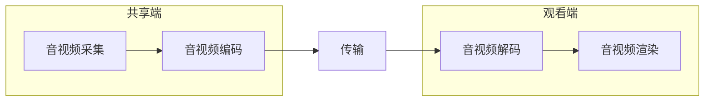

## Git

##### git commit之后，想撤销commit

`git reset --soft HEAD^`。仅仅是撤回commit操作，您写的代码仍然保留。


`git diff`这个命令来看看更改的地


git 换行：**先输入第一个引号，按 Enter 即可换行**，完成后再补齐后面的引号


## IDEA 

`option + command + m` 可将选择的代码块重新命名一个方法

`optin + command + v`   自动生成返回值

`optin + command + t`   包围快捷键（如try...catch、if、for等)

Debug时 可以用 Evaluate Expression 评估表达式，如下

```java
sc.write(Charset.defaultCharset().encode("ni hao"))
```


## Typora 画图

### 方向

- TB - 从上到下
- BT - 从下到上
- RL - 从右到左
- LR - 从左到右
- TD - 与TB相同


### 子图



