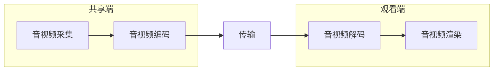

## Mac 命令

查找指定进程格式：

```
ps -ef | grep 进程关键字 # 如redis 或 php
```

- -au 显示较详细的资讯

## Git

##### git commit之后，想撤销commit

`git reset --soft HEAD^`。仅仅是撤回commit操作，您写的代码仍然保留。


`git diff`这个命令来看看更改的地


git 换行：**先输入第一个引号，按 Enter 即可换行**，完成后再补齐后面的引号


`git stash` 存储当前的修改

`git stash show`用于校验

`git stash apply`用于重新存储

`git stash clear` 清除贮藏

## IDEA 

`option + command + m` 可将选择的代码块重新命名一个方法

`optin + command + v`   自动生成返回值

`optin + command + t`   包围快捷键（如try...catch、if、for等)

Debug时 可以用 Evaluate Expression 评估表达式，如下

```java
sc.write(Charset.defaultCharset().encode("ni hao"))
```


## Xcode

快速跳到下一个 / 上一个单词：option +右 / 左

快速跳到一行的行首 / 行尾：com + 左 / 右

control + i 格式化代码

https://www.cnblogs.com/pengyunjing/p/6034725.html#:~:text=%E6%8C%89%E4%B8%8Boption%20%2B%20%E5%9B%9E%E8%BD%A6%2C%20label%E5%86%85%E5%AE%B9%E5%B0%B1%E4%BC%9A%E6%8D%A2%E8%A1%8C%E3%80%82

## Typora 画图

### 方向

- TB - 从上到下
- BT - 从下到上
- RL - 从右到左
- LR - 从左到右
- TD - 与TB相同


### 子图



