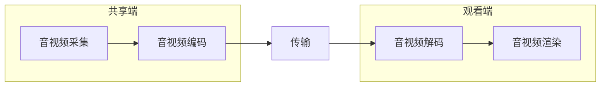

```
<?php
// +----------------------------------------------------------------------
// | ThinkPHP [ WE CAN DO IT JUST THINK IT ]
// +----------------------------------------------------------------------
// | Copyright (c) 2006-2018 http://thinkphp.cn All rights reserved.
// +----------------------------------------------------------------------
// | Licensed ( http://www.apache.org/licenses/LICENSE-2.0 )
// +----------------------------------------------------------------------
// | Author: liu21st <liu21st@gmail.com>
// +----------------------------------------------------------------------
namespace app\worker\controller;

use app\api\model\MuteRoomModel;
use app\common\controller\Enum;
use app\worker\model\LiveRoomModel;
use app\worker\model\MemberModel;
use app\worker\model\ScheduleMatchModel;
use app\worker\model\SystemMessageModel;
use GatewayWorker\Lib\Gateway;
use Psr\SimpleCache\InvalidArgumentException;
use think\facade\Cache;
use think\facade\Config;
use think\facade\Log;
use think\worker\Application;
use Workerman\Lib\Timer;
use Workerman\Worker;

/**
 * Worker 命令行服务类
 */
class Events
{
    /**
     * onWorkerStart 事件回调
     * 当businessWorker进程启动时触发。每个进程生命周期内都只会触发一次
     *
     * @access public
     * @param \Workerman\Worker $businessWorker
     * @return void
     */
    public static function onWorkerStart(Worker $businessWorker)
    {
        $app = new Application;
        $app->initialize();
        //只在进程1进行定时任务
//        if ($businessWorker->id === 1) {
        //业务定时器
//            Events::updateToday();
//            $room_id = 1000005;
//            Events::robot();
//        }
    }

    /**
     * onConnect 事件回调
     * 当客户端连接上gateway进程时(TCP三次握手完毕时)触发
     *
     * @access public
     * @param int $client_id
     * @return void
     */
    public static function onConnect($client_id)
    {
//        Gateway::sendToClient($client_id, json_encode(array(
//            'type'      => 'init',
//            'client_id' => $client_id,
//            'timeStemp' => time(),
//        )));
    }

    /**
     * onWebSocketConnect 事件回调
     * 当客户端连接上gateway完成websocket握手时触发
     *
     * @param integer $client_id 断开连接的客户端client_id
     * @param mixed $data
     * @return void
     */
    public static function onWebSocketConnect($client_id, $data)
    {
        var_export($data);
    }

    /**
     * onMessage 事件回调
     * 当客户端发来数据(Gateway进程收到数据)后触发
     *
     * @access public
     * @param int $client_id
     * @param mixed $data
     * @return void
     * @throws InvalidArgumentException
     */
    public static function onMessage($client_id, $data)
    {
        $data = json_decode($data, true);
        $room_id = $data['room_id'] ?? '';

        if (!empty($data['member_id']) && !empty($data['device'])) {
            $member_id = $data['member_id'];
            $device = $data['device'];
            $isLogin = Cache::store('redis')->get($device . 'member' . $member_id);
            if (!empty($isLogin)) {
                $member = Cache::store('redis')->hGet('liveRoomMember', $member_id);
                if (!empty($member)) {
                    $member = json_decode($member, true);
                } else {
                    $member = Events::memberInfo($member_id);
                    if (!empty($member)) {
                        $_SESSION['member_id'] = $member_id;
                        $member['room_id'] = $room_id;
                        Cache::store('redis')->hSet('liveRoomMember', $member_id, json_encode($member));
                    } else {
                        $message['msg'] = "数据库连接错误，或没有查到当前member数据";
                    }
                }
                $data['userInfo'] = $member;
            } else {
                $message['msg'] = "用户未登陆";
            }
        }

        // 根据类型执行不同的业务
        switch ($data['type']) {
            // 客户端回应服务端的心跳
            case 'ping':
                break;
            // 客户端登录 message格式: {type:login, name:xx, room_id:1} ，添加到客户端，广播给所有客户端xx进入聊天室
            case Enum::CHAT_LOGIN:
                Events::sendSystemMessage($client_id);
                // 发送历史消息到客户端
                Events::sendHistoryMessage($client_id, $room_id);
                if (!empty($member) && !empty($member_id)) {
                    Gateway::bindUid($client_id, $member['member_id']);
                    $message['member_type'] = 'member';
                    $message['member_id'] = $member['member_id'];
                    $message['nickname'] = $member['nickname'];
                    $message['avatar'] = $member['avatar'];

                    //验证用户是否有效
                    $signature = Cache::store('redis')->get('signature'.$data['device'].$member['member_id']);
                    if ($signature != $data['signature']) {
                        $mess['content'] = "登录已失效";
                        $mess['member_type'] = "login_out";
                        $mess['type'] = "1210";
                        Gateway::sendToClient($client_id, json_encode($mess));
                        unset($mess);
                        break;
                    }
                } else {
                    $message['nickname'] = '游客_' . Events::checkNo();
                    $message['member_type'] = 'visitor';
                    $message['room_id'] = $room_id;
                    Cache::store('redis')->hSet('liveRoomVisitor', $client_id, json_encode($message));
                }

                unset($message['room_id']);
                $message['content'] = $data;
                $message['type'] = Enum::CHAT_LOGIN;

                if (!empty($room_id)) {
                    if (!empty($member) && !empty($member_id)) {
                        $isMember = Cache::store('redis')->sIsMember('liveMemberRecord' . $room_id, $member_id);
                        if (!$isMember) {
                            Cache::store('redis')->sAdd('liveMemberRecord' . $room_id, $member_id);
                            Events::addView($room_id);
                        }
                    } else {
                        $ip = $_SERVER["REMOTE_ADDR"];
                        $isIp = Cache::store('redis')->sIsMember('liveVisitorRecord' . $room_id, $ip);
                        if (!$isIp) {
                            Cache::store('redis')->sAdd('liveVisitorRecord' . $room_id, $ip);
                            Events::addView($room_id);
                        }
                    }
//                    Events::robot($room_id);
                    Gateway::joinGroup($client_id, $room_id);
                    Gateway::sendToGroup($room_id, json_encode($message));
                    unset($message);
                }
                break;
            case Enum::CHAT_SEND_MESSAGE:
                if (empty($member) || empty($data['signature'])) {
                    $mess['content'] = "请先登录";
                    $mess['member_type'] = "no_login";
                    $mess['type'] = "2010";
                    Gateway::sendToClient($client_id, json_encode($mess));
                    break;
                }
                //验证用户是否有效
                $signature = Cache::store('redis')->get('signature'.$data['device'].$member['member_id']);
                if ($signature != $data['signature']) {
                    $mess['content'] = "登录已失效";
                    $mess['member_type'] = "login_out";
                    $mess['type'] = "1210";
                    Gateway::sendToClient($client_id, json_encode($mess));
                    unset($mess);
                    break;
                }

                $is_allow = Cache::store('redis')->get('allow_send' . $member['member_id']);
                if (!empty($is_allow)) {
                    $mess['content'] = "两秒内只能发一次信息";
                    $mess['member_type'] = "no_allow";
                    $mess['type'] = "2010";
                    Gateway::sendToClient($client_id, json_encode($mess));
                    break;
                }
                Cache::store('redis')->set('allow_send' . $member['member_id'], $member['member_id'], 2);

                // 判断用户是否被禁言
                $model = new MuteRoomModel();
                $isForbid = $model->getMute($member['member_id']);
                if ($isForbid['status'] == Enum::MUTE_STATUS_NORMAL) {
                    $mess['content'] = "用户已被禁言";
                    $mess['member_id'] = $member['member_id'];
                    $mess['nickname'] = $member['nickname'];
                    $mess['type'] = Enum::CHAT_MUTE_NOTICE;
                    Gateway::sendToClient($client_id, json_encode($mess));
                    break;
                }

                // 存聊天消息
                $historyData['member_id'] = $member['member_id'];
                $historyData['nickname'] = $member['nickname'];
                $historyData['msg'] = $data['msg'];
                $historyData['room_id'] = $room_id;
                $jsonData = json_encode($historyData);
                Cache::store('redis')->lPush("liveChatHistory:" . $room_id, $jsonData);

                $data['end_time'] = date('Y-m-d H:i:s', time());
                $send_data['content'] = $data;
                $send_data['member_id'] = $member['member_id'];
                $send_data['level'] = $member['level'];
                $send_data['nickname'] = $member['nickname'];
                $send_data['avatar'] = $member['avatar'];
                $send_data['type'] = Enum::CHAT_SEND_MESSAGE;
                $send_data['member_type'] = 'member';
//                $send_data['msg_count'] = $msgCount;

                if (!empty($room_id)) Gateway::sendToGroup($room_id, json_encode($send_data));
                unset($send_data);
                break;
            case '4000':
                //进球事件
                Gateway::joinGroup($client_id, 'match4000');
                break;
            case '5011':
                //重启系统消息任务列表
//                Events::systemMessage();
                break;
            default :
                return;
        }
    }

    /**
     * onClose 事件回调 当用户断开连接时触发的方法
     *
     * @param integer $client_id 断开连接的客户端client_id
     * @return void
     */
    public static function onClose($client_id)
    {
        $member_id = $_SESSION['member_id'];
        Cache::store('redis')->HDEL("liveRoomMember", $member_id);
        Cache::store('redis')->HDEL("liveRoomVisitor", $client_id);
//        GateWay::sendToAll("client[$client_id] logout\n");
    }

    /**
     * onWorkerStop 事件回调
     * 当businessWorker进程退出时触发。每个进程生命周期内都只会触发一次。
     *
     * @param \Workerman\Worker $businessWorker
     * @return void
     */
    public static function onWorkerStop(Worker $businessWorker)
    {
//        echo "WorkerStop\n";
    }


    public static function memberInfo($member_id)
    {
        $member = new MemberModel();
        $member_info = $member->getMember($member_id);

        if (!empty($member_info)) {
            return $member_info;
        } else {
            return null;
        }
    }

    public static function addView($room_id)
    {
        $model = new LiveRoomModel();
        $model->addView($room_id);
    }

    public static function checkNo()
    {
        $room_id = mt_rand(500000, 799999);
        $num = Cache::store('redis')->SCARD('visitor_list');
        if ($num > 299999) Cache::store('redis')->delete('visitor_list');
        $is = Cache::store('redis')->SISMEMBER('visitor_list', $room_id);
        if (!$is) {
            Cache::store('redis')->SADD('visitor_list', $room_id);
            return $room_id;
        }
        return Events::checkNo();
    }

    public static function checkNoRobot()
    {
        $room_id = mt_rand(800000, 999999);
        $num = Cache::store('redis')->SCARD('robot_visitor_list');
        if ($num > 199999) Cache::store('redis')->delete('robot_visitor_list');
        $is = Cache::store('redis')->SISMEMBER('robot_visitor_list', $room_id);
        if (!$is) {
            Cache::store('redis')->SADD('robot_visitor_list', $room_id);
            return $room_id;
        }
        return Events::checkNo();
    }

    public static function sendSystemMessage($client_id)
    {

        $system_data = Cache::store('redis')->get('sendSystemMessage');
        if (!empty($system_data)) $system_lists = json_decode($system_data, true);
        if (empty($system_lists)) {
            $system_message = new SystemMessageModel();
            $system_lists = $system_message->lists();
            Cache::store('redis')->set('sendSystemMessage', json_encode($system_lists), 86400);
        }

        if (!empty($system_lists[0])) {
            $data['type'] = '1120';
            $data['content']['msg'] = $system_lists[0]['content'];
            Gateway::sendToClient($client_id, json_encode($data));
        }
    }

    public static function sendHistoryMessage($client_id, $room_id)
    {
        // 获取 list 长度
        $length = Cache::store('redis')->lLen("liveChatHistory:" . $room_id);
        if ($length > 50) {
            $length = 50;
        }
        // 遍历 list
        $lists = Cache::store('redis')->lRange("liveChatHistory:" . $room_id, 0, $length);

        $data['type'] = '1121';
        for ($i = 0; $i < $length; $i++) {
            $data['content']['msg'][] = json_decode($lists[$i], true);
        }
        Gateway::sendToClient($client_id, json_encode($data));
    }

    public static function robot($room_id)
    {
        $room_robot_status = Cache::store('redis')->get('roomRobotStatus' . $room_id);
        if ((!empty($room_robot_status) && $room_robot_status != 2) || empty($room_robot_status)) {
            $roomModel = new LiveRoomModel();
            $room_info = $roomModel->getRoomRobot($room_id);
            if (!empty($room_info) && $room_info['live_status'] == 2) {
                Cache::store('redis')->set('autoStatus' . $room_id, $room_info['auto_status'], 3600);
                $times_task = $room_info['real_time'] ?? 5; //多久一个游客
                $timer_id = Timer::add($times_task, function () use ($room_id) {
                    $autoStatus = Cache::store('redis')->get('autoStatus' . $room_id);
                    if (!empty($autoStatus) && $autoStatus == 2) {
                        $message['nickname'] = "游客_" . Events::checkNoRobot();
                        $message['member_type'] = "visitor";
                        $message['type'] = '1010';
                        $message['content'] = $message;
                        Gateway::sendToGroup($room_id, json_encode($message));
                        Cache::store('redis')->set('roomRobotStatus' . $room_id, 2, 3600);
                    }
                });

                $times_over = $room_info['news_time'] ?? 300; //多久后删除
                Timer::add($times_over, function ($timer_id) {
                    Timer::del($timer_id);
                }, array($timer_id), false);
            }
        }
    }

    public static function updateToday()
    {
        $time_task_system = 120;
        Timer::add($time_task_system, function () {
            $url = Config::get('match.url');
            $api = '/football/today.aspx';
//            $key = Config::get('match.key');
//            $api_url = $url . $api . '?key=' . $key;
            $api_url = $url . $api;
            $data = Events::curlGetData($api_url);
            $data = json_decode($data, true);
            if (empty($data['matchList'])) return '数据为空';
            $scheduleModel = new ScheduleMatchModel();
            $res = $scheduleModel->addSchedule($data);
            return json($res);
        });
    }


    public static function curlGetData($url)
    {

        $header = array(
            'Accept: application/json',
        );
        $curl = curl_init();
        //设置抓取的url
        curl_setopt($curl, CURLOPT_URL, $url);
        //设置头文件的信息作为数据流输出
        curl_setopt($curl, CURLOPT_HEADER, 0);
        // 超时设置,以秒为单位
        curl_setopt($curl, CURLOPT_TIMEOUT, 50000);
        // 超时设置，以毫秒为单位
        curl_setopt($curl, CURLOPT_TIMEOUT_MS, 50000);
        // 设置请求头
        curl_setopt($curl, CURLOPT_HTTPHEADER, $header);
        //设置获取的信息以文件流的形式返回，而不是直接输出。
        curl_setopt($curl, CURLOPT_RETURNTRANSFER, 1);
        curl_setopt($curl, CURLOPT_SSL_VERIFYPEER, false);
        curl_setopt($curl, CURLOPT_SSL_VERIFYHOST, false);
        //执行命令
        $data = curl_exec($curl);
        // 显示错误信息
        if (curl_error($curl)) {
            return curl_error($curl);
        } else {
            // 打印返回的内容
            curl_close($curl);
            return $data;
        }
    }

    public static function systemMessage()
    {
        $time_task_system = 60;
        Timer::add($time_task_system, function () {
            $system_lists = Cache::store('redis')->get('system_lists');
            if (empty($system_lists)) {
                $system_message = new SystemMessageModel();
                $system_lists = $system_message->lists();
                Cache::store('redis')->set('system_lists', json_encode($system_lists));
                if (!empty($system_lists[0])) {
                    foreach ($system_lists as $k => $v) {
                        if (!empty($v['cycle']) && $v['status'] == 2) {
                            $is_run = Cache::store('redis')->get('system_lists_timer_id' . $v['id']);
                            if (!empty($is_run)) Timer::del($is_run);

                            $v['cycle'] = intval($v['cycle']);
                            $time_interval = $v['cycle'];
                            $timer_id = Timer::add($time_interval, function () use ($k, $v) {
                                $data['type'] = '1120';
                                $data['content']['msg'] = $v['content'];
                                Gateway::sendToAll(json_encode($data));
                                unset($data);
                            });
                            unset($content);
                            Cache::store('redis')->set('system_lists_timer_id' . $v['id'], $timer_id);
                        }
                    }
                }
            }
        });
    }
}


```


## Mac 命令

查找指定进程格式：

```
ps -ef | grep 进程关键字 # 如redis 或 php
```

- -au 显示较详细的资讯

## Git

##### git commit之后，想撤销commit

`git reset --soft HEAD^`。仅仅是撤回commit操作，您写的代码仍然保留。


`git diff`这个命令来看看更改的地


git 换行：**先输入第一个引号，按 Enter 即可换行**，完成后再补齐后面的引号


`git stash` 存储当前的修改

`git stash show`用于校验

`git stash apply`用于重新存储

`git stash clear` 清除贮藏

## IDEA 

`option + command + m` 可将选择的代码块重新命名一个方法

`optin + command + v`   自动生成返回值

`optin + command + t`   包围快捷键（如try...catch、if、for等)

Debug时 可以用 Evaluate Expression 评估表达式，如下

```java
sc.write(Charset.defaultCharset().encode("ni hao"))
```


##### **IDEA 快速返回上次查看代码的位置ctrl+alt+**方向键

**IDEA窗口快捷键**
ctrl+alt+s：Settings面板（设置面板）；
ctrl+shift+f/r：全局查找/替换；
ctrl+shift+n：文件查找面板；
alt+insert：快速生成面板

**代码编辑快捷键**
ctrl + ←、→ 上、下一个单词
crtl + shift + Enter 自动完成“;”，或换行
Alt + Enter 智能提示 (可以自动生产变量 )
Ctrl +Alt +L 格式化代码
Crtl + shift + / 行、块注释
Ctrl Alt Shift J 列操作 (多列相同的单词会被选中)
Shift + F6 重命名（只会对当前变量影响到的代码进行修改，比较安全）
Ctrl + W 选中单词

**代码快速定位：**
1、Ctrl+(Shift)+E：打开最近访问（编辑）的文件列表
2、Ctrl+Shift+1~9：创建书签
3、Shift+F11：查看书签
4、Ctrl+1~9：快速切换书签
5、Alt+←→：切换页签
6、Ctrl+G：实现行的快速跳转
7、Ctrl+Shift+1~9：快速定义书签
8、Ctrl+N：快速找到某个类

**设置背景:**
File->Settings->Keymap 中搜索 Set Background Image 
设置快捷键Ctrl+Shift+Alt+Q 键


**Live Template**

1、psvm生成main方法
2、sout生成打印语句
3、psfs生成字符串常量
4、fori生成for循环
5、itli生成list迭代
6、通过ctrl+shift+A中输入Live template。
之后在可以在其中自建模板，并进行 define 确定关联语言， 其中待定变量名用类似 $VAR1$ 形式表示。


**调试**

1、shift+F9调试；
2、shift+F10运行；
3、F8单步运行；
4、F9恢复运行至下一个断点；
5、Shift+Ctrl+F8查看所有断点；


**IDEA MAC下快捷键**：

1. 不同项目直接快速切换：command+shift+[ or ]   // 2021.1 version


## Xcode

快速跳到下一个 / 上一个单词：option +右 / 左

快速跳到一行的行首 / 行尾：com + 左 / 右

control + i 格式化代码

https://www.cnblogs.com/pengyunjing/p/6034725.html#:~:text=%E6%8C%89%E4%B8%8Boption%20%2B%20%E5%9B%9E%E8%BD%A6%2C%20label%E5%86%85%E5%AE%B9%E5%B0%B1%E4%BC%9A%E6%8D%A2%E8%A1%8C%E3%80%82

## Typora 画图

### 方向

- TB - 从上到下
- BT - 从下到上
- RL - 从右到左
- LR - 从左到右
- TD - 与TB相同


### 子图




## eclipse

ctrl+shift+o 快速导入包

Source > Override & Implements 重写的方法

ctrl+shift+F 格式化

Alt+/ 是Content Assist  可以进行快速的提示

复制当前行到上一行或者下一行  Ctrl + Alt + Up(向上方向键) / Down(向下方向键) 

查找一个类 Shift + Ctrl + h

光标到下一行 shift+enter

复制一行: ctrl+alt+向下箭头

移动一行 按住“alt+向上或向下箭头”移动本行代码向上或向下移动，点击箭头一次，移动一行
