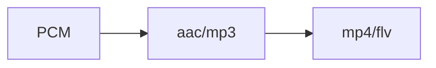
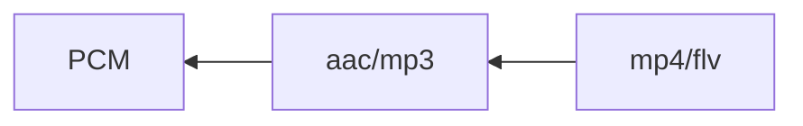
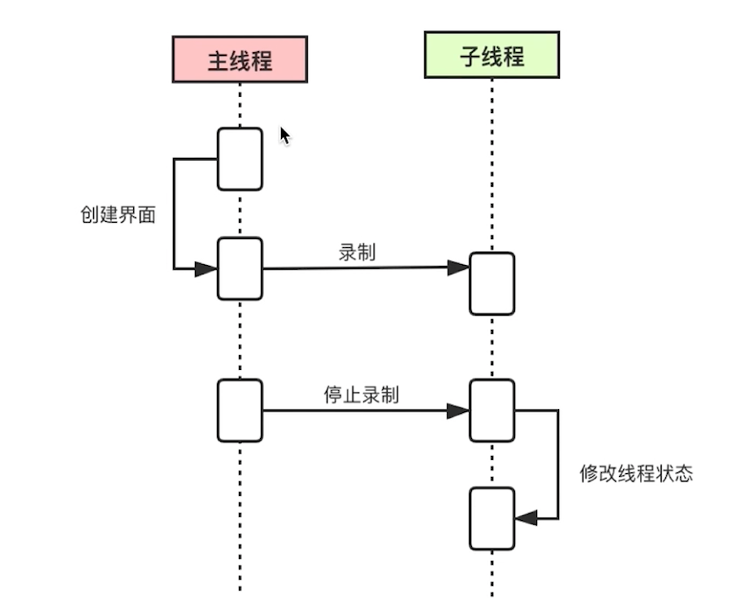
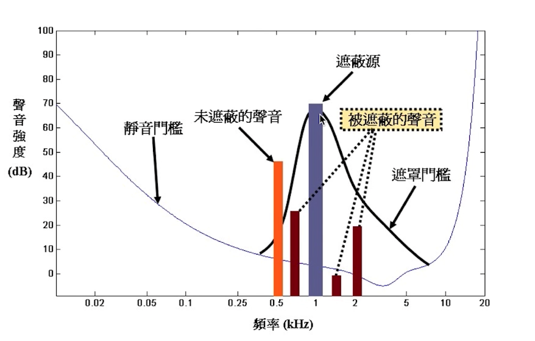
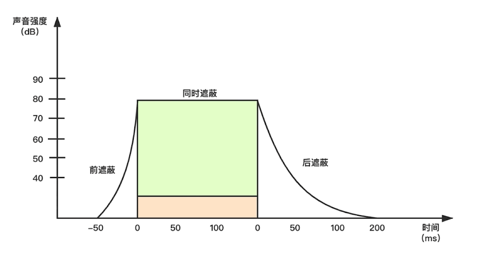
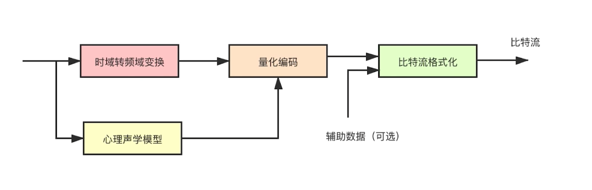
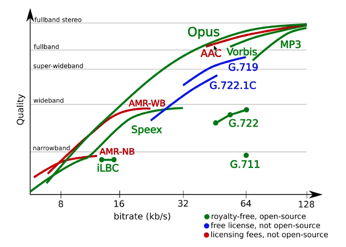
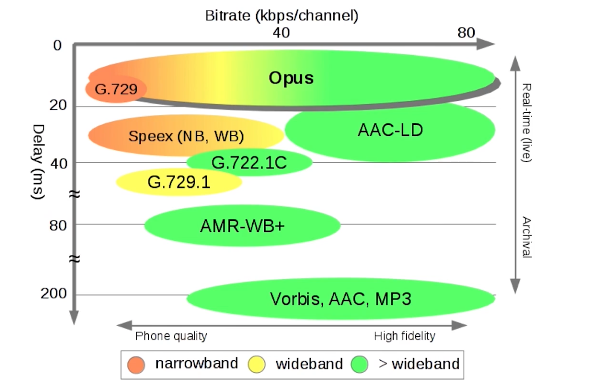
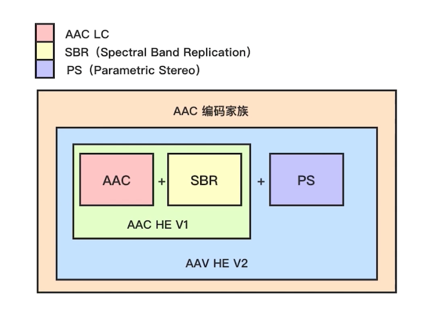

## 音视频环境基础

### 常用工具

* ffmpeg 用于推流到流媒体服务器

* ffplay  通过rtmp 从流媒体服务器取流并播放

* Vlc 可以从rtmp地址取流并播放，而且还可以进行暂停等ffplay没有的操作


### 问题

`ffmpeg -i ~/Documents/new_killer.mp4 -f flv rtmp://localhost/live/test`

#### **推流失败**

* 报错信息：时长不对，没有正确的文件大小，主要原因是时间戳出了问题
* 原因：默认是以最快的方式进行推流，将音频和视频分开，但这样很安宁进行同步。如放音频的时候方法和视频流的时间戳不匹配，就报错。
* 解决：加上-re 参数：让音视频按照原来的数独进行播放（同步）

#### 清晰度不高

* 原因：参数 -f flv 会讲MP4重新编发，再推流到流媒体服务器，对视频质量有损失；
* 解决：增加参数 -c copy，以原来的编码方式推到流媒体服务器; -c:v copy 只针对视频不重新编码。


## 在不同的系统上编译 ffmpeg

### Mac

#### 1. brew 方式安装

`brew install ffmpeg`

#### 2. 编译安装

* **下载 ffmpeg** https://ffmpeg.org/download.html\

* **编译 ffmpeg**

  ./configure --help 可以查看参数，如./configure --help | grep share 可以查看动态库相关的

  -enable-debug打开debug 级别为3

  --enable-shared --disable-static   开启动态库 关闭静态库

  ```
  ./configure --prefix=/usr/local/ffmpeg --enable-debug=3 --enable-shared --disable-static
  make -j 4  # -j 指定多少个CPU并发进行
  make install
  ```

* **ffmpeg 加入环境变量**，如果没有安装zsh，就将zshrc替换为bash_profile

  ```yml
  vim ~/.zshrc
  # 写入以下配置
  export PATH="/usr/local/ffmpeg/bin:$PATH"
  # 使zsh配置文件生效
  source ~/.zshrc
  ```

  

  

  


#### ffmpeg 目录

##### bin: 命令工具

* ffmpeg命令：推送，音视频处理

* ffplay命令：拉流

* ffprole：侦测多媒体文件，文件信息等

##### include:   ffmpeg 的头文件

* libavcodec：编解码
* libavfilter：滤镜 特效
* libavutil：基本工具
* libswresample：音频重采样
* libavdevice：管理设备
* libavformat：文件格式处理
* libpostproc：
* libswscale：视频的缩放等处理

##### lib: ffmpeg的动态库或者静态库

##### share: 文档相关，以及样例       


## C 语言回顾

### HelloWorld

```c
#include <stdio.h>

int main(int argc, char* argv[])
{
		printf("Hello World!\n");
		return 0;
}
```

`gcc/clang -g -o bin xxx.c`  -g 为开启 debug

### 语法

```java
int main(int argc, const char * argv[]) {
    // 基本类型
//    int a = 10;
//    float b = 12.5;
//    char c = 'a';
//
//    int d = 10;
//    int e = d % 6;
//    int f = d / 6;
//
//    printf("a+b=%f, a*b=%f, c=%d, e=%d, f=%d\n", a+b, a*b, c+5, e, f);
    
    // array
    int arr[10] = {4, 5, 6, 7};
    float f[2] = {1.2, 3.4};
    
    struct st ss;
    ss.a = 12345;
    ss.f = 4.5678;
    
    enum em ee;
    
    ee = balck_color;
    
    printf("%d, %d, %d, %d\n", arr[0], arr[1], arr[2], arr[3], arr[4]);
    
    printf("%f, %f\n", f[0], f[1]);
        
    printf("stuct:%d, %f\n", ss.a, ss.f);
    
    printf("enum:%d\n", ee );
    
    return 0;
}
```


### 指针

指针：存放内存地址的变量

#### 作用：

提升执行效率：减少内存中的值拷贝

更强的控制力：具有访问地址的能力

#### 操作：

一 对指针本身的操作

二 对指向的内容操作

```c

#include <stdio.h>
#include <stdlib.h>

int main(int argc, const char * argv[]) {

    
    // pointer
    char* p = (char*)malloc(10); // 分配内存
    *p = 'a';
  
    // 对指针本身的操作
    *(p+1) = 'b';
    *(p+2) = 'c';
  
    free(p); // 释放内存
    p = NULL;
    
    // 对指向的内容操作
    *p = 'd';
    printf("%s\n", p);
    
    return 0;
}
```

#### 内存泄漏与野指针

* 不断的向系统申请内存
* 申请的内存不用，也不释放
* 占用别人的内存称为野指针

### 函数

```c
void func(int a) {
		...
}
```

#### 函数指针

* 作用：函数指针主要是能够用一个指针的方式指向一个函数，并且还可以换换指向别的函数，比如有多个函数的申明，它们有不同的具体实现，如果需要调用它们，就可以用一个指针轮流指向它们。**多态**

* **返回值类型 ( * 指针变量名) ([形参列表]);**

  ```c
  int func(int x); /* 声明一个函数 */
  int (*f) (int x); /* 声明一个函数指针 */
  f = func; /* 将func函数的首地址赋给指针f */
  ```

  ```c
  int func(int a) {
      printf("a=%d\n", a);
      return 0;
  }
  int func1(int b) {
      printf("b=%d\n", b + 5);
      return 0;
  }
  
  int main(int argc, const char * argv[]) {
      // pointer
  //    char* p = (char*)malloc(10); // 分配内存
  //    *p = 'a';
  //    *(p+1) = 'b';
  //    *(p+2) = 'c';
  //    free(p); // 释放内存
  //    p = NULL;
  //    *p = 'd';
  //    printf("%s\n", p);
      
      // func
      int (*f)(int);
      
      f = func;
      f(2);
      
      f = func1;
      f(3);
      //func(2);
      //func1(3);
      
      return 0;
  }
  ```

### 操作文件

* 文件类型 FILE* file;
* 打开文件 FILE* fopen(path, mode)
* 闭关文件 fclose(FILE*);

```c
#include <stdio.h>
#include <stdlib.h>

void createfile(char *filename) {
    
    // 1. open/create file
    FILE* file = fopen(filename, "w");
    if(!file) {
        printf("Failed to create file(%s)\n", filename);
        return;
    }
    
    size_t len = fwrite("aaaaaa", 1, 5, file);
    if (len != 5) {
        printf("Failed to write file,(%zu)", len);
        fclose(file);
        return;
    }
    printf("Successed to write file");
    fclose(file);
    printf("Successed to create file\n");
}

void read_data(char* filename) {
    
    char buffer[1024] = {0,};
    
    FILE* file = fopen(filename, "r");
    if(!file) {
        printf("Failed to create file(%s)\n", filename);
        return;
    }
    
    size_t len = fread(buffer, 1, 12, file);
    if(len <= 0) {
        printf("Failed to read file!\n");
        fclose(file);
        return;
    }
    
    printf("read_data:%s\n", buffer);
    fclose(file);
    
    return;
}


int main(int argc, const char * argv[]) {
    // create file
    //createfile("/Users/wh37/workspace/test.txt");
    
    read_data("/Users/wh37/workspace/test.txt");
    return 0;
}

```


## 音视频基础知识


### 直播客户端处理流程


* 共享端：首先音频的采集（使用相关的API），采集完音频后，进行音视频编码（进行有损编码或无损编码），编码后将数据传输到观看端。
* 观看端 ：观看接收到数据后进行音视频解码，解码后交给音视频渲染进行播放和渲染。


### 音频数据流





* PCM音频数据（模拟信息转为数字信号）--> acc/MPE3（进行编码压缩为数据）-->MP4/FLV(封装格式)
* MP4/FLV解封装 -->acc/mp3对音频进行解封装还原pcm音频数据进行播放。


### 声音是如何被听到的

物体震动产生， 通过气态、液态、固态进行传输，耳膜震动将信号传给大脑

**人的听觉范围：20Hz ~ 20kHz，低于20Hz为次声波，高于20kHz为超声波**。       


### 声音的三要素

* 音调：音频的快慢 男生 < 女生 < 儿童
* 音量：震动的幅度
* 音色：谐波


### 数模转换

* 将模拟信号转换为数字信号

* 对声音进行采样量化，采样率有：48k 44.1k 32k 16k 8k


### PCM与WAV

*PCM*(Pulse Code Modulation)也被称为脉冲编码调制

#### 音频原始数据格式

* PCM 格式数据（纯音频数据无任何编码和封装）
* WAV 格式数据（有文件格式，一般存储原始PCM，很少存储编码数据）

#### 量化基本概念

1. 采样大小：一个采样用多少 bit 存放，常用的是 16bit
2. 采样率：采样频率 8k,16k,32k,44,1k,48k, （采样率越高还原度越高）
3. 声道数：单身道，双生道，多生道

#### 码率计算

要计算一个 PCM 音频流的`码率 = 采样率 * 采样大小(位深) * 声道数`

例如：采样率为44.1KHz，采样大小为 16bit，双声道的 PCM 编码的WAV文件，

它的码率为 `44.1K * 16 * 2 = 1411.2Kb/s`

这么大的码流显然无法在网络上传输，需要压缩后进行传输


#### WAV

##### 1.概述

`Waveform Audio File Format`（`WAVE`，又或者是因为`WAV`后缀而被大众所知的），它采用`RIFF`（Resource Interchange File Format）文件格式结构。通常用来保存`PCM`格式的原始音频数据，所以通常被称为无损音频。但是严格意义上来讲，`WAV`也可以存储其它压缩格式的音频数据。

##### 2.格式解析

`WAV`文件遵循RIFF规则，其内容以区块（`chunk`）为最小单位进行存储。`WAV`文件一般由3个区块组成：`RIFF chunk`、`Format chunk`和`Data chunk`。另外，文件中还可能包含一些可选的区块，如：`Fact chunk`、`Cue points chunk`、`Playlist chunk`、`Associated data list chunk`等。
 本文将只介绍`RIFF chunk`、`Format chunk`和`Data chunk`。

###### 2.1 RIFF区块

| 名称 | 偏移地址 | 字节数 | 端序 |        内容         |
| :--: | :------: | :----: | :--: | :-----------------: |
|  ID  |   0x00   | 4Byte  | 大端 | 'RIFF' (0x52494646) |
| Size |   0x04   | 4Byte  | 小端 |    fileSize - 8     |
| Type |   0x08   | 4Byte  | 大端 | 'WAVE'(0x57415645)  |

- 以`'RIFF'`为标识
- `Size`是整个文件的长度减去`ID`和`Size`的长度
- `Type`是`WAVE`表示后面需要两个子块：`Format`区块和`Data`区块

###### 2.2 FORMAT区块

|     名称      | 偏移地址 | 字节数 | 端序 |        内容         |
| :-----------: | :------: | :----: | :--: | :-----------------: |
|      ID       |   0x00   | 4Byte  | 大端 | 'fmt ' (0x666D7420) |
|     Size      |   0x04   | 4Byte  | 小端 |         16          |
|  AudioFormat  |   0x08   | 2Byte  | 小端 |      音频格式       |
|  NumChannels  |   0x0A   | 2Byte  | 小端 |       声道数        |
|  SampleRate   |   0x0C   | 4Byte  | 小端 |       采样率        |
|   ByteRate    |   0x10   | 4Byte  | 小端 |   每秒数据字节数    |
|  BlockAlign   |   0x14   | 2Byte  | 小端 |     数据块对齐      |
| BitsPerSample |   0x16   | 2Byte  | 小端 |      采样位数       |

- 以`'fmt '`为标识
- `Size`表示该区块数据的长度（不包含`ID`和`Size`的长度）
- `AudioFormat`表示`Data`区块存储的音频数据的格式，`PCM`音频数据的值为1
- `NumChannels`表示音频数据的声道数，1：单声道，2：双声道
- `SampleRate`表示音频数据的采样率
- `ByteRate`每秒数据字节数 = SampleRate * NumChannels * BitsPerSample / 8
- `BlockAlign`每个采样所需的字节数 = NumChannels * BitsPerSample / 8
- `BitsPerSample`每个采样存储的bit数，8：8bit，16：16bit，32：32bit

参考：https://jianshu.com/p/947528f3dff8


## 音频采集【实战】

### 通过命令方式采集音频数据

#### 各平台采集API接口

Android 端：

* Audio recodrder
* Media recoder

IOS 端

* Audio unit
* AV foundation

Windows 端

* Direct show
* Open AL
* Audio core (Win7 后)

端太多了 可以统一使用ffmpeg 进行音频采集

### ffmpeg 命令行采集

采集

`ffmpeg -f avfoundation -i :0 out.wav`

播放

`ffplay out.wav`


### Swift 语法

1. 下载Xcode

2. 创建新项目->macOS->Command Line Tool（控制台程序），语言选择Swift

3. ```swift
   import Foundation
   
   // 变量
   var a = 10
   var b: Int = 20
   
   // 常量
   let aa = 40
   
   // if
   if a < 20 {
       print("a < 20, true")
   } else {
       print("a >= 20")
   }
   
   // switch
   switch a {
   case 10:
       print("a equals 10")  // swift 的siwtch中case不用加break
   case 20:
       print("a equals 20")
   default:
       print("other")
   }
   
   // for
   var list = [1,2,3,4,5]
   
   for i in list {
       print("i=", i)
   }
   
   for i in 25..<100 {
       print("aa, i+", i)
   }
   
   // while
   var loop = 0
   while loop < 10 {
       print("loop, xxx=", loop)
       loop = loop + 1 // swift 中没有++和--
   }
   
   // func
   func myfunc(a : Int) -> Int{ // 参数a 类型为Int 返回类型为Int
       print("this is a function", a)
       return a
   }
   
   var mm = myfunc(a:10)
   
   print("Hello, World!", a, b, aa, mm)
   ```


### 创建APP

macOS -> App ，Interface 选 Storyboard，创建my app


### Swift调用C语言

* 编写C函数

  testc.c

  ```c
  #include "testc.h"
  
  void haha() {
      printf("this is a c function\n");
      return;
  }
  ```

  testc.h （C的头文件）

  ```h
  #ifndef testc_h
  #define testc_h
  
  #include <stdio.h>
  
  void haha(void);
  
  #endif /* testc_h */
  ```

* 在桥接头文件中引入C头文件

  myapp-Bridging-Header
  
  ```h
  #import "testc.h"
  ```

ViewController

```swift

import Cocoa

class ViewController: NSViewController {

    override func viewDidLoad() {
        super.viewDidLoad()
        
        // Do any additional setup after loading the view.
        self.view.setFrameSize(NSSize(width: 320, height: 240))
        
        let btn = NSButton.init(title: "button", target: nil, action: nil)
        btn.title = "hello"
        btn.frame = NSRect(x: 320/2-40, y: 240/2-15, width: 80, height: 30)
        btn.bezelStyle = .rounded
        btn.setButtonType(.pushOnPushOff)
        
        // callback
        btn.target = self
        btn.action = #selector(myfunc)
        
        self.view.addSubview(btn)
    }
    
    @objc
    func myfunc() {
        haha()
    }

    override var representedObject: Any? {
        didSet {
        // Upd ate the view, if already loaded.
        }
    }
}
```


### Mac App 中引入 ffmpeg 库

#### 拷贝文件

拷贝 ffmpeg 的 include (头文件)、libs (库文件) 到项目下

```toml
❯ cd /Users/wh37/workspace/sound/myapp/myapp
❯ mkdir include
❯ mkdir libs
❯ cp -r /usr/local/ffmpeg/include/* ./include
❯ cp -r /usr/local/ffmpeg/lib/* ./libs
```

#### 引入库文件

在`General -> Frameworks, Libraries, and Embedded Content` 中引入需要的库文件

这里引入：libavdevice.dylib、libavformat.dylib、libavutil.dylib

#### 引入头文件

`Build Settings -> Search Paths -> User Header Search Paths` 的 Debug 与 Release 配置头文件路径

/Users/wh37/Documents/Doc/音视频/mymacos/mymacos/include

#### 移除沙箱

将 Signging & Capabilities 中的 APP Sandbox 移除


### 采集音频的步骤

* 注册设备
* 设置采集方式 avfounddation/dshow/alsa  对应Mac/Windows/Linux
* 打开音频设备


### 打开音频设备

testc.h

```h
#ifndef testc_h
#define testc_h
#include <stdio.h>
#include "libavutil/avutil.h"
#include "libavdevice/avdevice.h"
#include "libavformat/avformat.h"
void haha(void);
#endif /* testc_h */
```

testc.c

```c
#include "testc.h"

void haha() {

    int ret = 0;
    char errors[1024];
    
    AVFormatContext *fmt_ctx = NULL;
    AVDictionary *options = NULL;
    
    char *devicename = ":0"; // [[vide device]:[audio device]]
    
    av_log_set_level(AV_LOG_DEBUG);
    
    // register audio device
    avdevice_register_all();
    
    AVInputFormat *iformat = av_find_input_format("avfoundation"); // 设置采集方式
    
    ret = avformat_open_input(&fmt_ctx, devicename, iformat, &options);
    if (ret < 0) {
        av_strerror(ret, errors, 1024);
        fprintf(stderr, "Failed to open audio device, [%d] %s\n", ret, errors);
        return;
    }

    av_log(NULL, AV_LOG_DEBUG, "hello, world!\n");
    
    return;
}
```

##### `avformat_open_input`

* AVFormatContext：上下文。前面与后面的API都依赖上下文。打开一个多媒体文件，去封装，编解码等操作都依赖于上下文件。

* url：可以是网络也可以是本地地址。

* *fmt：打开音频设备的方式

* **options：打开设备的方式。解码时会用

注：可以使用arecord -l 命令来查看你自己电脑上的音频输入设备


#### 打开macOS APP的麦克风权限

TARGETS -> Info -> Custom macOS application Target Properties 中加入：

`Privacy - Microphone Usage Description`

如果是ios app，则需要在info.plist 中加入 Privacy - Microphone Usage Description


### 从音频设备中读取音频数据

#### 读取音频数据：`av_read_frame`

* 读取音视频数据它会自己判断是音频数据还是视频数据
* 返回值为0表示成功
* 重要参数
  * AVFormatContext（上下文）
  * AVPacket（音视频包，可以看你是从设备中读取数据还是文件中读取数据）

#### AVPacket的方法

* data（音频的具体数据或视频的具体数据）

* size（大小字节）

#### 与 AVPacket 相关的API

* av_init_packet # AVPacket 初始化 **现在不需要用了**
* av_packet_unref #释放资源
* av_packet_alloc #分配空间，将分配的空间初始化
* av_packet_free #将分配的客户释放掉，然后解应用

AVPacket 需要增加头文件

`#include "libavcodec/avcodec.h"`


test.h

```h
#ifndef testc_h
#define testc_h

#include <stdio.h>
#include "libavutil/avutil.h"
#include "libavdevice/avdevice.h"
#include "libavformat/avformat.h"
#include <unistd.h>

void rec_audio(void);

#endif /* testc_h */

```

test.c

```c
#include "testc.h"

void rec_audio() {

    int ret = 0;
    char errors[1024] = {0, };
    
    // ctx
    AVFormatContext *fmt_ctx = NULL;
    AVDictionary *options = NULL;
    
    // packet
    int count = 0;
    AVPacket pkt;
    
    // [[vide device]:[audio device]]
    char *devicename = ":0";
    
    // set log level
    av_log_set_level(AV_LOG_DEBUG);
    
    // register audio device
    avdevice_register_all();
    
    //get format
    AVInputFormat *iformat = av_find_input_format("avfoundation");
    
    //open device
    if((ret = avformat_open_input(&fmt_ctx, devicename, iformat, &options)) < 0 ){
        av_strerror(ret, errors, 1024);
        fprintf(stderr, "Failed to open video device, [%d]%s\n", ret, errors);
        return;
    }

    //av_init_packet(&pkt); // 现在不需要初始化了
    
    // read data from device
    ret = 0;
    while(ret == 0 && count < 500) {
        ret = av_read_frame(fmt_ctx, &pkt);
//        av_log(NULL, AV_LOG_INFO, "pkt size is %d(%p), count=%d \n", pkt.size, pkt.data, count);
        printf("ret = %d at 第%d次\n", ret, count);
        // - 35 应该是设备暂时还没准备好，休息一秒继续尝试
        if (ret == -35) {
            sleep(1);
            ret = 0;
            // 释放音视频包
            av_packet_unref(&pkt);
            continue;
        }
        
        if (ret < 0) {
            // 释放音视频包
            av_packet_unref(&pkt);
            break;
        }
        printf("pkt size is %d at 第%d次 \n", pkt.size, count);
        count ++;
        // 释放音视频包
        av_packet_unref(&pkt);
    }
    
    // close device and release ctx
    avformat_close_input(&fmt_ctx);
    
    av_log(NULL, AV_LOG_DEBUG, "finish\n");
    
    return;
}

```


### 录制音频数据

#### 一、录制音频文件的操作步骤：

1. 创建文件 
   * fopen 函数
2. 将音频数据写入到文件中
   * fwrite 函数
   * 操作系统的机制，处于效率考虑，fwrite 函数不会立刻写入数据，而是将数据放到操作系统的缓冲区，等到缓冲的数据达到一定的量，才将数据写入
   * fflush 函数可以使数据立刻写入文件，但是会对程序的执行效率有所影响。
3. 关闭文件
   * fclose 函数

二、使用 ffplay 播放音频文件命令

命令格式： ffplay -ar 采样率 -ac 通道数 -f 采样大小 文件名称

本视频使用的命令：
ffplay -ar 44100 -ac 2 -f f32le audio.pcm


### 优化

问题引入：只通过主线程进行用户响应和音频处理会导致阻塞，给用户不好的体验
解决方案：利用多线程的方式将主线程和录制线程分离，通过界面来控制开启或关闭录制



#### Swift 线程

Thread  	#来创建线程

target: self		#线程要执行的对象

selector: #selector(myfunc)	 #回调的函数

界面

```swift
import Cocoa

class ViewController: NSViewController {

    var recStatus: Bool = false
    var thread: Thread?
    let btn = NSButton.init(title: "", target: nil, action: nil)
    
    override func viewDidLoad() {
        super.viewDidLoad()
        
        // Do any additional setup after loading the view.
        self.view.setFrameSize(NSSize(width: 320, height: 240))
        btn.title = "开始录制"
        btn.bezelStyle = .rounded
        btn.setButtonType(.pushOnPushOff)
        btn.frame = NSRect(x: 320/2-60, y: 240/2-15, width: 110, height: 30)
        btn.target = self
        btn.action = #selector(myfunc)
        
        self.view.addSubview(btn)
    }
    
    @objc func myfunc() {
        self.recStatus = !self.recStatus
        
        if recStatus {
            thread = Thread.init(target: self,
                                 selector: #selector(self.recAudio),
                                 object: nil)
            thread?.start()
            self.btn.title = "停止录制"
        } else {
            set_status(0)
            self.btn.title = "开始录制"
        }

    }
    
    @objc func recAudio() {
        rec_audio()
    }

    override var representedObject: Any? {
        didSet {
        // Upd ate the view, if already loaded.
        }
    }
}
```

test.h

```h
#ifndef testc_h
#define testc_h

#include <stdio.h>
#include "libavutil/avutil.h"
#include "libavdevice/avdevice.h"
#include "libavformat/avformat.h"
#include <unistd.h>

void rec_audio(void);
void set_status(int status);

#endif /* testc_h */
```

test.c

```c
//
//  testc.c
//  mymacos
//
//  Created by WH37 on 2022/9/15.
//

#include "testc.h"
static int rec_status = 0;

void set_status(int status) {
    rec_status = status;
}

void rec_audio() {

    int ret = 0;
    char errors[1024] = {0, };
    
    // ctx
    AVFormatContext *fmt_ctx = NULL;
    AVDictionary *options = NULL;
    
    // packet
    int count = 0;
    AVPacket pkt;
    
    // [[vide device]:[audio device]]
    char *devicename = ":0";
    
    // set log level
    av_log_set_level(AV_LOG_DEBUG);
    
    // start record
    rec_status = 1;
    
    // register audio device
    avdevice_register_all();
    
    // get format
    AVInputFormat *iformat = av_find_input_format("avfoundation");
    
    // open device
    if((ret = avformat_open_input(&fmt_ctx, devicename, iformat, &options)) < 0 ){
        av_strerror(ret, errors, 1024);
        fprintf(stderr, "Failed to open video device, [%d]%s\n", ret, errors);
        return;
    }
    
    // create file
    char *out = "/Users/wh37/Documents/Doc/音视频/audio.pcm";
    FILE *outfile = fopen(out, "wb+"); // w写 b二进制 +不存在则创建

    //av_init_packet(&pkt); // 现在不需要初始化了
    
    // read data from device
    ret = 0;
    while(ret == 0 && rec_status) {
        ret = av_read_frame(fmt_ctx, &pkt);
//        av_log(NULL, AV_LOG_INFO, "pkt size is %d(%p), count=%d \n", pkt.size, pkt.data, count);
        printf("ret = %d at 第%d次\n", ret, count);
        // - 35 应该是设备暂时还没准备好，休息一秒继续尝试
        if (ret == -35) {
            sleep(1);
            ret = 0;
            // 释放音视频包
            av_packet_unref(&pkt);
            continue;
        }
        
        if (ret < 0) {
            // 释放音视频包
            av_packet_unref(&pkt);
            break;
        }
        
        // write file
        fwrite(pkt.data, pkt.size, 1, outfile);
        fflush(outfile);
        
        printf("pkt size is %d at 第%d次 \n", pkt.size, count);
        count ++;
        // 释放音视频包
        av_packet_unref(&pkt);
    }
    
    // close file
    fclose(outfile);
    
    // close device and release ctx
    avformat_close_input(&fmt_ctx);
    
    av_log(NULL, AV_LOG_DEBUG, "finish\n");
    
    return;
}
```


## 音频编码原理

### **音频压缩**

音频压缩技术是在保证信号在听觉方面不产生失真的前提下，对音频数据信号进行尽可能大的压缩。

压缩的主要方法是去除采集到的音频冗余信息。

#### 有损压缩

* 压缩后，无法还原出原声。

* 有损编码就是消除**冗余信息**与**遮蔽效应**

#### 无损压缩

* 压缩后仍能够还原出原声。

#### 冗余信息

* 人耳听觉范围外的音频信号
* 被遮蔽掉的音频信号

#### **信号的遮蔽**

##### 1. 频域遮蔽

不同频率的声音产生遮蔽效应



##### 2. 时域遮蔽

声音强度高的在前后时间内将声音强度低的进行遮蔽




### 无损压缩方法

#### 一、熵编码

使用的熵编码进行无损编码，其基本原理是将用短的编码替代高频的词汇、句子，用长的句代表低频词。
熵编码常用的三种方法：

* 哈夫曼编码：使用一串二进制数代替一串特别长的字符。特点是：频率越高的编码越少，频率越低的编码越长。
* 算术编码：通过二进制小数进行编码。
* 香农编码

### 音频编码过程

采集到原始的音频数据，经过时域转频域变换，并且通过心理声学模型（滤除人听觉范围以外的频率），将这两个数据汇总之后进行量化编码（有损、无损编码），编码后的得到比特流的数据就可以用在网络的传输上。




### 几种常见编解码器比较


#### 常见的音频编码器

包括**OPUS** , **AAC** , Ogg ,Speex , iLBC, AMR, G.711等。

其中，AAC在直播系统中应用的比较广泛；OPUS是最新的音编码器，WebRTC默认使用OPUS；固话一般用的G.711。

（1）OPUS：目前较新的音频编码器，WebRTC默认使用OPUS；延迟小，压缩率高。应用在在线教育，视频会议
（2）AAC：在直播系统中应用比较广泛的编码器；（分软件和硬件）不适合实时性要求较高的场景
（3）Ogg：软件收费，应用比较少；
（4）Speex：显著的特点是支持回音消除，是七八年前应用非常广泛的编码器；
（5）G.711：固话、电话使用的窄带音频编码器，但是音损非常严重，不适合实时通信；
（6）其他：iLBC、AMR。

网上评测结果：OPUS>AAC>Ogg


#### 不同音频编码器的音频编码质量比较

OPUS对不同的网络质量（窄带、宽带、超宽带、全带）都有对应的码流选择



#### 三、不同音频编码器的音频编码码率

不同编码器在不同的延时对码率的支持范围




### AAC 编码器介绍


#### 一、AAC全称为Advanced Audio Coding

* 研发目的：取代MP3格式。
* 与MP3格式的比较：MP3的压缩率比较低，压缩后的文件大；
* AAC的压缩率比较高，保真性强，即使压缩成很小的数据，还原度仍然很高。
* 最初是基于MPEG-2的音频编码技术，在MPEG-4标准出现后，AAC加入了SBR技术和PS技术。


#### 二、常用的规格

1. AAC LC：低复杂度规格，码流128k，音质好；
2. AAC HE V1
3. AAC HE V2


#### 三、AAC编码家族规格之间的关系



#### 四、ACC规格描述

* AAC LC: `(Low Complexity) `低复杂度规格，码流是128k，音质好。
* AAC HE: 等于 AAC LC + `SBR (Spectral Band Replication 频段复制)`。其核心思想是按频谱分保存。低频编码保存主要成分，高频单独放大编码保存音质。码流在64k左右。
* AAC HE V2: 等于 AAC LC + SBR + `PS (Parametric Stereo 参数立体声)`。其核心思想是双声道中的声音存在某种相似性，只需存储一个声道的全部信息，然后花很少的字节用参数描述另一个声道和它不同的地方。


#### 五、AAC 的格式

`ADIF（Audio data interchange format）`

可以确定找个这个数据的开始，就相当于在aac数据前面加了个Header，header里面就会包含aac数据的一些信息，方便进行编解码。特点是只能从头开始解码，不能从音频数据中间开始，这种格式常用于磁盘文件中

`ADTS（Audio Data Transport Format）`

在每一帧的数据里面都会有一个同步字，所以他可以在任意的位置开始进行解码，就像流式数据


### ADTS 格式

ADTS：ACC类似数据流的音频压缩格式。
ADTS由7或9字节组成：这两种字节的差异在于是否使用CRC校验。
具体格式的组成可以从官网获取：https://www.p23.nl/projects/aac-header/
在开发的过程当中，FFmpeg提供了相应的API可以填充参数生成ADTS格式的数据，减少了编程的工作量。


### 通过 ffmpeg 生成AAC数据

ffmpeg 生成aac文件参数查询网址：

http://ffmpeg.org/ffmpeg-codecs.html#libfdk_005faac

ffmepg生成AAC文件

`ffmpeg 生成AAC文件命令：ffmpeg -i(输入文件) xxx.mp4 -vn(video none过滤视频) -c:a(编码器codec: audio) libfdk_aac(性能最好的一款编码器)  -ar 44100 -channels 2 -profile:a(对编解码器设置参数用的 a = 音频) aac_he_v2  xxx.aac`

```
-i xxx.mp4 代表输入的多媒体文件，文件中一定要带音频；
-vn v video，n-no，没有视频；
-c codec a-audio libfdk_aac代表编码库，指定用libfdk_aac编码器进行编码；
-ar 音频采样率
-channels 通道数
-profile:a 指定对音频的设置，设置为aac_he_v2
3.aac 代表输出文件
```


## 音频编码【实战】

### 什么是音频重采样

**音频重采样：**

将`音频三元组（采样率、采样大小/位深、通道数）`的值转成另外一组值；

例如：将44100/16/2 转成 48000/16/2

**为什么要重采样：**

1.从设备采集的音频数据与编码器要求的数据不一致；

2.扬声器要求的音频数据与要播放的音频数据不一致；

3.更方便计算；

**如何知道是否需要进行重采样：**

1. 要了解音频设备的参数；
2. 查看ffmpeg源码；

**重采样的步骤：**

1. 创建重采样上下文；

2. 设置参数；

3. 初始化重采样；

4. 进行重采样；

**几个重要的API：**

swr_alloc_set_opts  （swr = scale wave resample  尺度波重采样）

swr_init

swr_convert

swr_free


### 实战音频重采样

C头文件引入库重采样的库

在`General -> Frameworks, Libraries, and Embedded Content` 中引入需要的库文件

这里引入：libswresample.dylib


test.h

```h
#ifndef testc_h
#define testc_h

#include <stdio.h>
#include <unistd.h>
#include "libavutil/avutil.h"
#include "libavdevice/avdevice.h"
#include "libavformat/avformat.h"
#include "libavcodec/avcodec.h"
#include "libswresample/swresample.h"

void rec_audio(void);
void set_status(int status);

#endif /* testc_h */

```

test.c

```c
//
//  testc.c
//  mymacos
//
//  Created by WH37 on 2022/9/15.
//

#include "testc.h"
#include <string.h>

static int rec_status = 0;

void set_status(int status) {
    rec_status = status;
}

SwrContext* init_swr(void){
    
    SwrContext *swr_ctx = NULL;
    
    //channel, number/
    swr_ctx = swr_alloc_set_opts(NULL,                //ctx
                                 AV_CH_LAYOUT_STEREO, //输出channel布局
                                 AV_SAMPLE_FMT_S16,   //输出的采样格式
                                 44100,               //采样率
                                 AV_CH_LAYOUT_STEREO, //输入channel布局
                                 AV_SAMPLE_FMT_FLT,   //输入的采样格式
                                 44100,               //输入的采样率
                                 0, NULL);
    
    if(!swr_ctx){
        
    }
    
    if(swr_init(swr_ctx) < 0){
        
    }
    
    return swr_ctx;
}

void rec_audio() {
    
    int ret = 0;
    char errors[1024] = {0, };
    
    //重采样缓冲区
    uint8_t **src_data = NULL;
    int src_linesize = 0;
    
    uint8_t **dst_data = NULL;
    int dst_linesize = 0;
    
    // ctx
    AVFormatContext *fmt_ctx = NULL;
    AVDictionary *options = NULL;
    
    // packet
    AVPacket pkt;
    
    // [[vide device]:[audio device]]
    char *devicename = ":0";
    
    // set log level
    av_log_set_level(AV_LOG_DEBUG);
    
    // start record
    rec_status = 1;
    
    // register audio device
    avdevice_register_all();
    
    // get format
    const AVInputFormat *iformat = av_find_input_format("avfoundation");
    
    // open device
    if((ret = avformat_open_input(&fmt_ctx, devicename, iformat, &options)) < 0 ){
        av_strerror(ret, errors, 1024);
        fprintf(stderr, "Failed to open video device, [%d]%s\n", ret, errors);
        return;
    }
    
    // create file
    char *out = "/Users/wh37/workspace/sound/audio.pcm";
    FILE *outfile = fopen(out, "wb+"); // w写 b二进制 +不存在则创建
    
    SwrContext* swr_ctx = init_swr();
    
    // 4096/4 = 1024/2 = 512
    // 创建输入缓冲区
    av_samples_alloc_array_and_samples(&src_data,           // 输出缓冲区地址
                                       &src_linesize,       // 缓冲区的大小
                                       2,                   // 通道个数
                                       512,                 // 单通道采样个数
                                       AV_SAMPLE_FMT_FLT,   // 采样格式
                                       0);
    
    // 创建输出缓冲区
    av_samples_alloc_array_and_samples(&dst_data,           // 输出缓冲区地址
                                       &dst_linesize,       // 缓冲区的大小
                                       2,                   // 通道个数
                                       512,                 // 单通道采样个数
                                       AV_SAMPLE_FMT_S16,   // 采样格式
                                       0);
    
    
    //av_init_packet(&pkt); // 现在不需要初始化了
    
    // read data from device
    ret = 0;
    int count = 0;
    while(ret == 0 && rec_status) {
        ret = av_read_frame(fmt_ctx, &pkt);
        //        av_log(NULL, AV_LOG_INFO, "pkt size is %d(%p), count=%d \n", pkt.size, pkt.data, count);
        printf("ret = %d at 第%d次\n", ret, count);
        // - 35 应该是设备暂时还没准备好，休息一秒继续尝试
        if (ret == -35) {
            sleep(1);
            ret = 0;
            // 释放音视频包
            av_packet_unref(&pkt);
            continue;
        }
        
        if (ret < 0) {
            // 释放音视频包
            av_packet_unref(&pkt);
            break;
        }
        
        // 进行内存拷贝，按字节拷贝的
        memcpy((void*)src_data[0], (void*)pkt.data, pkt.size);
        
        // 重采样
        swr_convert(swr_ctx,
                    dst_data,
                    dst_linesize,
                    (const uint8_t **)src_data,
                    src_linesize);
        
        // write file
        //fwrite(pkt.data, pkt.size, 1, outfile);
        fwrite(dst_data[0], 1, dst_linesize, outfile);
        fflush(outfile);
        
        printf("pkt size is %d at 第%d次 \n", pkt.size, count);
        count ++;
        // 释放音视频包
        av_packet_unref(&pkt);
    }
    
    // close file
    fclose(outfile);
    
    // 释放输入输出缓冲区
    if (src_data) {
        av_freep(&src_data[0]);
    }
    av_freep(src_data);
    
    if (dst_data) {
        av_freep(&dst_data[0]);
    }
    av_freep(dst_data);
    
    // 释放重采样的上下文
    swr_free(&swr_ctx);
    
    // close device and release ctx
    avformat_close_input(&fmt_ctx);
    
    av_log(NULL, AV_LOG_DEBUG, "finish\n");
    
    return;
}

```


### 创建 AAC 编码器


#### ffmpeg 编码过程


#### 创建并打开编码器

`avcodec_find_encoder(); avcoder_find_encoder_by_name();` 根据ID或者根据name
`avcoder_alloc_context3();` 根据coder创建上下文
`avcodec_open2` 打开编码器


#### 编码使用的输入输出数据

**重要API:**

向编码器送帧 avcodec_send_frame

读取编码后的数据 avcodec_receive_packet

**输入输出数据：**

存放未编码的数据 AVFrame

存放编码后的数据 AVPacket


未看完。。。


## 视频基础知识


### 图像的基本概念

#### 视频

* 由一组<font color='red'>图像</font>组成
* 为了传输/占用更小的空间而被<font color='red'>压缩</font>
* 最终在现实<font color='red'>显示设备</font>上展示（未被压缩）

#### 图像

* 像素（由RPG组成）
* RGB
* 分辨率（横向的像素点，纵向的像素点）

#### 每个像素的位深

位深：我们用多少个位来表示一个像素

* RGB888（24位）  每个颜色都是8位
* RGBA（32位）  其中A表示alpha，表示透明度

   

### 屏幕显示器

#### 图像与屏幕的关系

* 图像是数据
* 屏幕是显示设备 ，由无数个发光二极管组成，每3个一组，表示红绿蓝
* 图像数据 经过驱动程序让 屏幕显示图像

#### RGB 的色彩问题

* RGB 与 BGR
* BMP 使用的是 BGR 格式，需要进行转换

#### 屏幕指标

* PPI（pixels per inch）每英寸的像素数
* DPI（Dots per inch）每英寸的点数，基本上 DPI=PPI
* PPI > 300 就属于视网膜级别，人眼区分不出来，认为是一体的


### 码流的计算

#### 分辨率

* X 轴的像素个数 * Y 轴的像素个数
* 常见的宽高比 16:9 / 4:3
* 360P(640 * 360)/720P(1280 * 720)/1K/2K，这些宽高比都是16:9的.

#### 帧率

* 每秒钟采集/播放图像的个数
* 动画的帧率是 25帧/s
* 常见的帧率：15帧/s (实时通信, 帧率越大，占用的传输带宽就越大)，30帧/s (录课)，60帧/s (电影) 

```
要求的平滑度越高，帧率就越大。
要求的清晰度越高，分辨率就要越高。
```

#### 未编码视频的 RBG 码流

``` 
RBG 码流 = 分辨率（宽 * 高）* 3(Byte) * 帧率（25帧）

例如：1280*720*3*25 = 69120000 约69M
```


> 未编码与 H264 视频编码的码流压缩比是多少？


### 图像的现实

* 图像大小等于显示区域大小
* 图像小于显示区域（拉伸/留白）
* 图像大于显示区域（缩小/截断）

> 在不同的平台上都有哪些库用来高效的渲染视频？


### 什么是 YUV

#### YUV

* YUV (也称YCbCr)：Y 表示明亮度，UV 的作用是描述影像及饱和度。
* 主要的采样格式有 YUV4:2:0 (主流)、YUV4:2:2 和 YUV4:4:4

#### RBG 与 YUV 的关系

* RGB 用于屏幕图像的展示
* YUV 用于采集和编码 （YUV存储的数据比RGB要小很多）
* 电视使用的是YUV数据显示，显示器等使用的是RGB数据显示。

#### RGB 转 YUV

```
Y = 0.299*R + 0.587*G + 0.114*B
U = -0.147*R - 0.289*G + 0.436*B = 0.492*(B-Y)
V = 0.615*R - 0.515*G - 0.100*B = 0.877*(R-Y)
```

#### YUV 转 RGB

```
R = Y + 1.140*V
G = Y - 0.394*U - 0.581*V
B = Y + 2.032*U
```

