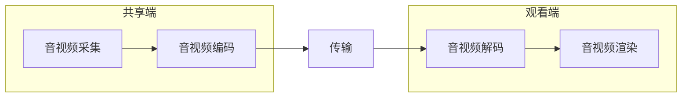
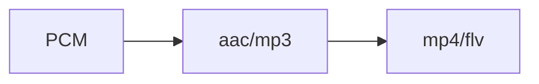
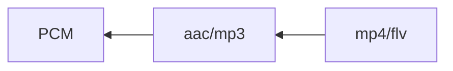

## 音视频环境基础

### 常用工具

* ffmpeg 用于推流到流媒体服务器

* ffplay  通过rtmp 从流媒体服务器取流并播放

* Vlc 可以从rtmp地址取流并播放，而且还可以进行暂停等ffplay没有的操作


### 问题

`ffmpeg -i ~/Documents/new_killer.mp4 -f flv rtmp://localhost/live/test`

#### **推流失败**

* 报错信息：时长不对，没有正确的文件大小，主要原因是时间戳出了问题
* 原因：默认是以最快的方式进行推流，将音频和视频分开，但这样很安宁进行同步。如放音频的时候方法和视频流的时间戳不匹配，就报错。
* 解决：加上-re 参数：让音视频按照原来的数独进行播放（同步）

#### 清晰度不高

* 原因：参数 -f flv 会讲MP4重新编发，再推流到流媒体服务器，对视频质量有损失；
* 解决：增加参数 -c copy，以原来的编码方式推到流媒体服务器; -c:v copy 只针对视频不重新编码。


## 在不同的系统上编译 ffmpeg

### Mac

#### 1. brew 方式安装

`brew install ffmpeg`

#### 2. 编译安装

* **下载 ffmpeg** https://ffmpeg.org/download.html\

* **编译 ffmpeg**

  ./configure --help 可以查看参数，如./configure --help | grep share 可以查看动态库相关的

  -enable-debug打开debug 级别为3

  --enable-shared --disable-static   开启动态库 关闭静态库

  ```
  ./configure --prefix=/usr/local/ffmpeg --enable-debug=3 --enable-shared --disable-static
  make -j 4  # -j 指定多少个CPU并发进行
  make install
  ```

* **ffmpeg 加入环境变量**，如果没有安装zsh，就将zshrc替换为bash_profile

  ```yml
  vim ~/.zshrc
  # 写入以下配置
  export PATH="/usr/local/ffmpeg/bin:$PATH"
  # 使zsh配置文件生效
  source ~/.zshrc
  ```

  

  

  


#### ffmpeg 目录

##### bin: 命令工具

* ffmpeg命令：推送，音视频处理

* ffplay命令：拉流

* ffprole：侦测多媒体文件，文件信息等

##### include:   ffmpeg 的头文件

* libavcodec：编解码
* libavfilter：滤镜 特效
* libavutil：基本工具
* libswresample：音频重采样
* libavdevice：管理设备
* libavformat：文件格式处理
* libpostproc：
* libswscale：视频的缩放等处理

##### lib: ffmpeg的动态库或者静态库

##### share: 文档相关，以及样例       


## C 语言回顾

### HelloWorld

```c
#include <stdio.h>

int main(int argc, char* argv[])
{
		printf("Hello World!\n");
		return 0;
}
```

`gcc/clang -g -o bin xxx.c`  -g 为开启 debug

### 语法

```java
int main(int argc, const char * argv[]) {
    // 基本类型
//    int a = 10;
//    float b = 12.5;
//    char c = 'a';
//
//    int d = 10;
//    int e = d % 6;
//    int f = d / 6;
//
//    printf("a+b=%f, a*b=%f, c=%d, e=%d, f=%d\n", a+b, a*b, c+5, e, f);
    
    // array
    int arr[10] = {4, 5, 6, 7};
    float f[2] = {1.2, 3.4};
    
    struct st ss;
    ss.a = 12345;
    ss.f = 4.5678;
    
    enum em ee;
    
    ee = balck_color;
    
    printf("%d, %d, %d, %d\n", arr[0], arr[1], arr[2], arr[3], arr[4]);
    
    printf("%f, %f\n", f[0], f[1]);
        
    printf("stuct:%d, %f\n", ss.a, ss.f);
    
    printf("enum:%d\n", ee );
    
    return 0;
}
```


### 指针


## 音视频基础知识


### 直播客户端处理流程



* 共享端：首先音频的采集（使用相关的API），采集完音频后，进行音视频编码（进行有损编码或无损编码），编码后将数据传输到观看端。
* 观看端 ：观看接收到数据后进行音视频解码，解码后交给音视频渲染进行播放和渲染。


### 音频数据流





* PCM音频数据（模拟信息转为数字信号）--> acc/MPE3（进行编码压缩为数据）-->MP4/FLV(封装格式)
* MP4/FLV解封装 -->acc/mp3对音频进行解封装还原pcm音频数据进行播放。


### 声音是如何被听到的

物体震动产生， 通过气态、液态、固态进行传输，耳膜震动将信号传给大脑

**人的听觉范围：20Hz ~ 20kHz，低于20Hz为次声波，高于20kHz为超声波**。       


### 声音的三要素

* 音调：音频的快慢 男生 < 女生 < 儿童
* 音量：震动的幅度
* 音色：谐波


### 数模转换

* 将模拟信号转换为数字信号

* 对声音进行采样量化，采样率有：48k 44.1k 32k 16k 8k


### PCM与WAV

*PCM*(Pulse Code Modulation)也被称为脉冲编码调制

#### 音频原始数据格式

* PCM 格式数据（纯音频数据无任何编码和封装）
* WAV 格式数据（有文件格式，一般存储原始PCM，很少存储编码数据）

#### 量化基本概念

1. 采样大小：一个采样用多少 bit 存放，常用的是 16bit
2. 采样率：采样频率 8k,16k,32k,44,1k,48k, （采样率越高还原度越高）
3. 声道数：单身道，双生道，多生道

#### 码率计算

要计算一个 PCM 音频流的`码率 = 采样率 * 采样大小(位深) * 声道数`

例如：采样率为44.1KHz，采样大小为 16bit，双声道的 PCM 编码的WAV文件，

它的码率为 `44.1K * 16 * 2 = 1411.2Kb/s`

这么大的码流显然无法在网络上传输，需要压缩后进行传输


#### WAV

##### 1.概述

`Waveform Audio File Format`（`WAVE`，又或者是因为`WAV`后缀而被大众所知的），它采用`RIFF`（Resource Interchange File Format）文件格式结构。通常用来保存`PCM`格式的原始音频数据，所以通常被称为无损音频。但是严格意义上来讲，`WAV`也可以存储其它压缩格式的音频数据。

##### 2.格式解析

`WAV`文件遵循RIFF规则，其内容以区块（`chunk`）为最小单位进行存储。`WAV`文件一般由3个区块组成：`RIFF chunk`、`Format chunk`和`Data chunk`。另外，文件中还可能包含一些可选的区块，如：`Fact chunk`、`Cue points chunk`、`Playlist chunk`、`Associated data list chunk`等。
 本文将只介绍`RIFF chunk`、`Format chunk`和`Data chunk`。

###### 2.1 RIFF区块

| 名称 | 偏移地址 | 字节数 | 端序 |        内容         |
| :--: | :------: | :----: | :--: | :-----------------: |
|  ID  |   0x00   | 4Byte  | 大端 | 'RIFF' (0x52494646) |
| Size |   0x04   | 4Byte  | 小端 |    fileSize - 8     |
| Type |   0x08   | 4Byte  | 大端 | 'WAVE'(0x57415645)  |

- 以`'RIFF'`为标识
- `Size`是整个文件的长度减去`ID`和`Size`的长度
- `Type`是`WAVE`表示后面需要两个子块：`Format`区块和`Data`区块

###### 2.2 FORMAT区块

|     名称      | 偏移地址 | 字节数 | 端序 |        内容         |
| :-----------: | :------: | :----: | :--: | :-----------------: |
|      ID       |   0x00   | 4Byte  | 大端 | 'fmt ' (0x666D7420) |
|     Size      |   0x04   | 4Byte  | 小端 |         16          |
|  AudioFormat  |   0x08   | 2Byte  | 小端 |      音频格式       |
|  NumChannels  |   0x0A   | 2Byte  | 小端 |       声道数        |
|  SampleRate   |   0x0C   | 4Byte  | 小端 |       采样率        |
|   ByteRate    |   0x10   | 4Byte  | 小端 |   每秒数据字节数    |
|  BlockAlign   |   0x14   | 2Byte  | 小端 |     数据块对齐      |
| BitsPerSample |   0x16   | 2Byte  | 小端 |      采样位数       |

- 以`'fmt '`为标识
- `Size`表示该区块数据的长度（不包含`ID`和`Size`的长度）
- `AudioFormat`表示`Data`区块存储的音频数据的格式，`PCM`音频数据的值为1
- `NumChannels`表示音频数据的声道数，1：单声道，2：双声道
- `SampleRate`表示音频数据的采样率
- `ByteRate`每秒数据字节数 = SampleRate * NumChannels * BitsPerSample / 8
- `BlockAlign`每个采样所需的字节数 = NumChannels * BitsPerSample / 8
- `BitsPerSample`每个采样存储的bit数，8：8bit，16：16bit，32：32bit

参考：https://jianshu.com/p/947528f3dff8


## 音频采集【实战】

### 通过命令方式采集音频数据

#### 各平台采集API接口

Android 端：

* Audio recodrder
* Media recoder

IOS 端

* Audio unit
* AV foundation

Windows 端

* Direct show
* Open AL
* Audio core (Win7 后)

端太多了 可以统一使用ffmpeg 进行音频采集

### ffmpeg 命令行采集

采集

`ffmpeg -f avfoundation -i :0 out.wav`

播放

`ffplay out.wav`


### Swift 语法

1. 下载Xcode

2. 创建新项目->macOS->Command Line Tool（控制台程序），语言选择Swift

3. ```swift
   import Foundation
   
   // 变量
   var a = 10
   var b: Int = 20
   
   // 常量
   let aa = 40
   
   // if
   if a < 20 {
       print("a < 20, true")
   } else {
       print("a >= 20")
   }
   
   // switch
   switch a {
   case 10:
       print("a equals 10")  // swift 的siwtch中case不用加break
   case 20:
       print("a equals 20")
   default:
       print("other")
   }
   
   // for
   var list = [1,2,3,4,5]
   
   for i in list {
       print("i=", i)
   }
   
   for i in 25..<100 {
       print("aa, i+", i)
   }
   
   // while
   var loop = 0
   while loop < 10 {
       print("loop, xxx=", loop)
       loop = loop + 1 // swift 中没有++和--
   }
   
   // func
   func myfunc(a : Int) -> Int{ // 参数a 类型为Int 返回类型为Int
       print("this is a function", a)
       return a
   }
   
   var mm = myfunc(a:10)
   
   print("Hello, World!", a, b, aa, mm)
   ```


### 创建APP

macOS -> App ，Interface 选 Storyboard，创建my app


### Swift调用C语言

* 编写C函数

  testc.c

  ```c
  #include "testc.h"
  
  void haha() {
      printf("this is a c function\n");
      return;
  }
  ```

  testc.h （C的头文件）

  ```h
  #ifndef testc_h
  #define testc_h
  
  #include <stdio.h>
  
  void haha(void);
  
  #endif /* testc_h */
  ```

* 在桥接头文件中引入C头文件

  myapp-Bridging-Header
  
  ```h
  #import "testc.h"
  ```

ViewController

```swift

import Cocoa

class ViewController: NSViewController {

    override func viewDidLoad() {
        super.viewDidLoad()
        
        // Do any additional setup after loading the view.
        self.view.setFrameSize(NSSize(width: 320, height: 240))
        
        let btn = NSButton.init(title: "button", target: nil, action: nil)
        btn.title = "hello"
        btn.frame = NSRect(x: 320/2-40, y: 240/2-15, width: 80, height: 30)
        btn.bezelStyle = .rounded
        btn.setButtonType(.pushOnPushOff)
        
        // callback
        btn.target = self
        btn.action = #selector(myfunc)
        
        self.view.addSubview(btn)
    }
    
    @objc
    func myfunc() {
        haha()
    }

    override var representedObject: Any? {
        didSet {
        // Upd ate the view, if already loaded.
        }
    }
}
```


### Mac App 中引入 ffmpeg 库

#### 拷贝文件

拷贝 ffmpeg 的 include (头文件)、libs (库文件) 到项目下

```toml
❯ cd /Users/wh37/workspace/sound/myapp/myapp
❯ mkdir include
❯ mkdir libs
❯ cp -r /usr/local/ffmpeg/include/* ./include
❯ cp -r /usr/local/ffmpeg/lib/* ./libs
```

#### 引入库文件

在`General -> Frameworks, Libraries, and Embedded Content` 中引入需要的库文件

这里引入：libavdevice.dylib、libavformat.dylib、libavutil.dylib

#### 引入头文件

`Build Settings -> Search Paths -> User Header Search Paths` 的 Debug 与 Release 配置头文件路径

/Users/wh37/Documents/Doc/音视频/mymacos/mymacos/include

#### 移除沙箱

将 Signging & Capabilities 中的 APP Sandbox 移除


### 采集音频的步骤

* 注册设备
* 设置采集方式 avfounddation/dshow/alsa  对应Mac/Windows/Linux
* 打开音频设备


### 打开音频设备

testc.h

```h
#ifndef testc_h
#define testc_h
#include <stdio.h>
#include "libavutil/avutil.h"
#include "libavdevice/avdevice.h"
#include "libavformat/avformat.h"
void haha(void);
#endif /* testc_h */
```

testc.c

```c
#include "testc.h"

void haha() {

    int ret = 0;
    char errors[1024];
    
    AVFormatContext *fmt_ctx = NULL;
    AVDictionary *options = NULL;
    
    char *devicename = ":0"; // [[vide device]:[audio device]]
    
    av_log_set_level(AV_LOG_DEBUG);
    
    // register audio device
    avdevice_register_all();
    
    AVInputFormat *iformat = av_find_input_format("avfoundation"); // 设置采集方式
    
    ret = avformat_open_input(&fmt_ctx, devicename, iformat, &options);
    if (ret < 0) {
        av_strerror(ret, errors, 1024);
        fprintf(stderr, "Failed to open audio device, [%d] %s\n", ret, errors);
        return;
    }

    av_log(NULL, AV_LOG_DEBUG, "hello, world!\n");
    
    return;
}
```

##### `avformat_open_input`

* AVFormatContext：上下文。前面与后面的API都依赖上下文。打开一个多媒体文件，去封装，编解码等操作都依赖于上下文件。

* url：可以是网络也可以是本地地址。

* *fmt：打开音频设备的方式

* **options：打开设备的方式。解码时会用

注：可以使用arecord -l 命令来查看你自己电脑上的音频输入设备


#### 打开macOS APP的麦克风权限

TARGETS -> Info -> Custom macOS application Target Properties 中加入：

`Privacy - Microphone Usage Description`

如果是ios app，则需要在info.plist 中加入 Privacy - Microphone Usage Description

